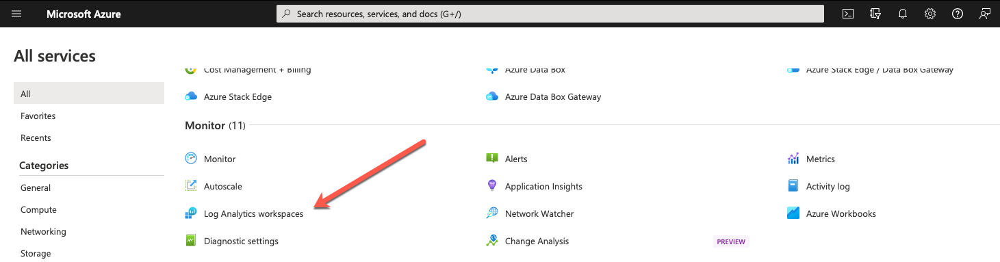

# Module 3 - Clip 1 - Terms and Definitions - Azure Data Explorer

Images are cut off… and this was more of an interface tour than an intro to KQL
Clip 1 - Azure Data Explorer Interface - Talk about the definitions and then show us the hierarchy drill down with live footage and not a screen shot, keeps things moving instead of one screen shot on the screen for 45sec
Clusters
Database
Table
Columns
Data types

**Start at https://portal.azure.com/#allservices**

We'll start on the All Services page of the Azure Portal. As we scroll down there are many services Azure offers, for monitoring 

**Scroll to Monitor**

**Point out Log Analytics Workspaces**
_Highlight the Log Analytics Workspaces_

Explain that Azure creates several places for tracking your infrastructure. One of those places is Log Analytics, which we'll be using heavily in this series of courses.

Now click on it to open Log Analytics

## Formatting Guide

The notes in this file are used during the recording of the course. It is not meant to be a word for word script, but rather the talking points used for recording.

Notes in plain text are to be used during the recording.

**Notes in bold are instructions during recording, not to be spoken.**

_Notes in italic will be used during the video editing processing._

KQL doesn't have a predefined code setting in Markdown. Use python as the closest match for multi-line code samples.

## Author Information

### Author

Robert C. Cain | [@ArcaneCode](https://twitter.com/arcanecode) | arcanecode@gmail.com

### Websites

About Me: [http://arcanecode.me](http://arcanecode.me)

Blog: [http://arcanecode.com](http://arcanecode.com)

Github: [http://arcanerepo.com](http://arcanerepo.com)

LinkedIn: [http://arcanecode.in](http://arcanecode.in)

### Copyright Notice

This document is Copyright (c) 2022 Robert C. Cain. All rights reserved.

The code samples herein is for demonstration purposes. No warranty or guarantee is implied or expressly granted.

This document may not be reproduced in whole or in part without the express written consent of the author and/or Pluralsight. Information within can be used within your own projects.

