# Fun With KQL - Search

## Introduction

In this post we will examine the KQL (Kusto Query Language) `search` operator. Search allows us to look across all columns in one or more tables for a specific text string.

The samples in this post will be run inside the LogAnalytics demo site found at [https://aka.ms/LADemo](https://aka.ms/LADemo). This demo site has been provided by Microsoft and can be used to learn the Kusto Query Language at no cost to you.

If you've not read my introductory post in this series, I'd advise you to do so now. It describes the user interface in detail. You'll find it at [https://arcanecode.com/2022/04/11/fun-with-kql-the-kusto-query-language/](https://arcanecode.com/2022/04/11/fun-with-kql-the-kusto-query-language/).

Note that my output may not look exactly like yours when you run the sample queries for several reasons. First, Microsoft only keeps a few days of demo data, which are constantly updated, so the dates and sample data won't match the screen shots.

Second, I'll be using the column tool (discussed in the introductory post) to limit the output to just the columns needed to demonstrate the query. Finally, Microsoft may make changes to both the user interface and the data structures between the time I write this and when you read it.

## Comments

Before I talk about search, I just wanted to mention how _comments_ in KQL work. Here you can see my search query, with a comment above it.

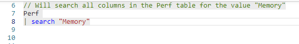

Comments in KQL begin with two slashes `//`. If you want a multi-line comment you'll have to begin each line with the two slashes.

## Basic Search

Let's take a look at a basic query that uses the `search` operator.

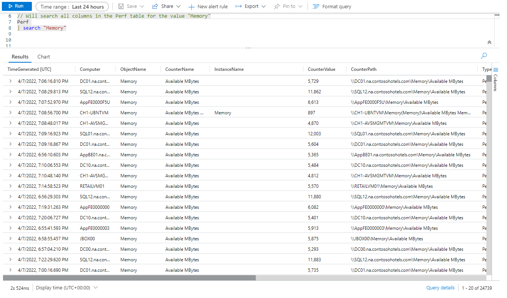

The query begins with our `Perf` table. On the next line is a pipe symbol (the vertical bar), following this is the `search` operator. Then, in quotation marks is the term we are looking for, `Memory`. So what's happening here?

First, KQL accesses the entire `Perf` table. Next, it takes those results, and pipes them into the `search` operator. The job of search is to look across all columns in the data that was passed in, for a specific string of text. In this case the table Perf was passed into the search operator, but in a later post we'll see ways to pass other types of data into search.

Once the search operator completes its work, it then pipes the data out to the next step in the query. Since there are no more operators after it, the next step is displaying the results in the pane at the bottom.

KQL knew the query was done when it encountered the blank line at the end. At that point it knows to go ahead and process the query. You can place more queries in the file after, and they won't execute.

Optionally, you can place a semicolon to end the query. This is only needed though if you want to run multiple queries at the same time.

If you notice, the query is highlighted with a light gray background. This indicates the current query which will be executed when you click _Run_, or press _Shift+Enter_ on your keyboard. If you need to run multiple queries you can highlight them, then run.

 As you can see in the output the **ObjectName** column contains the word `Memory`. Likewise, the **InstanceName** column also as a row with the word `Memory`. Finally if you look in the **CounterPath** column the word `Memory` is embedded in the path.

The search term only has to occur in a single column to be included in the results.

## Formatting the Query

In the previous example we used two lines for our query. This is a common practice when authoring Kusto queries, it improves readability and makes it easier to update.

This is not a requirement though, we could put the entire query on a single line, like so:

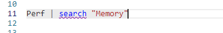

If you were to use the _Format query_ button in the toolbar above the query pane, it will reformat your query breaking it into multiple lines as shown in the previous example.

## Case Sensitivity with Search

By default, the `search` operator is not case sensitive. The following query will return the same results as the first one.

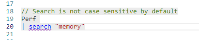

We can make a search case sensitive by adding the `kind` argument, indicating the search kind should be case sensitive.

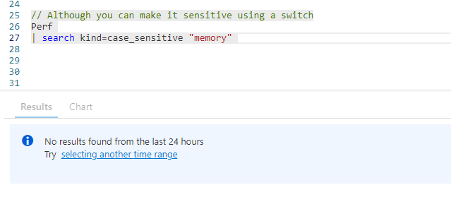

Between the `search` operator and the term we are looking for, we add `kind=case_sensitive`. As you can see from the output, looking for `memory` with a lower case `m` finds no results.

## Searching Everything

It is possible to search all the tables in the database. If you don't pipe anything into search, it assumes you want to go over the whole database.

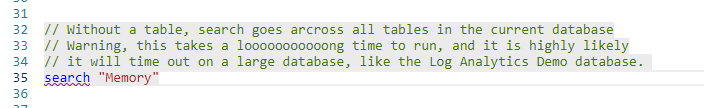

Be warned though, this is considered poor practice. It is slow on a large database, will take a long time, and will usually time out unless your database is very small.

I tried running this once on the whole sample Demo database. After half an hour it timed out.

There is a way to search across several tables though if you need to.

## Searching Multiple Tables

If you have a handful of tables you want to search, you can append `in`, followed by the list of tables to search in parenthesis, then the term to search for.

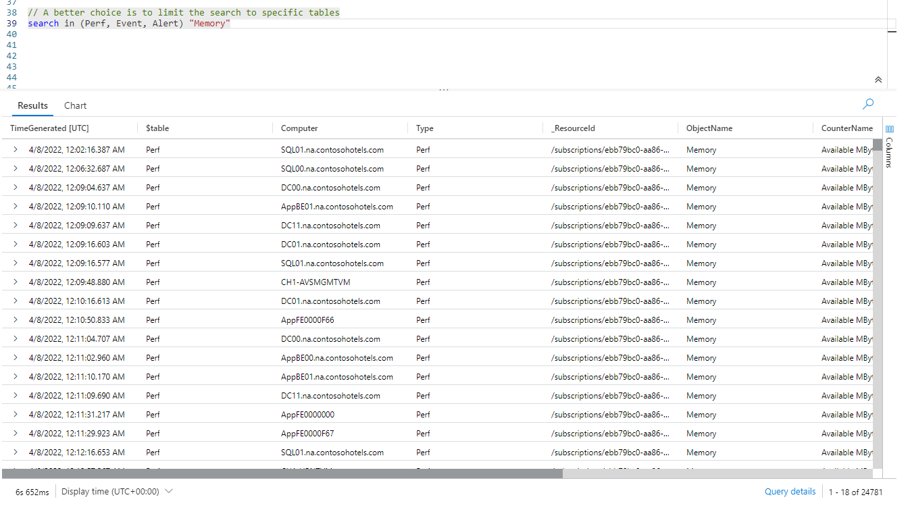

This query searched only the tables **Perf**, **Event**, and **Alert** for the term `Memory` and displayed the output at the bottom.

## Searching A Specific Column

So far we've seen search used to go over all columns in a table to look for a string. It is possible to search only a single column.

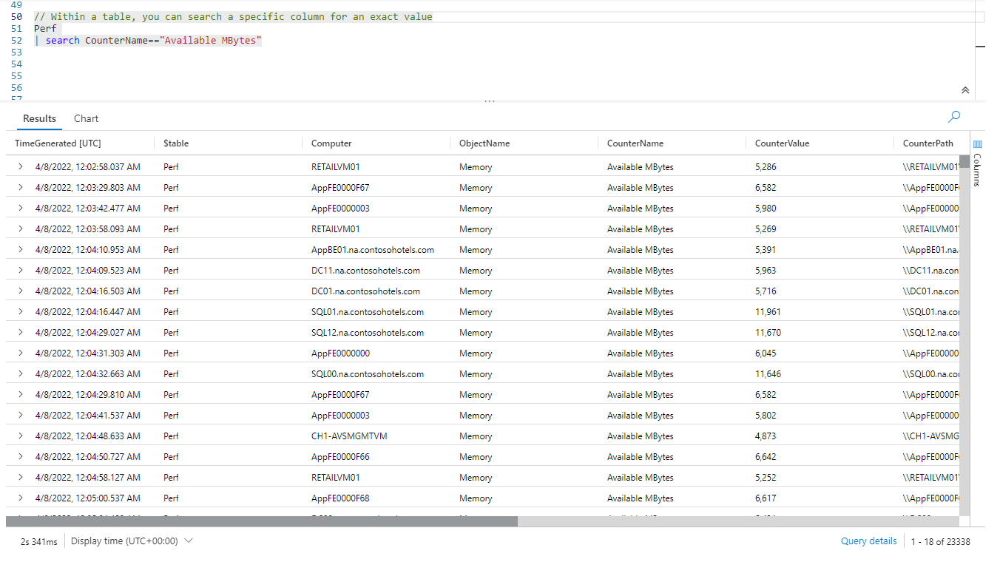

To search, you use the column name, followed by two equal signs, then the term to look for. This will look for an _exact match_. It will not return partial matches. In other words the entire contents of that column must match the search phrase exactly.

## Searching For Text Anywhere In The Column

It is also possible to search for a phrase anywhere in the column text. You simply replace the double equal sign with a colon.

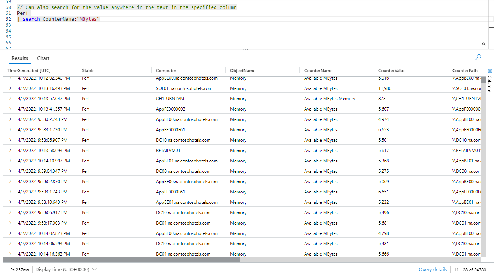

If you look at the results in the **CounterName** column, searching for `MBytes` returned `Available MBytes`, but it also returned `Available MBytes Memory`.

## Searching Across Columns for Partial Text

In the previous example we saw how to search a single column for a partial match. In other words the text could appear anywhere in that specific column.

It is also possible to search across _all_ the columns for a partial match using _wildcards_.

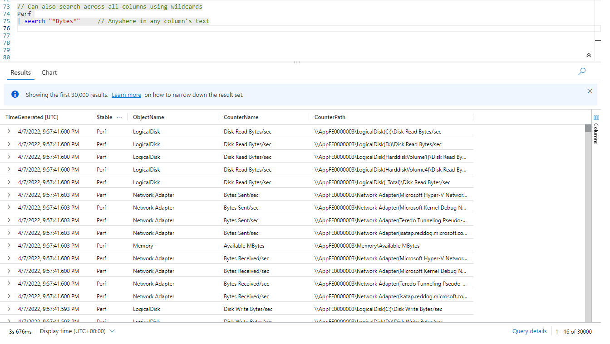

Doing so is simple, just place an asterisk `*` at the beginning and end of the search term. As you can see in the results, searching for `*Bytes*` found both  `Disk Read Bytes/sec` and `Bytes Sent/sec`.

I slipped in another example on comments, the line with `search` demonstrates that a comment can come at the end of a line as well.

It is also possible to search for text which occurs only at the start, or at the end of a column's text. To do so, you use the `startswith` or `endswith` parameters.

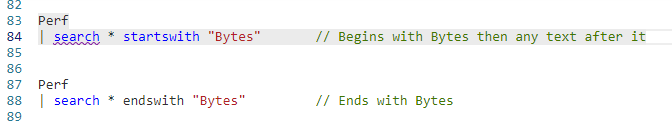

Finally, you can search for text with a specific word at the start and at the end, but any letters in between. Again, we use the wildcard asterisk.

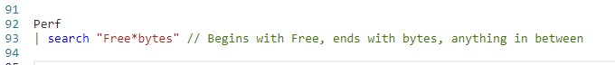

## Combining Searches Logically

Search will allow you to combine multiple searches in one expression, using the logical operators `and` and `or`.

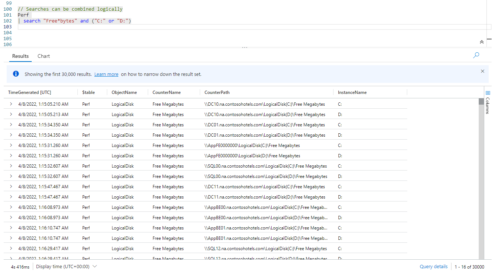

I reused the search from the previous example, then used the `and` to add another condition. In the second condition I use an `or` to look for either the text `C:` or `D:` as an exact match in any column.

In the output you can see the **CounterName** column has matches for `Free*Bytes`. In the **InstanceName** column it found matches for both `C:` and `D:`. It also found matches inside the **CounterPath** column.

## Regular Expressions

Finally, I'm sure fans of regular expressions will be thrilled to find out that the search operator does indeed support _regular expressions_ (often abbreviated _RegEx_).

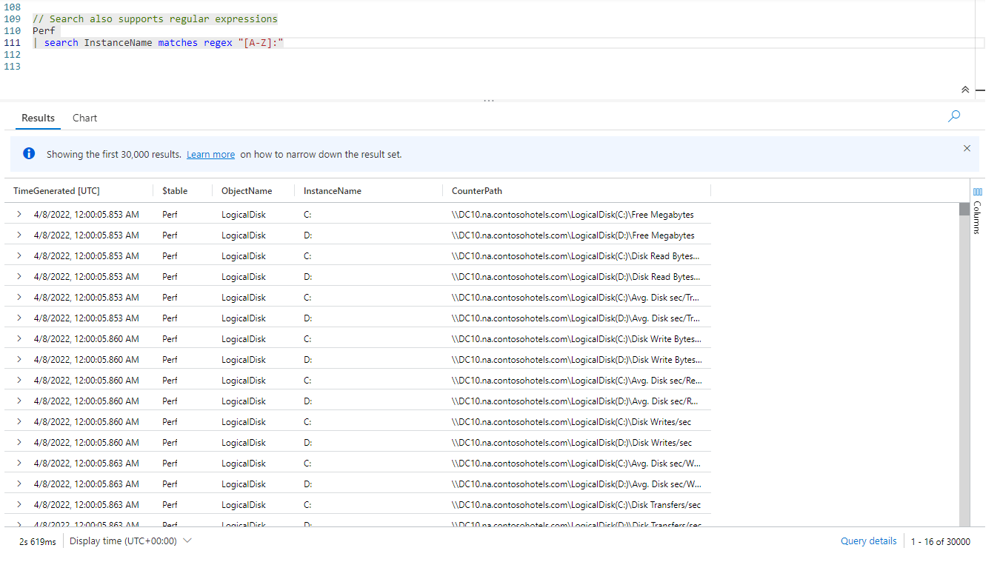

Here we used the `search` operator, followed by the name of the column to search, here `InstanceName`.

Then, to use a regular expression, add the keywords `matches regex` to the end, followed by the regular expression in quotes.

In this example the expression `[A-Z]` means any single character in the range A to Z. The colon is simply static text, it will look for any character from A to Z followed by a colon.

If you examine the **InstanceName** column you'll see matches for `C:` and `D:`.

## Conclusion

In this post we learned about the `search` operator, and the many ways to use it. In the next post we'll examine the `where` operator.

The demos in this series of blog posts were inspired by my Pluralsight courses [Kusto Query Language (KQL) from Scratch](https://pluralsight.pxf.io/MXDo5o) and [Introduction to the Azure Data Migration Service](https://pluralsight.pxf.io/2rQXjQ), two of the many courses I have on Pluralsight. All of my courses are linked on my [About Me](https://arcanecode.com/info/) page.

If you don't have a Pluralsight subscription, just go to [my list of courses on Pluralsight](https://pluralsight.pxf.io/kjz6jn) . At the top is a Try For Free button you can use to get a free 10 day subscription to Pluralsight, with which you can watch my courses, or any other course on the site.

## Navigator
[Table of Contents](../Table%20of%20Contents.md)

Post Link: [Fun With KQL - Search](https://arcanecode.com/2022/04/18/fun-with-kql-search/)

Post URL: [https://arcanecode.com/2022/04/18/fun-with-kql-search/](https://arcanecode.com/2022/04/18/fun-with-kql-search/)
