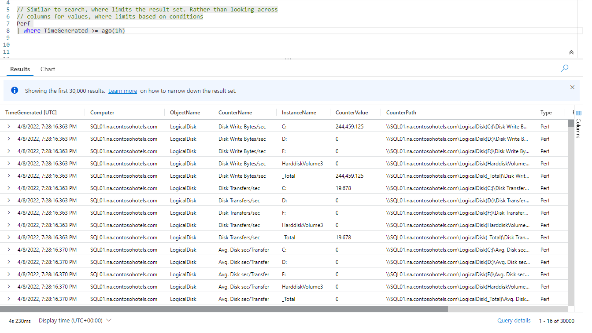
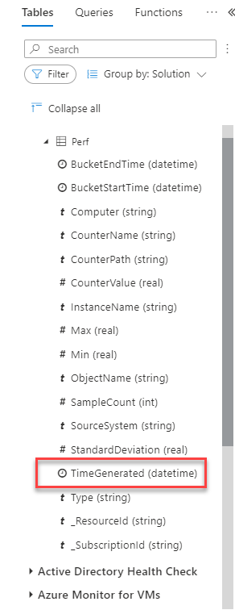
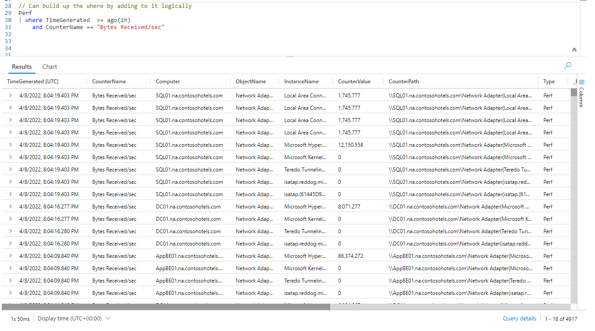
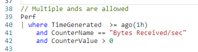
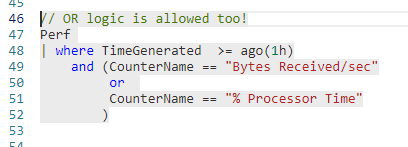
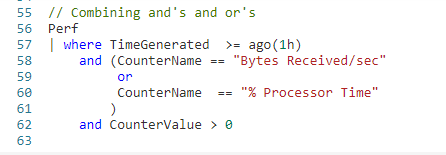
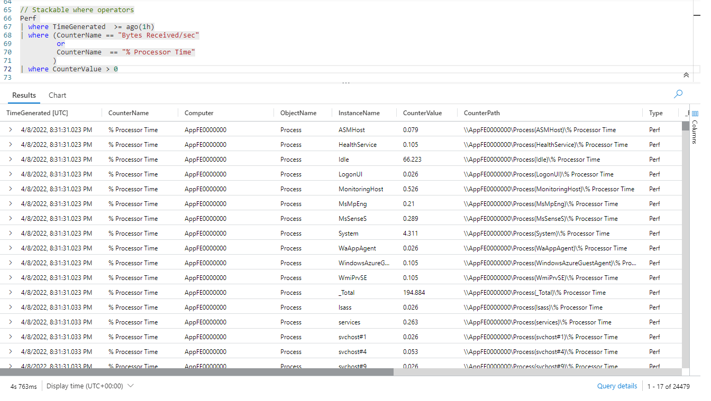
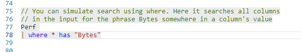
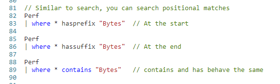
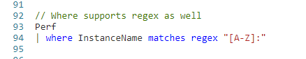

# Fun With KQL - Where

## Introduction

In my [previous post](https://arcanecode.com/2022/04/18/fun-with-kql-search/), we saw how the `search` operator was used to limit the results of a query. This post will focus on the `where` operator, which performs a similar function.

Whereas `search` is used to limit based on matching of a string, the `where` operator is used to match based on a _condition_. In this post we'll see some of the conditions that can be used with a `where` operator to narrow down a dataset.

The samples in this post will be run inside the LogAnalytics demo site found at [https://aka.ms/LADemo](https://aka.ms/LADemo). This demo site has been provided by Microsoft and can be used to learn the Kusto Query Language at no cost to you.

If you've not read my introductory post in this series, I'd advise you to do so now. It describes the user interface in detail. You'll find it at [https://arcanecode.com/2022/04/11/fun-with-kql-the-kusto-query-language/](https://arcanecode.com/2022/04/11/fun-with-kql-the-kusto-query-language/).

Note that my output may not look exactly like yours when you run the sample queries for several reasons. First, Microsoft only keeps a few days of demo data, which are constantly updated, so the dates and sample data won't match the screen shots.

Second, I'll be using the column tool (discussed in the introductory post) to limit the output to just the columns needed to demonstrate the query. Finally, Microsoft may make changes to both the user interface and the data structures between the time I write this and when you read it.

## Basic Where with Time

One of the most common uses of the `where` operator is to limit a result set based on time. Let's look at a common example.

Here we take the `Perf` table, and pipe it into the `where` operator. We are then going to use the `TimeGenerated` column as the column to limit our results on.

Next up is our comparison. Here we use `>=` (greater than or equal), but `==` (equals) and `<=` (less than or equal to) are also valid, as is just less than and greater than (`<` and `>`).

Next up is `ago`, which in KQL is classified as a _scalar function_. Scalar functions return a specific value, in this case the `ago` scalar function returns a date, going back in time from right now, for a certain amount of time.

In this case `ago(1h)` will return a value of one hour in the past based on the current time.

If you could look over the entire 30,000 rows returned by the query, you would see all of them ocurred within the last hour (from when you ran the query).

## Ago Time Ranges

In the previous example, we used `1h` for one hour with `ago`. But we could have used any number, for example `12h` would be 12 hours.

In addition we can use more time slices beyond just hours. Here is a table with the basic set of time slicers.

| Abbreviation | Time Unit |
|------:|:------|
|            d | days |
|            h | hours |
|            m | minutes |
|            s | seconds |
|           ms | milliseconds |
|  microsecond | microseconds |

## Restrictions on Ago

There is one restriction when using `ago`. The column you compare to must be a _datetime_ column.

In the side bar, expand the **LogAnalytics** solution then expand the **Perf** table. Look beside the **TimeGenerated** column.

Beside the column name you'll see the text _(datetime)_. This indicates the _data type_ of the column. In order for `ago` to work, the data type of the column used for the `where` operator must be a datetime.

In the list, you'll note there are two other datetime columns, **BucketEndTime** and **BucketStartTime**. These columns could also have been used with the `ago` operator.

## Using Where with Logical Joins

Just like the `search` operator, the `where` operator can be used with the logical joins of `and` and `or`.

Here you can see we used `where` with `ago`. Then on the next line we used `and` to add a second condition, looking for an exact match in the **CounterName** column for the text `Bytes Received/sec`.

Note that it was not necessary to use a pipe symbol on the third line of our query. Kusto knew to combine the `where` with the `and` as part of the same query.

We are not limited to a single `and` either, we can use multiple `and` clauses in our query.

As mentioned, we can also use the `or` in queries.

We can create a more complex condition for the `where` operator by combining `and` and `or` in a chain.

## Stacking Where Operators

It is also possible to stack several `where` operators in sequence.

It is important to understand what happens here is a little different than previous examples. In the previous example, the `Perf` table is rendered as a dataset. That entire dataset then has the `where` clause applied to it.

This example is a bit different. First, the call to the `Perf` table creates a dataset. That dataset is then piped into the first `where` operator, which reduces the passed in dataset to only rows for the last hour, using the `ago` scalar function.

That dataset is then passed into the next `where` operator, which will only return rows for one of the two matches on **CounterName**. This then generates another dataset.

This dataset is then piped into the third `where` clause, which only includes rows where the **CounterValue** is greater than zero.

This is a very common technique with Kusto queries. You take the biggest dataset, then pipe it into an operator that will remove a large number of rows. That resultant dataset is then (optionally) piped into another operator, which further reduces the rows.

With each pipe operation you want to remove as many rows as possible. Each time the dataset should be reduced in size further and further until it has the smallest number of rows to give the results you are looking for.

Again, this is an important concept so make sure you understand it clearly, as it is used over and over again with Kusto.

## Simulating Search with Where

It is possible to simulate the `search` operator using a `where`.

Here we take the output of the `Perf` and pipe it into where. We can then indicate a specific column name to look in, or use `*` to look across all columns in the passed in dataset.

The `has` clause is needed to indicate we want to look for the text anywhere inside the column, and finally we pass in the string to look for, in this case `Bytes`. Unlike `search`, we do not need to include any asterisks within the search string.

In my [previous post](https://arcanecode.com/2022/04/18/fun-with-kql-search/) you saw the `search` operator has `startswith` and `endswith` parameters to look for a word at the beginning or end of the text in a column. The `where` operator has similar functionality using the `hasprefix` and `hassuffix` parameter names.

In addition, `search` as the ability to look for text anywhere in a column using wildcards, for example `*Bytes*` looks for the text Bytes anywhere in a columns text. The `where` operator simulates this by using the `contains` parameter, and ommiting the asterisk, as in `where * contains "Bytes"`.

Here are examples of all three.

As stated at the beginning, with all of these, you can use the `*` to indicate look in all columns, or you can use a specific column name.

## Regular Expressions

I'm sure you will be overjoyed to find that the `where` operator also supports _regular expressions_. The syntax is almost identical to the `search`.

For this example I did specify a column name, but could have used `*` as well. I then use `matches regex` followed by the regular expression. If you want to know a bit more about this regular expression, see the previous post I did on the [search operator](https://arcanecode.com/2022/04/18/fun-with-kql-search/).

## Conclusion

In this post we took a look at the `where` operator. It is similar to `search`, except `where` looks for conditions rather than text strings, although it can do that as well.

The chief difference between the two is scope. The `search` operator can be used across multiple tables, while `where` can only be used with the passed in dataset, typically a single table.

The demos in this series of blog posts were inspired by my Pluralsight courses [Kusto Query Language (KQL) from Scratch](https://pluralsight.pxf.io/MXDo5o) and [Introduction to the Azure Data Migration Service](https://pluralsight.pxf.io/2rQXjQ), two of the many courses I have on Pluralsight. All of my courses are linked on my [About Me](https://arcanecode.com/info/) page.

If you don't have a Pluralsight subscription, just go to [my list of courses on Pluralsight](https://pluralsight.pxf.io/kjz6jn) . At the top is a Try For Free button you can use to get a free 10 day subscription to Pluralsight, with which you can watch my courses, or any other course on the site.

## Navigator
[Table of Contents](../Table%20of%20Contents.md)

Post Link: [Fun With KQL - Where](https://arcanecode.com/2022/04/25/fun-with-kql-where/)

Post URL: [https://arcanecode.com/2022/04/25/fun-with-kql-where/](https://arcanecode.com/2022/04/25/fun-with-kql-where/)
