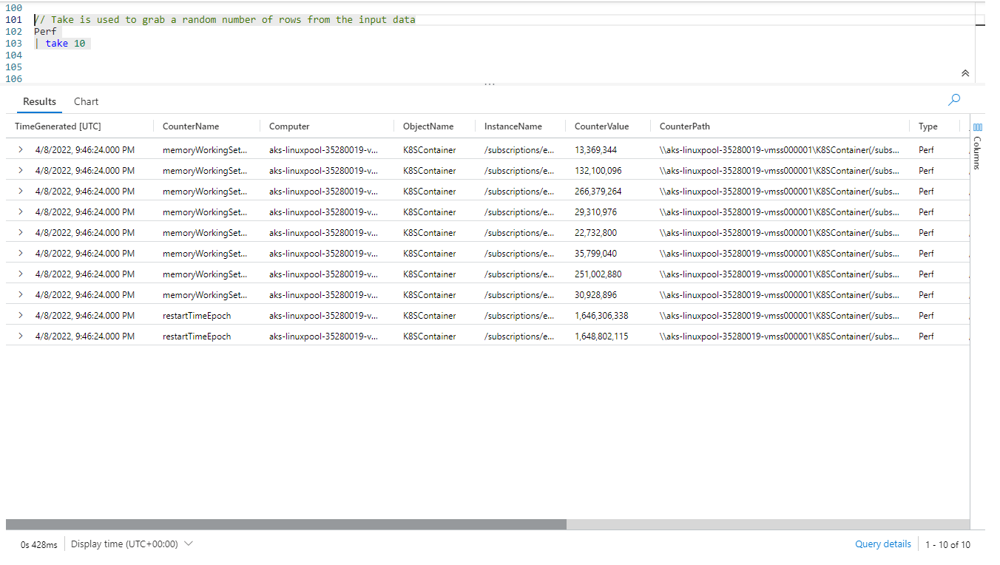
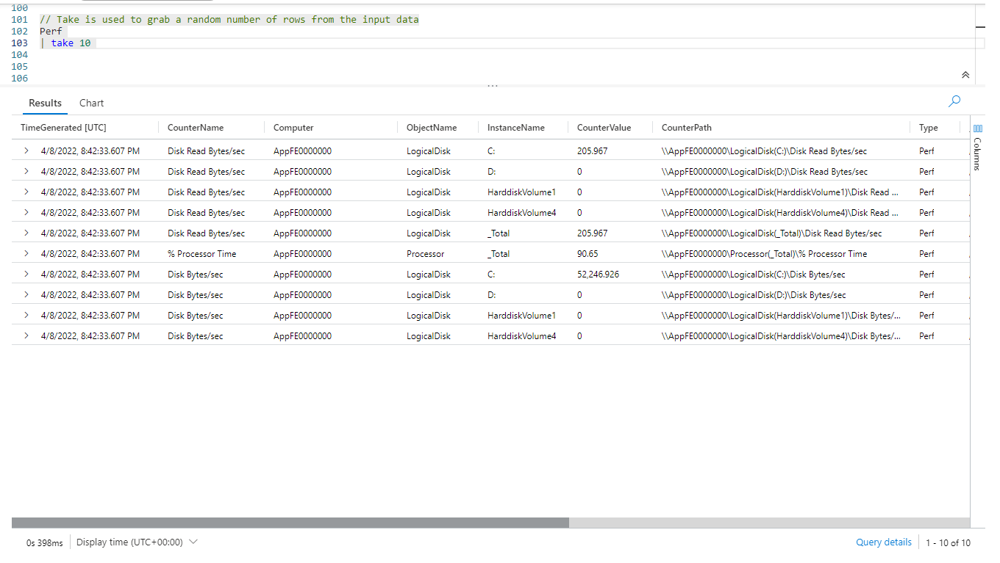
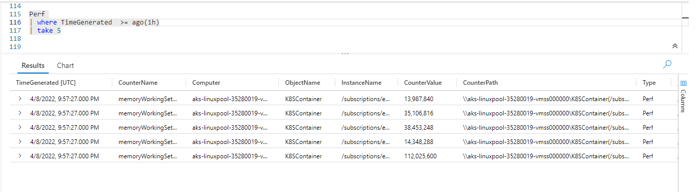
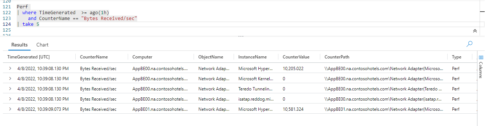
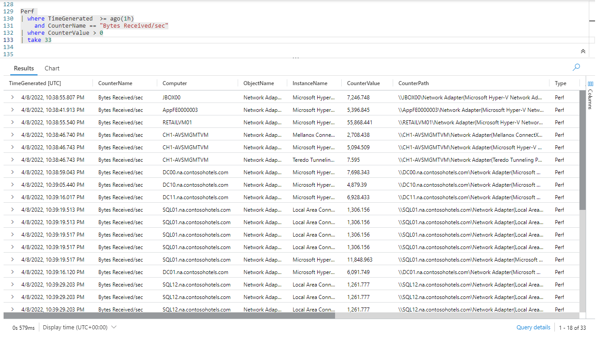
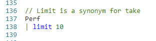

# Fun With KQL - Take

## Introduction

The `take` operator can be a useful debugging tool, or a tool to use as you develop your Kusto queries. It will grab a random number of rows from the incoming dataset and return them.

The samples in this post will be run inside the LogAnalytics demo site found at [https://aka.ms/LADemo](https://aka.ms/LADemo). This demo site has been provided by Microsoft and can be used to learn the Kusto Query Language at no cost to you.

If you've not read my introductory post in this series, I'd advise you to do so now. It describes the user interface in detail. You'll find it at [https://arcanecode.com/2022/04/11/fun-with-kql-the-kusto-query-language/](https://arcanecode.com/2022/04/11/fun-with-kql-the-kusto-query-language/).

Note that my output may not look exactly like yours when you run the sample queries for several reasons. First, Microsoft only keeps a few days of demo data, which are constantly updated, so the dates and sample data won't match the screen shots.

Second, I'll be using the column tool (discussed in the introductory post) to limit the output to just the columns needed to demonstrate the query. Finally, Microsoft may make changes to both the user interface and the data structures between the time I write this and when you read it.

## Take Basics

The `take` operator is incredibly simple to use. Just take a dataset, then pipe it into the `take` operator and indicate how many rows you want.

In this example we took the `Perf` table, and piped the dataset it generated into the `take` operator. We indicated we wanted to get `10` rows, which it did as you can see.

It is important to understand that `take` grabs these rows _at random_. Further, there is no consistency between each execution of `take`. You are likely to get a different set of rows with each execution. Let me run the exact same query again, so you can see the different data being returned.

As you can see, the resulting data is completely different, even though I ran the exact same query within seconds after the first execution.

## Why Take?

So why use the `take` operator? Well it is an incredibly useful tool for developing your query. As you add each new operator to your pipe, you can add a `take` at the end to spot check your results. Because `take` executes very quickly, you can rapidly find out if your query is working, or maybe you did something that returned zero rows.

## Building Queries Step by Step

Lets look at an example of using take when building a query. We'll reuse a query from our post on the `where` operator.

We took our `Perf` table and piped it into the `where` operator to limit the data to the last hour. We then pipe it into `take` to verify the rows are indeed from the last hour. Since they are, we can now continue our query development.

For the next step in our query, we want to limit the result set to only include rows where the **CounterName** column contains the text `Bytes Received/sec`.

As you can see, I added an `and` clause to our `where` operator to limit based on the **CounterName**. That was piped into our `take` so we could verify the results.

So far so good. Now lets add another condition! We'll pipe the existing query into a new `where` clause to only return data when the **CounterValue** is greater than zero. We'll then pipe that into our `take` so we can spot check the results.

There we go, the output shows no rows with a zero **CounterValue**, giving us some assurance things are working correctly.

From here we can keep adding more and more steps to our query, using `take` each time to spot check the results. The `take` operator winds up being an extremely useful tool, which I use frequently when developing queries.

Note too that for this example I changed the number of rows passed into the `take` operator to 33. I just wanted to illustrate this can be any value. Early in my development I set it to a low number, perhaps 100, but toward the end will bump it up to 1000, or even higher, so I can better verify my results.

## Limit

You may see references to the `limit` operator. Be aware that `limit` is nothing more than a synonym for `take`.

There is no difference between `limit` and `take`. They behave _identically_. In some query languages the keyword `limit` is used to perform the same task, so to make learning KQL easier the creators included the ability to use `limit` and `take` interchangeably.

## Conclusion

In this post we covered one of the easiest to use, but extremely useful operators in KQL: `take`. As you begin your life as a Kusto query developer, I'm sure you'll find `take` as useful as I do.

The demos in this series of blog posts were inspired by my Pluralsight courses [Kusto Query Language (KQL) from Scratch](https://pluralsight.pxf.io/MXDo5o) and [Introduction to the Azure Data Migration Service](https://pluralsight.pxf.io/2rQXjQ), two of the many courses I have on Pluralsight. All of my courses are linked on my [About Me](https://arcanecode.com/info/) page.

If you don't have a Pluralsight subscription, just go to [my list of courses on Pluralsight](https://pluralsight.pxf.io/kjz6jn) . At the top is a Try For Free button you can use to get a free 10 day subscription to Pluralsight, with which you can watch my courses, or any other course on the site.

## Navigator
[Table of Contents](../Table%20of%20Contents.md)

Post Link: [Fun With KQL - Take](https://arcanecode.com/2022/05/02/fun-with-kql-take/)

Post URL: [https://arcanecode.com/2022/05/02/fun-with-kql-take/](https://arcanecode.com/2022/05/02/fun-with-kql-take/)
