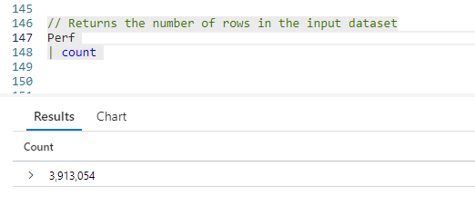
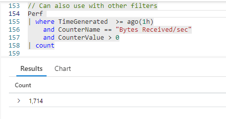
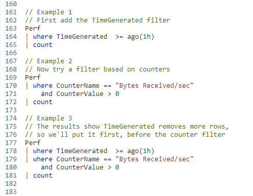

# Fun With KQL - Count

## Introduction

The [previous post](https://arcanecode.com/2022/05/02/fun-with-kql-take/) in the series covered the `take` operator. In that post I mentioned that `take` was one of the simplest operators in KQL. But it is not the simplest, that honor goes to the `count` operator.

The `count` operator does nothing more than takes the piped in dataset and returns the number of rows in it. We'll see more in a moment.

For now, I should mention samples in this post will be run inside the LogAnalytics demo site found at [https://aka.ms/LADemo](https://aka.ms/LADemo). This demo site has been provided by Microsoft and can be used to learn the Kusto Query Language at no cost to you.

If you've not read my introductory post in this series, I'd advise you to do so now. It describes the user interface in detail. You'll find it at [https://arcanecode.com/2022/04/11/fun-with-kql-the-kusto-query-language/](https://arcanecode.com/2022/04/11/fun-with-kql-the-kusto-query-language/).

Note that my output may not look exactly like yours when you run the sample queries for several reasons. First, Microsoft only keeps a few days of demo data, which are constantly updated, so the dates and sample data won't match the screen shots.

Second, I'll be using the column tool (discussed in the introductory post) to limit the output to just the columns needed to demonstrate the query. Finally, Microsoft may make changes to both the user interface and the data structures between the time I write this and when you read it.

## Count Basics

To use `count`, simply take a dataset and pipe it into the `count` operator.

Here, we took the `Perf` table and piped it into `count`. In the output at the bottom, you can see it has 3,913,054 rows as of the time I ran this query. You will likely get a different value as the Demo database is updated constantly.

## Use Count Like Take

You can use the `count` operator like `take` (covered in the post [Fun With KQL - Take](https://arcanecode.com/2022/05/02/fun-with-kql-take/)), to spot check your query as you develop it.

Here you can see the `where` operator was added to the query, along with several conditions. It resulted in 1,714 rows being returned.

The `take` operator lets you get a sample of the data. The `count` operator tells you how many rows will be returned by your query.

This is another great way to spot check your work. If you know, for example, the query should bring back 1,714 rows, and the `count` returns that value, you can have some assurance your query is working a you designed it.

## Pairing Down Your Data

In a an earlier post I stated the best way to write a query is to start with the largest dataset and keep trimming until you get to the smallest. But if you are developing your query in stages, how do you know which dataset is the biggest?

Using `count` at each stage will help you to determine this. You start with your core dataset, and measure it. Then add your first filter, perhaps a `where` operator, and check its count. Next, comment this filter out and try with the next filter you wish to use and get its count. This will let you know which of the two filters removes the biggest number of rows.

Let's see an example of this. We want to author a query to return data for the last hour, where the **CounterName** is `Bytes Received/sec` and the **CounterValue** is greater than zero.

In example 1, I apply the time filter and pipe it to the `count` operator.

In example 2, I remove the time filter and use the counter based filters instead.

Between the two of them, we'll say (for example purposes) the time filter removed more rows, so in the final version of the query (shown in example 3) the time filter is placed first, followed by the counter filter.

## Conclusion

That's it! That's all there is to the `count` operator. Sorry if you were expecting more, but there's not a lot to say about such a simple KQL operator.

The demos in this series of blog posts were inspired by my Pluralsight courses [Kusto Query Language (KQL) from Scratch](https://pluralsight.pxf.io/MXDo5o) and [Introduction to the Azure Data Migration Service](https://pluralsight.pxf.io/2rQXjQ), two of the many courses I have on Pluralsight. All of my courses are linked on my [About Me](https://arcanecode.com/info/) page.

If you don't have a Pluralsight subscription, just go to [my list of courses on Pluralsight](https://pluralsight.pxf.io/kjz6jn) . At the top is a Try For Free button you can use to get a free 10 day subscription to Pluralsight, with which you can watch my courses, or any other course on the site.

## Navigator
[Table of Contents](../Table%20of%20Contents.md)

Post Link: [Fun With KQL - Count](https://arcanecode.com/2022/05/09/fun-with-kql-count/)

Post URL: [https://arcanecode.com/2022/05/09/fun-with-kql-count/](https://arcanecode.com/2022/05/09/fun-with-kql-count/)
