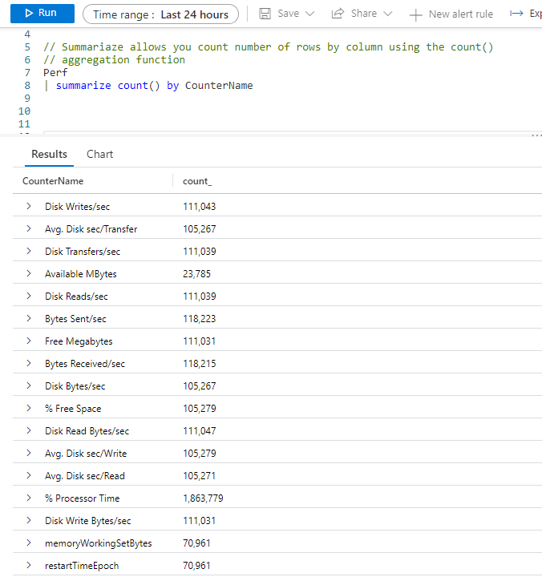
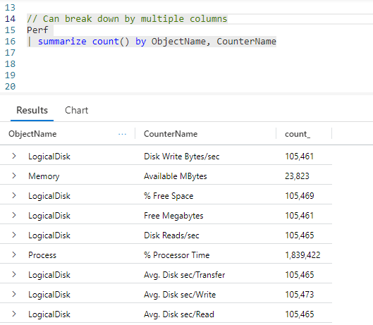
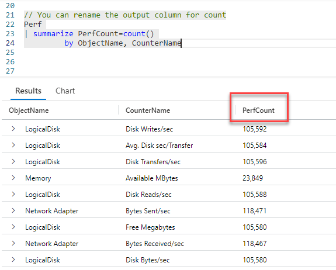
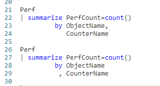
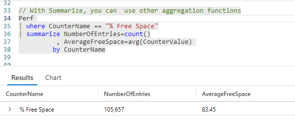
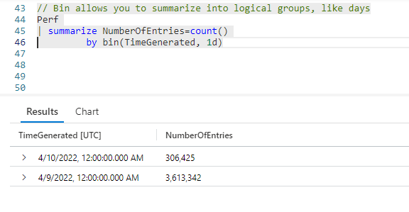
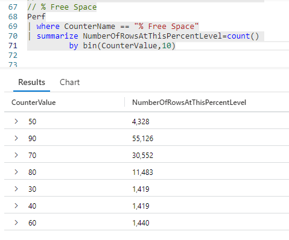

# Fun With KQL - Summarize

## Introduction

When data is analyzed, it is seldom done on a row by row basis. Instead, data analysts look at the big picture, looking at total values. For example, the total number of times the disk transfer counter is recorded for a time period may give an indication of disk utilization.

To aggregate these values with KQL, we'll use the `summarize` operator.

The samples in this post will be run inside the LogAnalytics demo site found at [https://aka.ms/LADemo](https://aka.ms/LADemo). This demo site has been provided by Microsoft and can be used to learn the Kusto Query Language at no cost to you.

If you've not read my introductory post in this series, I'd advise you to do so now. It describes the user interface in detail. You'll find it at [https://arcanecode.com/2022/04/11/fun-with-kql-the-kusto-query-language/](https://arcanecode.com/2022/04/11/fun-with-kql-the-kusto-query-language/).

Note that my output may not look exactly like yours when you run the sample queries for several reasons. First, Microsoft only keeps a few days of demo data, which are constantly updated, so the dates and sample data won't match the screen shots.

Second, I'll be using the column tool (discussed in the introductory post) to limit the output to just the columns needed to demonstrate the query. Finally, Microsoft may make changes to both the user interface and the data structures between the time I write this and when you read it.

## Summarize Basics

Let's first see our query and its results, then we can start breaking it down.

We begin by creating a dataset, taking the `Perf` table and piping it into our `summarize` _operator_.

Next we need to tell what we want to summarize, and what column (or columns) we want to summarize for. Here, we want to create summaries for each **CounterName**.

And what do we want to summarize? That will be the number of times each **CounterName** appears in our data, for the default time range of last 24 hours (note the _Time range_ just above the query pane).

In my previous post, [Fun With KQL - Count](http://), we covered the `count` _operator_. What you see here is different, we are using the `count()` _function_. When used in the query, the count function essentially creates a brand new column for the output. The number represents the number of times each value in the `by` column occurs in the dataset passed into summarize.

The output dataset has two columns. It contains the column name indicated after the `by`, in this case the **CounterName**.

The second column is `count_`, which is the number of rows for each counter. For example, you can see _Disk Writes/sec_ occurred 111,043 times. The _Avg. Disk sec/Transfer_ counter had 105,267 rows in the input dataset.

You can distinguish between the count _operator_ and the count _function_ by the parenthesis. All functions in KQL have parenthesis at the end. Most of the time these won't contain anything, but on occasion a function will require one or more _parameters_, extra data the function needs to do its job. The parameters are placed inside the parenthesis.

## Summarizing on Multiple Columns

Should you want to create summarizes for the combination of multiple columns it is easy to do so. Just list each column after the `by` keyword.

In this example, after the `by` we listed the **ObjectName** and **CounterName** columns. In the first row of output, the combination of _LogicalDisk_ and _Disk Write Bytes/sec_ occurred 105,461 times.

The combination of _Memory_ and _Available MBytes_ had 23,823 rows in the incoming dataset (here, the `Perf` table).

## A Count By Any Other Name...

I think we can all agree, the default column name of `count_` is pretty darn ugly. It doesn't give us any clue as to what was being counted.

Ideally we should rename the column to something more meaningful, so let's do just that.

To rename our count function when it gets to the output, simply create the new column name you want to use, and set it equal to the count function. In this example we chose the name `PerfCount`. In the output, you can see the column name now reflects our choice.

## Code Formatting Note

In the previous example we moved the `by` down to the next line. I feel this improves readability, in addition to showing the flexibility of formatting in KQL.

To further enhance readability, we could also chose to put each column name on its own line. The list of columns needs to be separated by a comma, but KQL is not picky about where the comma goes. Both of the examples below are valid Kusto queries.

Personally I'm a "commas at the front" kind of person. I think it's easier to read, lines up nicely, and it is much easier to rearrange the lines.

Whichever form you take though, be consistent. If you work in a company with other KQL developers, then agree on a standard for formatting your KQL queries, document it for everyone to refer to, and stick with it.

This, by the way, should apply to all languages you use: SQL, PowerShell, C#, and so on.

## Summarize With Other Aggregations

So far, our examples have used the `count()` function to perform our summaries. Kusto allows us to summarize with a variety of aggregation functions. For this example, lets use `summarize` to get the average percentage of free disk space.

First, we take our `Perf` table and pipe it to the `where` operator to limit the data to only rows where the **CounterName** is `% Free Space`.

Next we pipe into a `summarize`, where we will aggregate two values. First, we want to get a count of rows which we rename to `NumberOfEntries`. Next, we want an average free space amount.

To do so we will use the `avg` function. The `avg` function requires one parameter, the value (usually a column name) we want to average. Here we want to average the **CounterValue** column. We'll give this a meaningful column name of `AverageFreeSpace`.

In the output you can see our counter name, _% Free Space_, and that it had 105,657 entries in our dataset. The average amount of free space was 83.45 percent.

I also want to point out that the `summarize` operator allows us to perform aggregations on multiple columns at the same time. Here, we got a count aggregation, as well as an average.

## Bin Basics

Often, it is useful to aggregate our data based on a column, but rather than returning a single value we want to break the results into groups. An extremely common example is dates. We may wish to see the total number of rows entered into our `Perf` table for each day.

To accomplish this we need to use KQL's `bin` function.

As we've done in previous examples, we'll use the `count` function and rename it to `NumberOfEntries` in the output. In our examples so far, after the `by` we have used one or more column names to summarize on.

To bin our data, more formally called _bucketization_, we use the `bin` function after the `by`. It requires two parameters. The first is the column with the data to bin on, the second is how to group the data within that column.

Here, we will bin on the datetime column `TimeGenerated`. We will then group our data into one day bins, as indicated by `1d`. In the output you can see for April 9, we had 3,613,342 rows. For April 10, there wre 306,425 rows of data.

We could have chosen other ways to bin, for example using `1h` would have binned the results into hours. 10m would group into 10 minute increments. For quick reference, here's the most common list of time abbreviations.

| Abbreviation | Time Unit |
|------:|:------|
|            d | days |
|            h | hours |
|            m | minutes |
|            s | seconds |
|           ms | milliseconds |
|  microsecond | microseconds |

## Other Ways to Bin

While binning by date is by far the most common way the bin function is used, you can break your data into bins using other values.

In this example, lets create bins for our `% Free Space` values.

Our **CounterValue** column holds the percent of free space on a disk when the **CounterName** is `% Free Space`. We want to break the counts into buckets for each ten percent of free space.

On the first row of the results, you see the value 50. This represents the range 50 to 59 percent. At that level there were 4,328 rows.

The bottom row reads 60. From 60 to 69 percent there were 1,440 rows of data.

We didn't have to pick 10, we could have instead used 5, or 25, or any other value which makes sense for this query.

## Conclusion

With this post we covered the `summarize` operator, which is used to aggregate values. Along the way we learned about two new functions, `count` and `bin`.

The demos in this series of blog posts were inspired by my Pluralsight courses [Kusto Query Language (KQL) from Scratch](https://pluralsight.pxf.io/MXDo5o) and [Introduction to the Azure Data Migration Service](https://pluralsight.pxf.io/2rQXjQ), two of the many courses I have on Pluralsight. All of my courses are linked on my [About Me](https://arcanecode.com/info/) page.

If you don't have a Pluralsight subscription, just go to [my list of courses on Pluralsight](https://pluralsight.pxf.io/kjz6jn) . At the top is a Try For Free button you can use to get a free 10 day subscription to Pluralsight, with which you can watch my courses, or any other course on the site.

## Navigator
[Table of Contents](../Table%20of%20Contents.md)

Post Link: [Fun With KQL - Summarize](https://arcanecode.com/2022/05/16/fun-with-kql-summarize/)

Post URL: [https://arcanecode.com/2022/05/16/fun-with-kql-summarize/](https://arcanecode.com/2022/05/16/fun-with-kql-summarize/)
