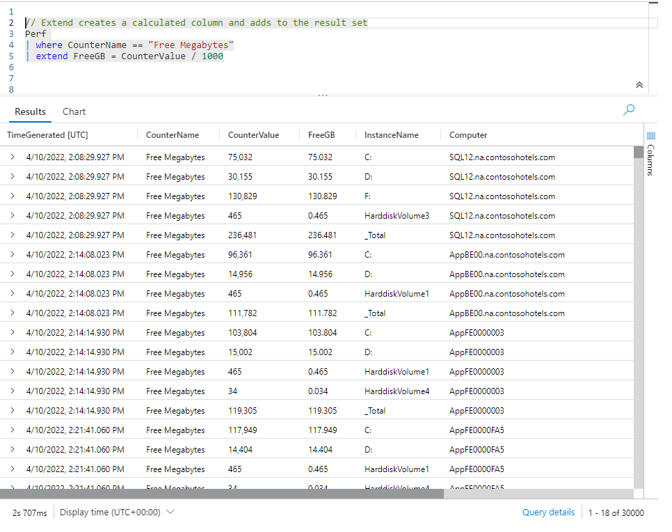
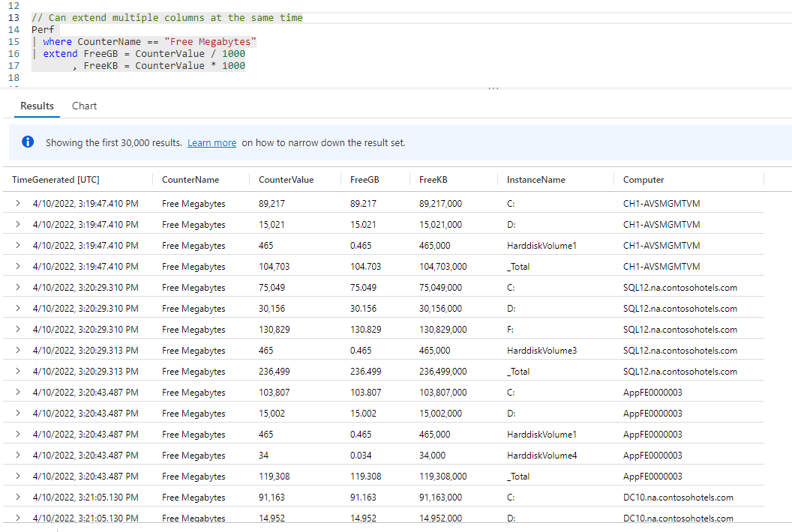
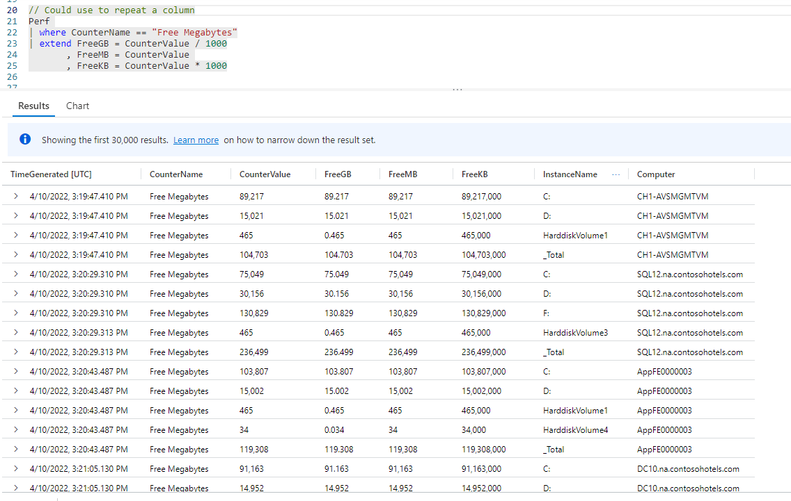
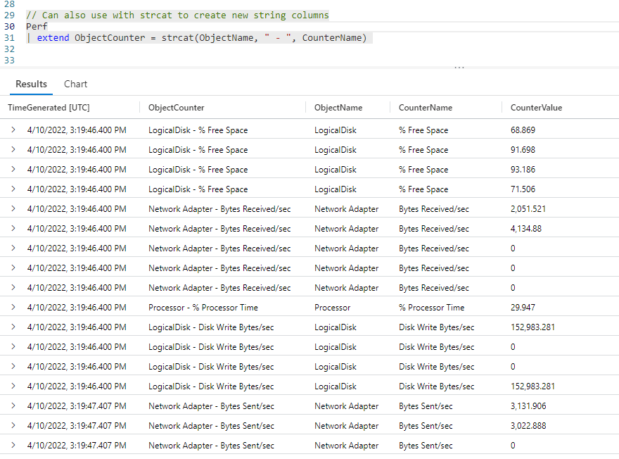

# Fun With KQL - Extend

## Introduction

When dealing with data, it's not at all uncommon to want to create a new column of data by performing a calculation with two other columns. A common example is taking two stored columns, the purchase price of an item, and its shipping cost, then adding them together to get a column which wasn't stored in your dataset, the total amount of the sale.

The Kusto Query Language lets you accomplish this through the `extend` operator. This operator allows you to manifest new columns in your output data, based on calculations.

The samples in this post will be run inside the LogAnalytics demo site found at [https://aka.ms/LADemo](https://aka.ms/LADemo). This demo site has been provided by Microsoft and can be used to learn the Kusto Query Language at no cost to you.

If you've not read my introductory post in this series, I'd advise you to do so now. It describes the user interface in detail. You'll find it at [https://arcanecode.com/2022/04/11/fun-with-kql-the-kusto-query-language/](https://arcanecode.com/2022/04/11/fun-with-kql-the-kusto-query-language/).

Note that my output may not look exactly like yours when you run the sample queries for several reasons. First, Microsoft only keeps a few days of demo data, which are constantly updated, so the dates and sample data won't match the screen shots.

Second, I'll be using the column tool (discussed in the introductory post) to limit the output to just the columns needed to demonstrate the query. Finally, Microsoft may make changes to both the user interface and the data structures between the time I write this and when you read it.

## Extend Basics

Using `extend` is pretty simple. Let's take a look.

We started by doing something that should be familiar if you've been reading the other posts in this **Fun With KQL** series. We piped the `Perf` table through a `where` operator to reduce the dataset to only those rows whose **CounterName** column holds the value of `Free Megabytes`.

In the `Perf` table, the amount of free space is stored in the **CounterValue** column in _Megabytes_. These days Megabytes are pretty small quantities, most drives these days hold Gigabytes, if not Terabytes of data.

To make the output easier to read, we'd like to have the amount of free space expressed in terms of Gigabytes. The `extend` operator can be used to accomplish this goal.

In the example we use the `extend` operator, followed by the name for our new column, `FreeGB`. Then comes an equal sign, and our calculation. To convert Megabytes to Gigabytes we'll simply divide the **CounterValue** by 1000.

> Before anyone begins a "well actually" debate in the comments, I'm aware that some argue the mega to giga conversion value should be 1024, others say 1000. To make the examples in this article simple and easy to understand, I'm going to use 1000.

In the output, which I have rearranged using the _column_ pop out on the right, you'll see I have the original column, **CounterValue**, as well as the new calculated column, **FreeGB**. Since it's a bit hard to read in the screen hot I'll point out the **CounterValue** column reads `75,032` megabytes, while the **FreeGB** column has `75.032` gigabytes.

One last item. You can actually omit the name for a new calculated columns. We could have just used `extend CounterValue / 1000` if we wanted. However this will generate the new column with meaningless names like `Column1`, `Column2` and so on. I _highly advise_ giving all your calculated columns a name, even on simple queries.

## Creating Multiple Columns with Extend

When using the `extend` operator, you can create multiple calculated columns at one time, as you can see in the example below.

After entering the first calculated column for `FreeGB`, I simply use a comma, then enter the calculation to get the amount of free space in terms of Kilobytes and named it `FreeKB`.

In the output (again rearranged with the _column_ tool) you'll see the original **CounterValue** column and both of my new, calculated columns `FreeGB` and `FreeMB`.

If you read my article [Fun With KQL - Summarize](https://arcanecode.com/2022/05/16/fun-with-kql-summarize/), specifically the section titled **Code Formatting Note**, you'll know the formatting of KQL code is extremely flexible. I placed the new calculation on the next line, and put the comma at the start of the line. Kusto would have been just as happy though if I'd put the comma at the end of the `FreeGB` line, or put everything on a single line.

## Repeating a Column with Extend

In our output, we still retained the **CounterValue** column. It would be nice to have this column appear with the name of `FreeMB` so it is consistent with the other two column names. We can do this with `extend` by simply setting a new column name equal to the existing column, **CounterValue**.

## Creating Calculated Values with Text Data

So far all of our calculations using the `extend` operator have been done with numeric data. It is also possible to perform calculations that concatenate text data.

Text based data is often stored in separate columns, which as humans (or other intelligent species) we consider a single value. A common example is someone's name. Frequently stored in first name and last name columns, but often users prefer to see this in a single column as full name.

In our `Perf` data, the **ObjectName** and **CounterName** columns are closely associated. In order to reduce the number of columns in our output, it would be nice to combine these into a single column. To do that, Kusto provides the `strcat` function.

The `strcat` function accepts two or more parameters. You pass in a list of column names that were passed into the pipe (in this case from the `Perf` table) as well as static text enclosed in quotation marks, separated by commas.

In this example we pass in three values to `strcat`. First is the **ObjectName** column. Next is a static string of a dash, with a space on either side. Finally we pass in the **CounterName** column.

These are combined using the `strcat` function, and in the output named `ObjectCounter`. In the sample output I've included the original columns, as well as the new `ObjectCounter` column.

## Conclusion

The `extend` operator is a powerful tool in your Kusto toolbox. With it you can create new columns for display purposes or as output to the next set of operators in the pipeline.

One question I get asked, with the example of `FreeMB` you have the new column `FreeMB`, as well as the original column of **CounterValue**. How do we remove the **CounterValue** column from the output since it wouldn't be needed?

That question will be answered in my next post, **Fun With KQL - Project**, so stay tuned!

The demos in this series of blog posts were inspired by my Pluralsight courses [Kusto Query Language (KQL) from Scratch](https://pluralsight.pxf.io/MXDo5o) and [Introduction to the Azure Data Migration Service](https://pluralsight.pxf.io/2rQXjQ), two of the many courses I have on Pluralsight. All of my courses are linked on my [About Me](https://arcanecode.com/info/) page.

If you don't have a Pluralsight subscription, just go to [my list of courses on Pluralsight](https://pluralsight.pxf.io/kjz6jn) . At the top is a Try For Free button you can use to get a free 10 day subscription to Pluralsight, with which you can watch my courses, or any other course on the site.

## Navigator
[Table of Contents](../Table%20of%20Contents.md)

Post Link: [Fun With KQL - Extend](https://arcanecode.com/2022/05/23/fun-with-kql-extend/)

Post URL: [https://arcanecode.com/2022/05/23/fun-with-kql-extend/](https://arcanecode.com/2022/05/23/fun-with-kql-extend/)
