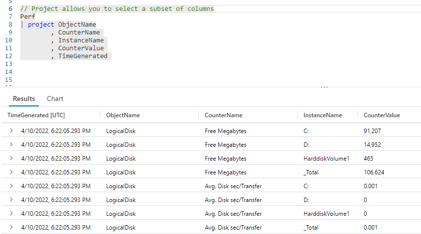
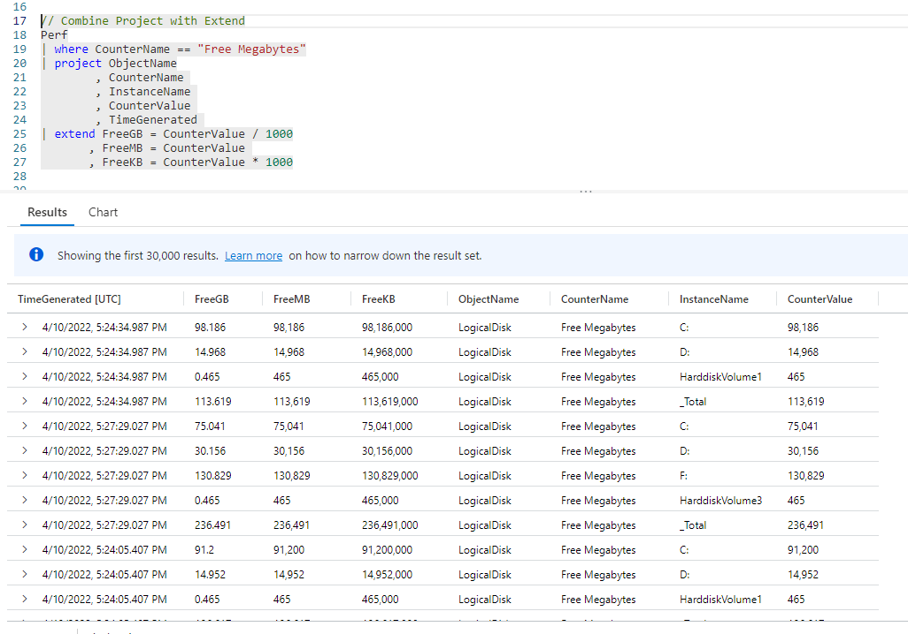
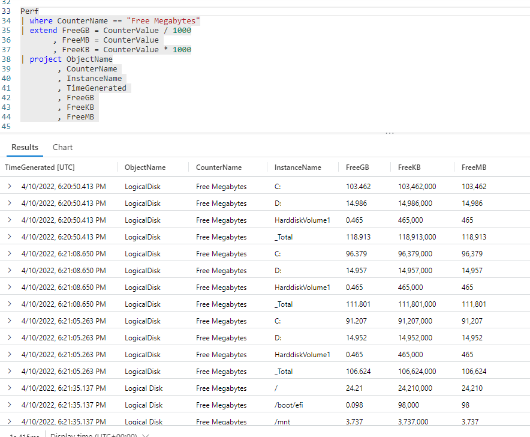
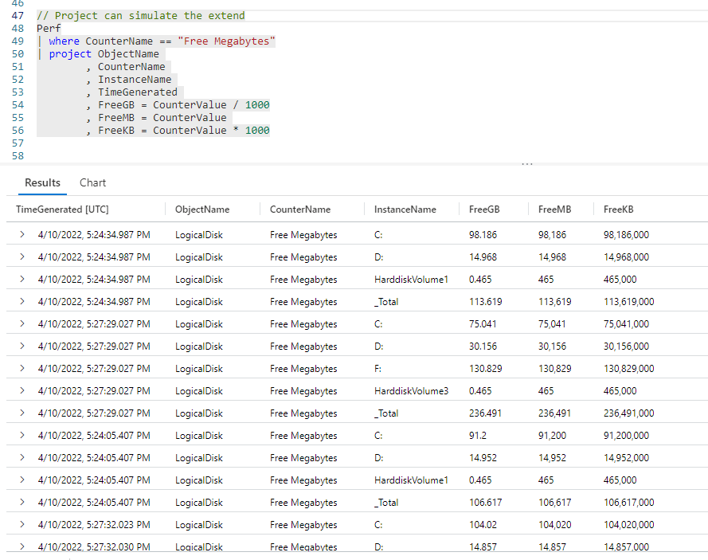
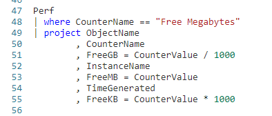
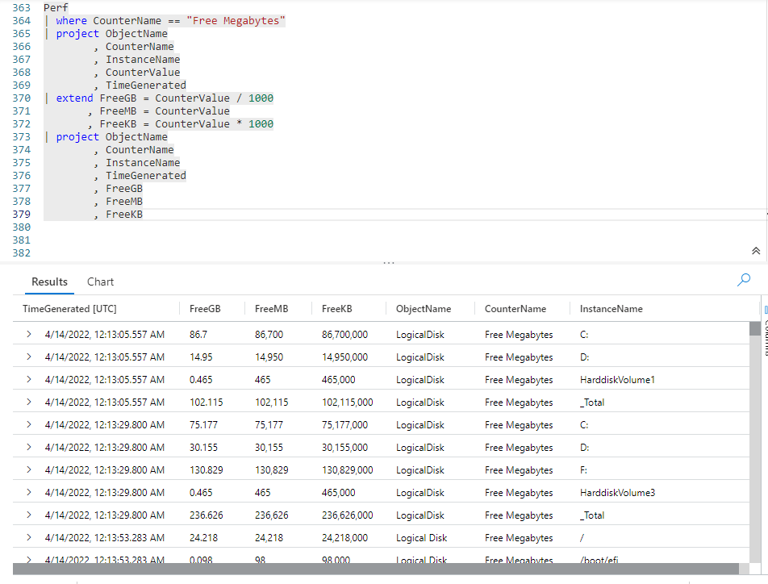

# Fun With KQL - Project

## Introduction

So far in my **Fun With KQL** series, we have used the _column_ tool, found on the right side of the output pane and described in my original post [Fun With KQL - The Kusto Query Language](https://arcanecode.com/2022/04/11/fun-with-kql-the-kusto-query-language/), to arrange and reduce the number of columns in the output.

We can actually limit the number of columns, as well as set their order, right within our KQL query. To accomplish this we use the `project` operator.

Before we get into `project`, I want to mention that the samples in this post will be run inside the LogAnalytics demo site found at [https://aka.ms/LADemo](https://aka.ms/LADemo). This demo site has been provided by Microsoft and can be used to learn the Kusto Query Language at no cost to you.

If you've not read my introductory post in this series, I'd advise you to do so now. It describes the user interface in detail. You'll find it at [https://arcanecode.com/2022/04/11/fun-with-kql-the-kusto-query-language/](https://arcanecode.com/2022/04/11/fun-with-kql-the-kusto-query-language/).

Note that my output may not look exactly like yours when you run the sample queries for several reasons. First, Microsoft only keeps a few days of demo data, which are constantly updated, so the dates and sample data won't match the screen shots.

Second, I'll be using the column tool (discussed in the introductory post) to limit the output to just the columns needed to demonstrate the query. Finally, Microsoft may make changes to both the user interface and the data structures between the time I write this and when you read it.

## Project Basics

The `project` operator is pretty simple to use. You simply pipe a dataset into the `project` operator, then list the columns you want to output, in the order you want them.

From previous blog posts in this **Fun With KQL** series, you know that the `Perf` table contains many columns. In this example I listed five of those columns to be included in the output.

In the output pane below the query, you'll note that only the five columns listed after the `project` operator, in the order you listed them, with the exception of **TimeGenerated**. This is a special column which KQL always wants to list first.

## Project and Extend

The `project` operator is often combined with the `extend` operator. If you've not read my previous post [Fun With KQL - Extend](https://arcanecode.com/2022/05/23/fun-with-kql-extend/) you should do so now if you aren't familiar with the `extend` operator.

Let's see the example, then we can break it down.

This example combines several techniques we've seen over this series. First, we pipe the output of the `Perf` table into a `where` operator (covered in [Fun With KQL - Where](https://arcanecode.com/2022/04/25/fun-with-kql-where/)) to limit the results to only rows with the `Free Megabytes` counter.

We then pipe that resulting dataset into the `project` operator to limit the number of columns.

Finally, that dataset is piped into the `extend` operator, to generate three new calculated columns. The final result is displayed at the bottom.

## Using Projected Columns in Calculations

The ordering of your `project` and `extend` is important. In order for an `extend` to work, the column must be included in the input dataset. If we had omitted the **CounterValue** column in the `project` operator, the `extend` would have errored out due to a missing column.

We can fix this by moving our `extend` _before_ the `project`.

The `extend` operator now works because it has all of the columns in the `Perf` dataset to work with, including the **CounterValue**. Then when we use `project` we can safely omit the **CounterValue**.

## Projecting Calculated Values

The `project` operator can also do the work of `extend`. This lets you include calculated values as part of your `project` operation.

Here, I have the projected columns, then after it listed the calculated columns using the same syntax as you'd use with the `extend` operator. This works because at this point the `project` operator has all of the columns being passed into the pipe from the `where` operation.

In this example I placed the new calculated values at the end of the `project` operation. This is not a requirement, I could have placed them at the beginning, in the middle, or mixed them up between other columns. This next example is perfectly valid:

## Record Set Sizes

In previous posts, I'd mentioned it is a best practice to start with the biggest record set, then reduce that as much as possible before passing into the next operation, then reducing that, and so on.

What if, for speed operations, we found it was faster to first reduce the `Perf` / `where` data, then do the calculations, but still wanted to remove the **CounterValue** from the final output. To accomplish this, we could use multiple `project` operators in our query, like so.

Here we make a big reduction in the size of our data through the use of the `where` operator. We further reduce it by using the `project`. Next, we add our calculated values using `extend`. Finally we use `project` again to remove the unwanted **CounterValue** column.

So which query is fastest? We've seen three ways, using `extend`, the `project`, using only `project` and adding the calculated values, and using `project`, `extend`, then one more `project`.

If you remember from my inital post [Fun With KQL - The Kusto Query Language/](https://arcanecode.com/2022/04/11/fun-with-kql-the-kusto-query-language/), the query execution time is listed just below and on the left under the result pane.

Run each query multiple times and measure the results, this will give you a general rule of thumb on which query executes the fastest. As your database grows in size and scope, you may wish to re-run this test periodically to ensure your chosen query is still fastest.

## Conclusion

Today's post went in depth to the `project` operator, and the many ways it can be used. There are a few variants to the `project` operator, which we'll cover in the next post, **Fun With KQL - Variants Of Project**.

The demos in this series of blog posts were inspired by my Pluralsight courses [Kusto Query Language (KQL) from Scratch](https://pluralsight.pxf.io/MXDo5o) and [Introduction to the Azure Data Migration Service](https://pluralsight.pxf.io/2rQXjQ), two of the many courses I have on Pluralsight. All of my courses are linked on my [About Me](https://arcanecode.com/info/) page.

If you don't have a Pluralsight subscription, just go to [my list of courses on Pluralsight](https://pluralsight.pxf.io/kjz6jn) . At the top is a Try For Free button you can use to get a free 10 day subscription to Pluralsight, with which you can watch my courses, or any other course on the site.

## Navigator
[Table of Contents](../Table%20of%20Contents.md)

Post Link: [Fun With KQL - Project](https://arcanecode.com/2022/05/30/fun-with-kql-project/)

Post URL: [https://arcanecode.com/2022/05/30/fun-with-kql-project/](https://arcanecode.com/2022/05/30/fun-with-kql-project/)
