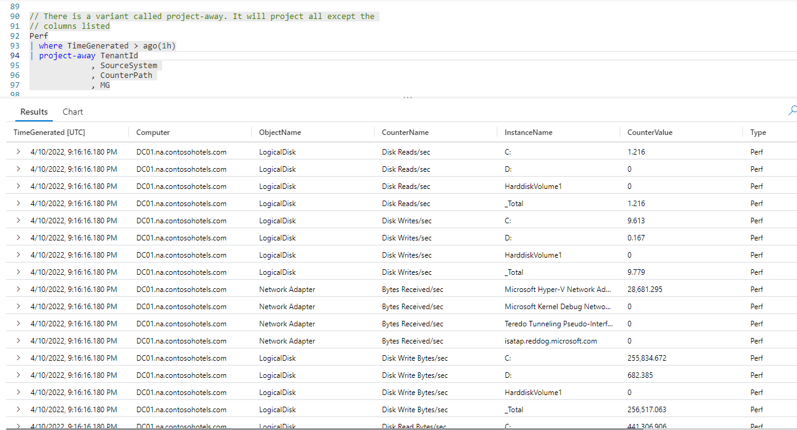
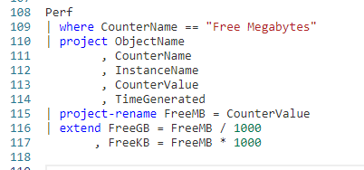
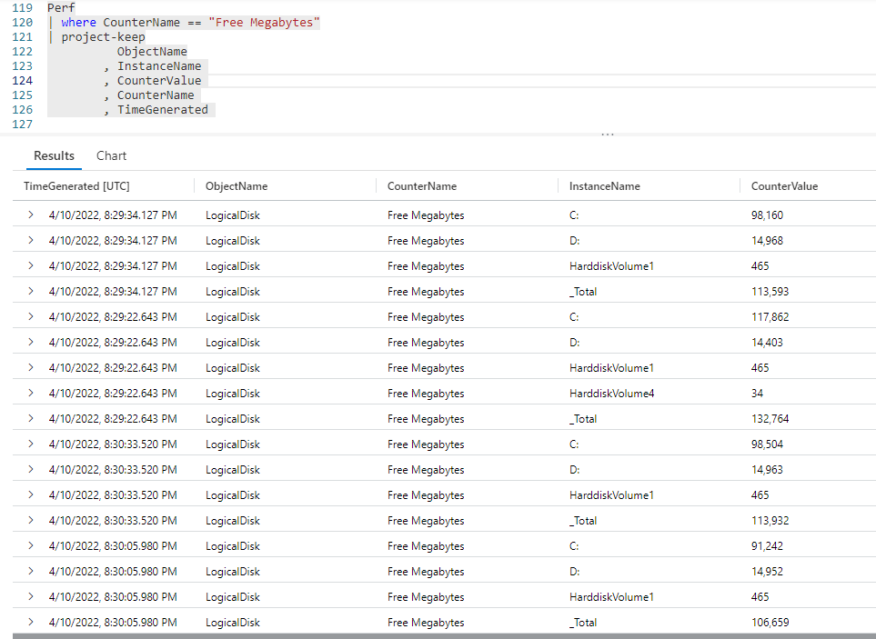
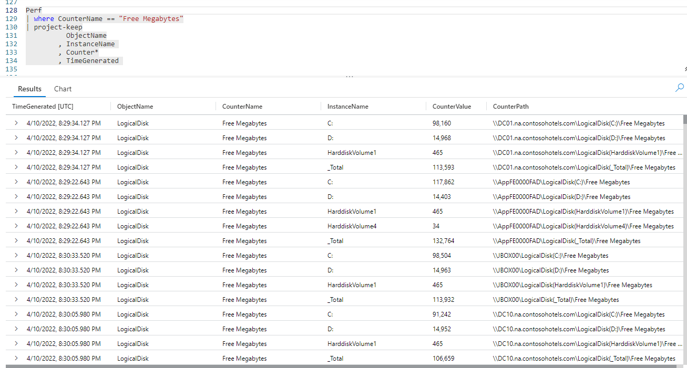
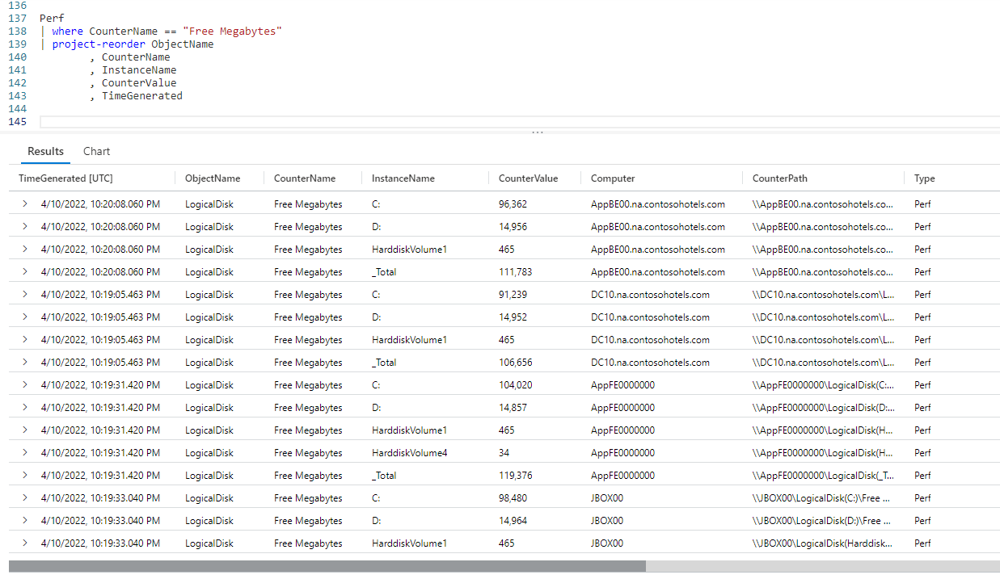
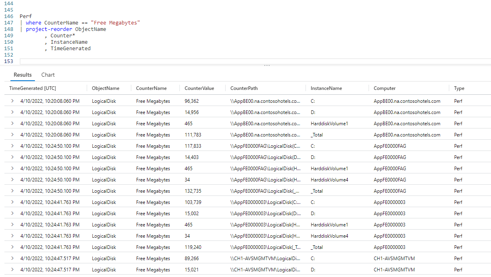
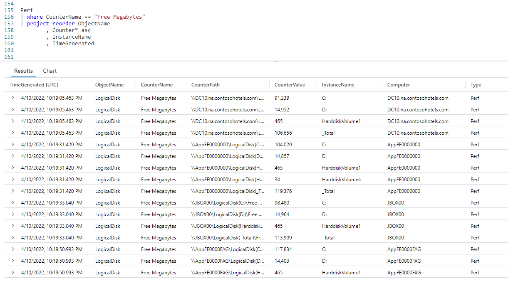
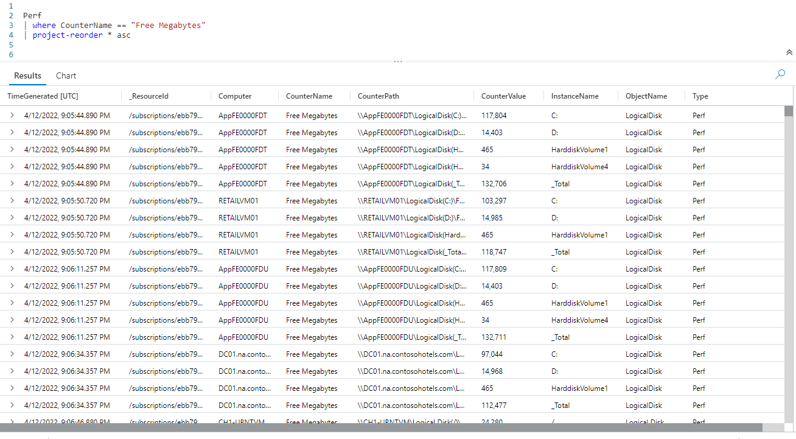

# Fun With KQL - Variants of Project

## Introduction

In the previous post, [Fun With KQL - Project](https://arcanecode.com/2022/05/30/fun-with-kql-project/), we took a dive into the `project` operator and the ways it could be used. The `project` operator has several variants: `project-away`, `project-rename`, `project-keep`, and `project-reorder`. This post will take a quick look at each.

For most of the examples we'll build on the examples from the [Fun With KQL - Project](https://arcanecode.com/2022/05/30/fun-with-kql-project/) blog article, so if you've not read it you should do so now.

You should be aware that the samples in this post will be run inside the LogAnalytics demo site found at [https://aka.ms/LADemo](https://aka.ms/LADemo). This demo site has been provided by Microsoft and can be used to learn the Kusto Query Language at no cost to you.

If you've not read my introductory post in this series, I'd advise you to do so now. It describes the user interface in detail. You'll find it at [https://arcanecode.com/2022/04/11/fun-with-kql-the-kusto-query-language/](https://arcanecode.com/2022/04/11/fun-with-kql-the-kusto-query-language/).

Note that my output may not look exactly like yours when you run the sample queries for several reasons. First, Microsoft only keeps a few days of demo data, which are constantly updated, so the dates and sample data won't match the screen shots.

Second, I'll be using the column tool (discussed in the introductory post) to limit the output to just the columns needed to demonstrate the query. Finally, Microsoft may make changes to both the user interface and the data structures between the time I write this and when you read it.

## Project-Away

There are several variants to the `project` operator. The first I wanted to mention is `project-away`.

The `project-away` operator is the reverse of `project`. It will return all columns _except_ the ones you indicate. This can be a way of _future proofing_ your queries. With `project`, if someone adds a new column to the table it won't appear in the results. With `project-away`, these new columns will now appear in the results.

To be honest, the `project-away` operator isn't something I've used a great deal, but wanted to include it for completeness.

## Project-Rename

Another variant to the `project` operator is `project-rename`. You can use it to rename a column. As this example shows, that renamed column can also be used in calculations done with `extend`.

In this example, after performing the `project` we use `project-rename` to change the name of the **CounterName** column to **FreeMB**. Since **CounterName** is no longer in our dataset, we need to use the new name in the `extend` calculations. It also eliminates the need to use `extend` to copy the column into the `FreeMB` column, making the query more efficient.

The `project-rename` operator, while not something I use daily, is quite useful and one I employ regularly.

## Project-Keep

The next variant of `project` to discuss is `project-keep`. At first glance it seems identical to `project`.

If you look closely though, you'll notice a subtle but important difference. In the query we listed the two counter columns together. In the output though, you can see the **CounterName** column is followed by the **InstanceName** column, then the **CounterValue** column appears.

The `project-keep`  operator preserves the order of the columns as they appeared in the input dataset, and ignores the order they were listed in your query.

There is another useful feature to `project-keep`, it allows you to use wildcards for the column names. Simply enter the first part of a column name, then use an asterisk.

In the query, I specified `Counter*` for one of the columns. In the output, Kusto found three matches and included the **CounterName**, **CounterValue**, and **CounterPath** columns in the output.

The `project-keep` can be useful when you are writing quick queries to examine your data. For any query I would be keeping to run in production though, I would always specify the column names. This will improve readability plus make your intent clear to KQL developers who may come behind you.

## Project-Reorder

The final variant we'll look at is `project-reorder`. This operator is a bit counterintuitive, as it doesn't behave quite like you expect.

The `project-reorder` operator returns _all columns_ in the input dataset. However, it will take the columns you pass in to the operator and list them _first_, in the order you specify, _then_ the rest of the columns in the order they occur in the incoming dataset.

As you can see in the output, the five columns we listed come first in the output, followed by the remaining columns (you can scroll to the right in the output pane to see the rest). The `project-reorder` can be handy when you want to see all of the columns, but you want to see certain columns first in the  output.

Like the `project-keep`, the `project-reorder` operator can use wildcards.

As you can see, it listed the three columns that began with the word `Counter`, in the same order they appeared in the input dataset.

You can also reorder the columns in alphabetical order easily by appending `asc` after the wildcard.

Now the three columns with the word `Counter` appear in ascending alphabetical order. As you might guess, there is also a `desc` that will list the columns in descending order alphabetically.

This leads to a neat trick you can do, if you want to list all the columns in alphabetical order.

After the `project-reorder` operator, simply use an asterisk followed by the `asc` keyword. This will list all of the columns in the incoming dataset in alphabetical order, which can be quite useful especially in a dataset with many columns. The exception is that pesky **TimeGenerated** column, which Kusto will always list first in the output.

On occasion you may encounter a table that has columns with numbers embedded in the names. For example, you may have col100, col20. When sorted in ascending order alphabetically, col20 will appear before col100.

To fix this, you can use `granny-asc` and `granny-desc` which will take into account these odd column names and force a100 to appear prior to (when used with `granny-asc`) to a20.

## Conclusion

This post covered the variants to the `project` operator. While not used frequently, they can be useful when developing your Kusto queries.

The demos in this series of blog posts were inspired by my Pluralsight courses [Kusto Query Language (KQL) from Scratch](https://pluralsight.pxf.io/MXDo5o) and [Introduction to the Azure Data Migration Service](https://pluralsight.pxf.io/2rQXjQ), two of the many courses I have on Pluralsight. All of my courses are linked on my [About Me](https://arcanecode.com/info/) page.

If you don't have a Pluralsight subscription, just go to [my list of courses on Pluralsight](https://pluralsight.pxf.io/kjz6jn) . At the top is a Try For Free button you can use to get a free 10 day subscription to Pluralsight, with which you can watch my courses, or any other course on the site.

## Navigator
[Table of Contents](../Table%20of%20Contents.md)

Post Link: [Fun With KQL - Variants of Project](https://arcanecode.com/2022/06/06/fun-with-kql-variants-of-project/)

Post URL: [https://arcanecode.com/2022/06/06/fun-with-kql-variants-of-project/](https://arcanecode.com/2022/06/06/fun-with-kql-variants-of-project/)
