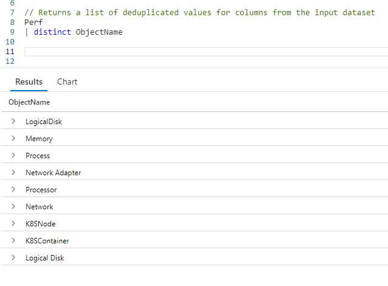
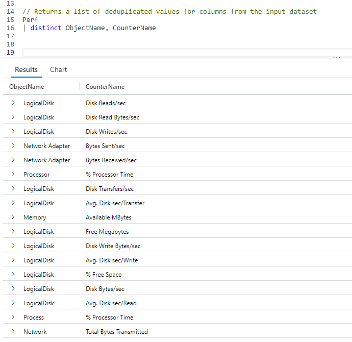
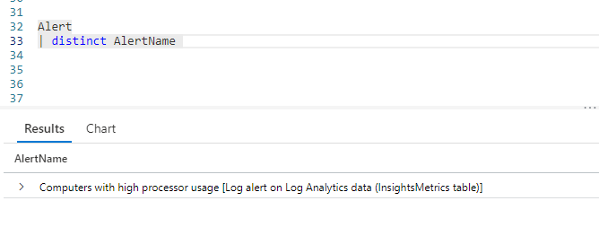
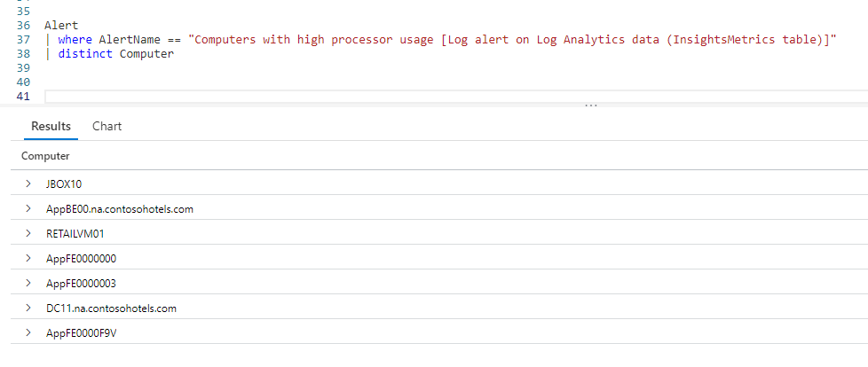

# Fun With KQL - Distinct

## Introduction

As with other languages such as SQL, KQL has an operator for returning a unique list of values in a column: `distinct`. Using this you can return the values in a column, but only once, removing any duplicate values from the result set.

The samples in this post will be run inside the LogAnalytics demo site found at [https://aka.ms/LADemo](https://aka.ms/LADemo). This demo site has been provided by Microsoft and can be used to learn the Kusto Query Language at no cost to you.

If you've not read my introductory post in this series, I'd advise you to do so now. It describes the user interface in detail. You'll find it at [https://arcanecode.com/2022/04/11/fun-with-kql-the-kusto-query-language/](https://arcanecode.com/2022/04/11/fun-with-kql-the-kusto-query-language/).

Note that my output may not look exactly like yours when you run the sample queries for several reasons. First, Microsoft only keeps a few days of demo data, which are constantly updated, so the dates and sample data won't match the screen shots.

Second, I'll be using the column tool (discussed in the introductory post) to limit the output to just the columns needed to demonstrate the query. Finally, Microsoft may make changes to both the user interface and the data structures between the time I write this and when you read it.

## Distinct Basics

Using `distinct` we can get a list of unique values in a column. Let's say we want to get a list of distinct values in the `Perf` tables **ObjectName** column.

All we had to do was take our `Perf` table and pipe it into the `distinct` operator. We then specify the column name to get the unique values for.

In the output, you can see the list of values. You could use these to build a lookup table, or as input to another query.

## Distinct Combinations of Columns

When using the `distinct` operator you are not limited to a single column. You can get distinct values for a combination of columns.

After `distinct` we simply list all of the columns to find unique combinations for. In this example, you can see the _LogicalDisk_ object has several counter names associated with it. It was too long for a screen capture, but in total the query returned 43 unique combinations. (As of this writing, be aware the value may be different for you due to the constant updates to the `Perf` tables sample data.)

## Distinct As A Troubleshooting Tool

One way you can use `distinct` is as a trouble shooting tool. There is another table in the LogManagement solution named `Alert`. In here certain conditions which may become issues are logged. You can use the `distinct` operator to get a list of those conditions.

When I ran this query, it only returned one alert condition, but there could be more. We can now use this information to get a list of the computers that raised this specific issue.

With the list of computers narrowed down, we can start investigating each one to see what raised this issue.

## Conclusion

It was my "distinct" pleasure to bring you this article on `distinct`!

OK, sorry for the bad pun, but hopefully you learned some ways the `distinct` operator can help you in your work.

The demos in this series of blog posts were inspired by my Pluralsight courses [Kusto Query Language (KQL) from Scratch](https://pluralsight.pxf.io/MXDo5o) and [Introduction to the Azure Data Migration Service](https://pluralsight.pxf.io/2rQXjQ), two of the many courses I have on Pluralsight. All of my courses are linked on my [About Me](https://arcanecode.com/info/) page.

If you don't have a Pluralsight subscription, just go to [my list of courses on Pluralsight](https://pluralsight.pxf.io/kjz6jn) . At the top is a Try For Free button you can use to get a free 10 day subscription to Pluralsight, with which you can watch my courses, or any other course on the site.

## Navigator
[Table of Contents](../Table%20of%20Contents.md)

Post Link: [Fun With KQL - Distinct](https://arcanecode.com/2022/06/13/fun-with-kql-distinct/)

Post URL: [https://arcanecode.com/2022/06/13/fun-with-kql-distinct/](https://arcanecode.com/2022/06/13/fun-with-kql-distinct/)
