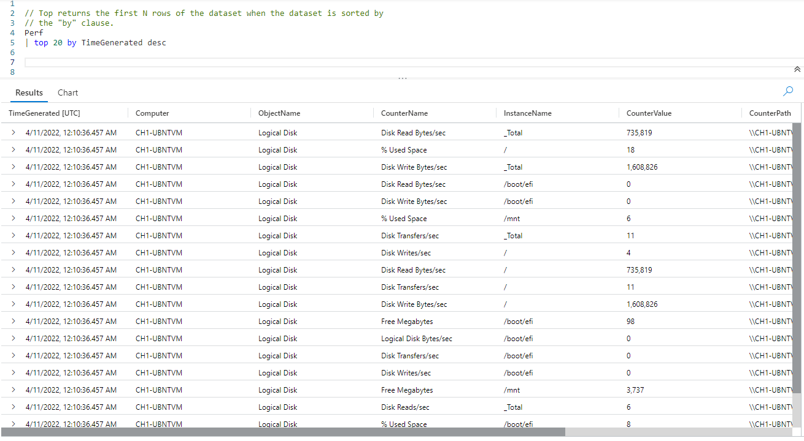
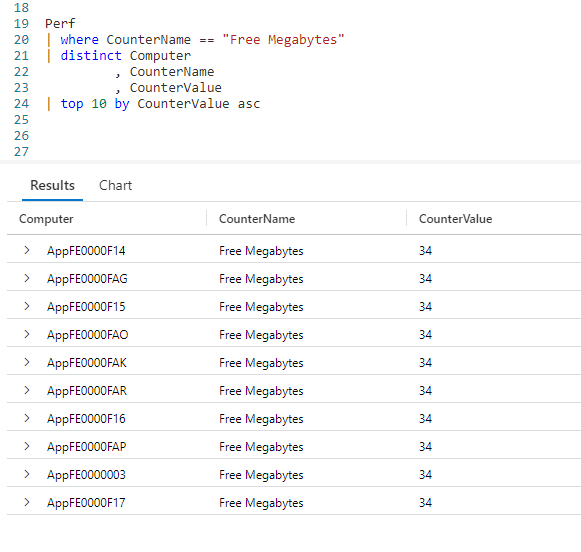

# Fun With KQL - Top

## Introduction

Top 10 lists are all the rage on the internet. Everywhere you look you see "Top 10 Cute Kitten Videos" or "Top 10 Pluralsight Videos by ArcaneCode".

KQL includes a `top` operator so you can generate your own top lists. Even better, you are not limited to just ten items either.

The samples in this post will be run inside the LogAnalytics demo site found at [https://aka.ms/LADemo](https://aka.ms/LADemo). This demo site has been provided by Microsoft and can be used to learn the Kusto Query Language at no cost to you.

If you've not read my introductory post in this series, I'd advise you to do so now. It describes the user interface in detail. You'll find it at [https://arcanecode.com/2022/04/11/fun-with-kql-the-kusto-query-language/](https://arcanecode.com/2022/04/11/fun-with-kql-the-kusto-query-language/).

Note that my output may not look exactly like yours when you run the sample queries for several reasons. First, Microsoft only keeps a few days of demo data, which are constantly updated, so the dates and sample data won't match the screen shots.

Second, I'll be using the column tool (discussed in the introductory post) to limit the output to just the columns needed to demonstrate the query. Finally, Microsoft may make changes to both the user interface and the data structures between the time I write this and when you read it.

## Top Basics

Using top is straightforward. Simply pipe a dataset into the `top` operator, indicate how many items you want, then what you want to use to measure the top with.

By using `top` with the **TimeGenerated** datetime column, and adding `desc` to get descending order, we get the most recent 20 rows that are in the `Perf` table.

## Top Troubleshooting

The `top` operator has many potential uses. In a financial system it could be used to retrieve the top 10 transactions by monetary amount. Beyond such obvious uses, `top` can also be useful as a troubleshooting tool.

For example, lets say we want to get a list of computers with low disk space as recorded in the `Perf` table.

In this query, we'll take the `Perf` table and narrow it down to just rows for the `Free Megabytes` **CounterName**.

Since we don't want to look at every single row, as the same value may have many entires, lets reduce the dataset by using the `distinct` operator to just the computer, counter name, and counter value.

Finally, we use `top` to get the top results sorted in ascending order (least free space to largest) by the **CounterValue**, which in this case is the amount of free disk space in megabytes.

Now we have a list of computers reporting a low disk space. In this case they all have 34 megabytes free, but that is due to this being a sample database.

## Conclusion

In today's post, we covered the `top` operator, and saw several ways it could be used. Hopefully you'll be able to use this operator to get your queries in "top" shape!

The demos in this series of blog posts were inspired by my Pluralsight courses [Kusto Query Language (KQL) from Scratch](https://pluralsight.pxf.io/MXDo5o) and [Introduction to the Azure Data Migration Service](https://pluralsight.pxf.io/2rQXjQ), two of the many courses I have on Pluralsight. All of my courses are linked on my [About Me](https://arcanecode.com/info/) page.

If you don't have a Pluralsight subscription, just go to [my list of courses on Pluralsight](https://pluralsight.pxf.io/kjz6jn) . At the top is a Try For Free button you can use to get a free 10 day subscription to Pluralsight, with which you can watch my courses, or any other course on the site.

## Navigator
[Table of Contents](../Table%20of%20Contents.md)

Post Link: [Fun With KQL - Top](https://arcanecode.com/2022/06/20/fun-with-kql-top/)

Post URL: [https://arcanecode.com/2022/06/20/fun-with-kql-top/](https://arcanecode.com/2022/06/20/fun-with-kql-top/)
