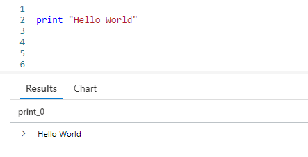

# Fun With KQL - Print

## Introduction

In this post we'll cover the `print` operator. This Kusto operator is primarly used as a development tool, to test calculations.

The samples in this post will be run inside the LogAnalytics demo site found at [https://aka.ms/LADemo](https://aka.ms/LADemo). This demo site has been provided by Microsoft and can be used to learn the Kusto Query Language at no cost to you.

If you've not read my introductory post in this series, I'd advise you to do so now. It describes the user interface in detail. You'll find it at [https://arcanecode.com/2022/04/11/fun-with-kql-the-kusto-query-language/](https://arcanecode.com/2022/04/11/fun-with-kql-the-kusto-query-language/).

Note that my output may not look exactly like yours when you run the sample queries for several reasons. First, Microsoft only keeps a few days of demo data, which are constantly updated, so the dates and sample data won't match the screen shots.

Second, I'll be using the column tool (discussed in the introductory post) to limit the output to just the columns needed to demonstrate the query. Finally, Microsoft may make changes to both the user interface and the data structures between the time I write this and when you read it.

## Print Basics

The `print` operator is very simple. It simply takes the expression after the `print` operator and returns it to the results pane at the bottom.

We passed in a static string of `"Hello World"` and it was displayed at the bottom.

A bit more useful job for print is to verify the formatting of a calculated string using `strcat`. Perhaps it is one that involved multiple column names. You could create and test a rough draft using `print`.

For this example, I want to take four columns and create an output that reads like a normal sentence. Getting the formatting just right can often be a bit of trial and error. Even more, you don't want to keep running long queries just to test your output string formatting.

This is where the `print` operator comes in handy. Here you can see I used placeholders for the column names, surrounding them in double asterisks (although that's not necessary), then included the static strings I'd be using in the final query. This lets me verify I have the spacing right, decide if I like the look of the output, and so forth.

## Print and Calculations

More commonly, you might use `print` to verify a calculation.

Normally your calculations would be more complex, but it would give a way to enter and test it before you apply it to a column of data in a later query.

If you want, you can even give your calculated column a name.

Simply assign a column name prior to the calculation. In the output grid at the bottom you can see it now used the name for the column.

## Print and Dates

A frequent use for `print` is to verify dates. In an upcoming post I'll cover the `ago` function in depth, but briefly you can pass in a value to see what the date would be a certain number of days in the past.

Perhaps you have a query that relies on using `ago` to get the date for one year ago, but it doesn't seem to be working right. You can use `print` to see what date Kusto is calculating.

This lets you verify if the date you think is being used is, in fact, the date Kusto is using.

## Conclusion

In this post we covered the use of the simple `print` operator and some of its uses. Hopefully you'll find creative ways to use it as you develop your Kusto queries.

The demos in this series of blog posts were inspired by my Pluralsight courses [Kusto Query Language (KQL) from Scratch](https://pluralsight.pxf.io/MXDo5o) and [Introduction to the Azure Data Migration Service](https://pluralsight.pxf.io/2rQXjQ), two of the many courses I have on Pluralsight. All of my courses are linked on my [About Me](https://arcanecode.com/info/) page.

If you don't have a Pluralsight subscription, just go to [my list of courses on Pluralsight](https://pluralsight.pxf.io/kjz6jn) . At the top is a Try For Free button you can use to get a free 10 day subscription to Pluralsight, with which you can watch my courses, or any other course on the site.

## Navigator
[Table of Contents](../Table%20of%20Contents.md)

Post Link: [Fun With KQL - Print](https://arcanecode.com/2022/06/27/fun-with-kql-print/)

Post URL: [https://arcanecode.com/2022/06/27/fun-with-kql-print/](https://arcanecode.com/2022/06/27/fun-with-kql-print/)
