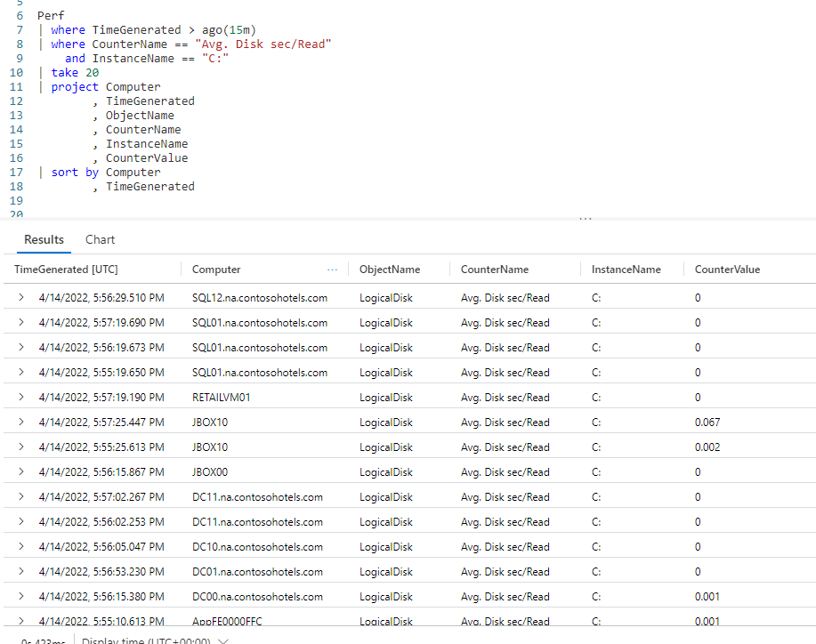
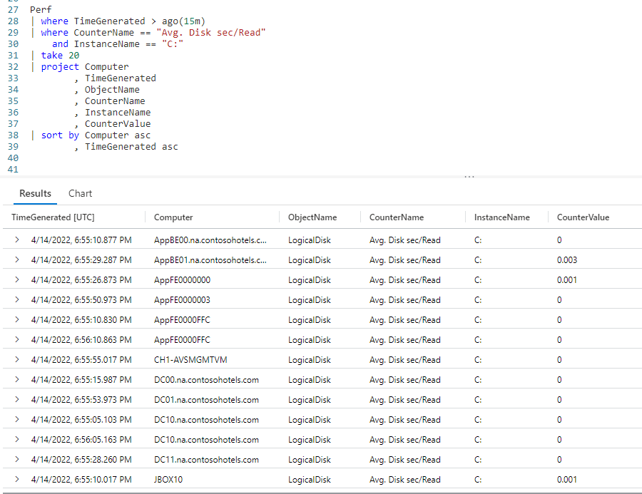
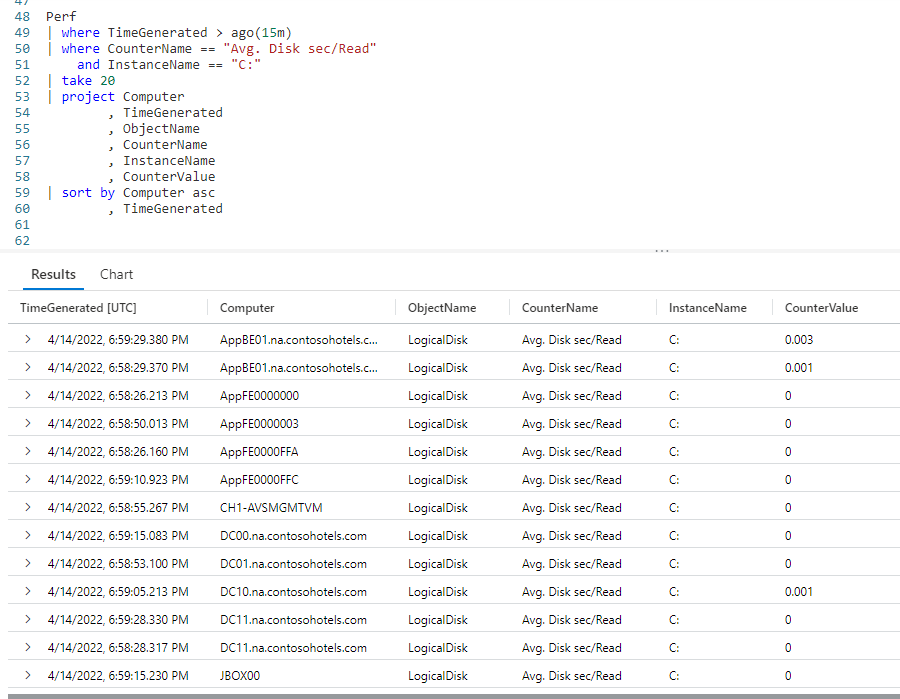
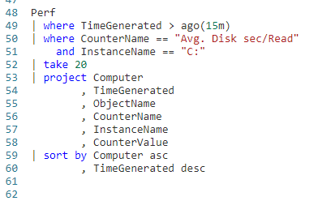
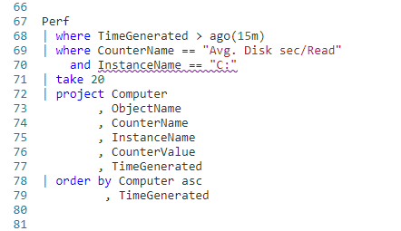

# Fun With KQL - Sort

## Introduction

Like most query languages, the Kusto Query Language as the ability to sort the output. It works almost, but not quite, like you expect. So let's take a look at the KQL `sort` operator.

First though, let me mention the samples in this post will be run inside the LogAnalytics demo site found at [https://aka.ms/LADemo](https://aka.ms/LADemo). This demo site has been provided by Microsoft and can be used to learn the Kusto Query Language at no cost to you.

If you've not read my introductory post in this series, I'd advise you to do so now. It describes the user interface in detail. You'll find it at [https://arcanecode.com/2022/04/11/fun-with-kql-the-kusto-query-language/](https://arcanecode.com/2022/04/11/fun-with-kql-the-kusto-query-language/).

Note that my output may not look exactly like yours when you run the sample queries for several reasons. First, Microsoft only keeps a few days of demo data, which are constantly updated, so the dates and sample data won't match the screen shots.

Second, I'll be using the column tool (discussed in the introductory post) to limit the output to just the columns needed to demonstrate the query. Finally, Microsoft may make changes to both the user interface and the data structures between the time I write this and when you read it.

## Sort Basics

Using `sort` is just about like you'd expect. You take your query, and pipe the output into the `sort` operator. After the `by` you simply list the column or columns to sort by.

Here we pipe our `Perf` table into two `where` clauses to first reduce the output to the last 15 minutes using `ago`, then further reduce for only rows with a **CounterName** of `Avg. Disk sec/Read` and the **InstanceName** of `C:`.

From here we use a `take`, to grab 20 random rows just to keep this result set small for the demo. A `project` follows, to reduce the columns we want.

Finally is our `sort` operator. It will sort our output first by the **Computer** column, then by the **TimeGenerated**. (If you need further info on any of these commands, refer to the **See Also** section below.)

Now take a look at the output, specifically the **Computer** column. You'll see we have computers with SQL first. Then there's a Retail computer, then some entries for JBOX.

"Wait!" you might be yelling at your computer. "That's not sorted right!"

Well in fact it is, since by default the `sort` operator sorts in _descending_ order. With text based fields, like **Computer**, it sorts Z to A.

With numeric fields it sorts biggest to smallest, and with dates the most recent to the farthest back in time.

Frequently you want to get the biggest values for troubleshooting. Which computers had the biggest network latency? Which computers have the largest amount of disk space used? Hence the developers of Kusto chose to have the default for `sort` be descending.

## Sort in Ascending Order

Not to worry though, it is easy to get your output to sort in ascending order.

All you have to do is place the `asc` keyword after the column name, and it will now sort smallest to largest. As you can see, the **Computer** column now starts with the A's, then C's, and so on. Likewise the **TimeGenerated** starts with the oldest, then works its way forward in time.

## Mixed Sorting

The nice thing about placing the sort order after the column name is that you can set the sort order for each column independent of the other columns.

Here we simply removed the `asc` after the **TimeGenerated** column in the `by`. Now the **Computer** column will sort alphabetically, A to Z, but the **TimeGenerated** will sort in descending order, most recent to oldest.

There is actually a `desc` keyword you can use.

In terms of syntax, it makes no difference whether you use `desc` or not, as descending order is the default. However, I personally think it makes a big difference in terms of _readability_.

If you have `asc` on some columns, but not others, readers of your query (including you later) may wonder "well did they intend to sort in descending order, or did they forget to put an `asc` on the end?"

By explicitly having the `desc` in the query, you remove all doubt. Yes indeed, you meant for this column to be in descending order. As such I'd encourage you to always use `desc` whenever you have `asc` as part of your `sort` operator.

## Order By

Are you coming to KQL from an SQL world? Well to make it easier, Kusto includes an `order by` operator.

The `order by` is just a synonym for `sort by`. As such it behaves _exactly_ the same.

## See Also

The following operators and / or functions were used in this article's demos. You can learn more about them in some of my previous posts, linked below.

[Fun With KQL - Where](https://arcanecode.com/2022/04/25/fun-with-kql-where/)

[Fun With KQL - Take](https://arcanecode.com/2022/05/02/fun-with-kql-take/)

[Fun With KQL - Project](https://arcanecode.com/2022/05/30/fun-with-kql-project/)

[Fun With KQL - Ago](https://arcanecode.com/2022/07/11/fun-with-kql-ago/)

## Conclusion

In this post we saw how to sort your query results using the `sort` operator. We learned that it defaults to descending order, but you can override that with the `asc` keyword. Finally we learned about the synonym for `sort by`, `order by`.

The demos in this series of blog posts were inspired by my Pluralsight courses [Kusto Query Language (KQL) from Scratch](https://pluralsight.pxf.io/MXDo5o) and [Introduction to the Azure Data Migration Service](https://pluralsight.pxf.io/2rQXjQ), two of the many courses I have on Pluralsight. All of my courses are linked on my [About Me](https://arcanecode.com/info/) page.

If you don't have a Pluralsight subscription, just go to [my list of courses on Pluralsight](https://pluralsight.pxf.io/kjz6jn) . At the top is a Try For Free button you can use to get a free 10 day subscription to Pluralsight, with which you can watch my courses, or any other course on the site.

## Navigator
[Table of Contents](../Table%20of%20Contents.md)

Post Link: [Fun With KQL - Sort](https://arcanecode.com/2022/07/18/fun-with-kql-sort/)

Post URL: [https://arcanecode.com/2022/07/18/fun-with-kql-sort/](https://arcanecode.com/2022/07/18/fun-with-kql-sort/)
