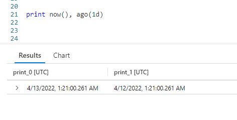
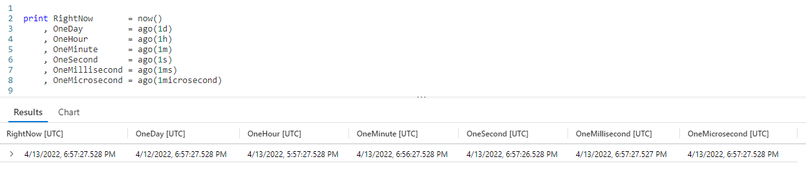
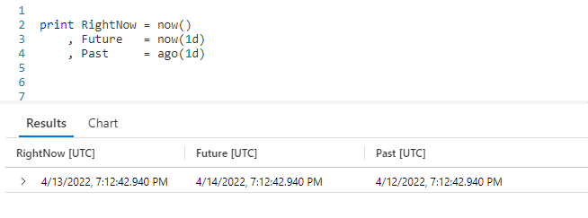
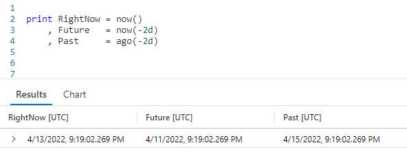
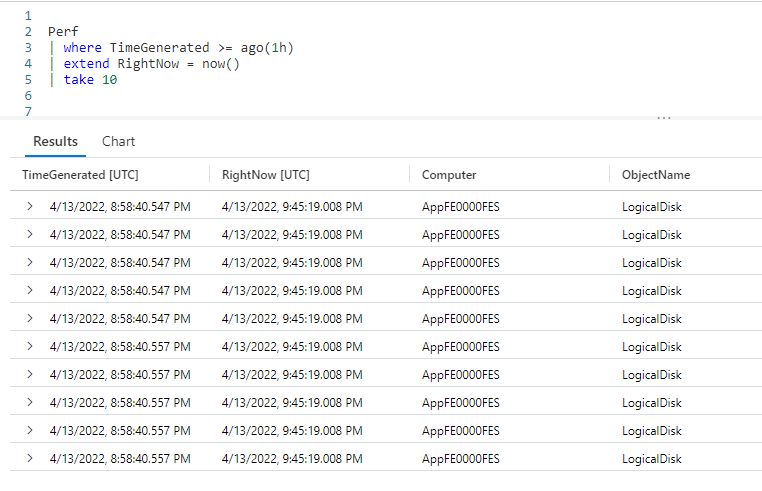
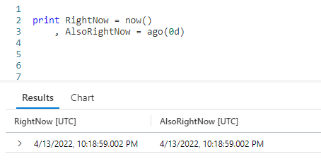

# Fun With KQL - Ago

## Introduction

The `ago` function is very similar to the `now` function, which was discussed in my previous post [Fun With KQL - Now](https://arcanecode.com/2022/07/04/fun-with-kql-now/). In this article we'll take a look at `ago`, see how it works and how it differs from `now`.

We'll be using both the `print` operator and the `now` function in this post, so if you aren't familiar with them please go read my articles [Fun With KQL - Print](https://arcanecode.com/2022/06/27/fun-with-kql-print/) and [Fun With KQL - Now](http://).

In addition, I also use the `where` operator, documented in [Fun With KQL - Where](https://arcanecode.com/2022/04/25/fun-with-kql-where/), the `extend` operator, which I discussed in the article [Fun With KQL - Extend](https://arcanecode.com/2022/05/23/fun-with-kql-extend/), and `take`, which you'll find more information in [Fun With KQL - Take](https://arcanecode.com/2022/05/02/fun-with-kql-take/).

The samples in this post will be run inside the LogAnalytics demo site found at [https://aka.ms/LADemo](https://aka.ms/LADemo). This demo site has been provided by Microsoft and can be used to learn the Kusto Query Language at no cost to you.

If you've not read my introductory post in this series, I'd advise you to do so now. It describes the user interface in detail. You'll find it at [https://arcanecode.com/2022/04/11/fun-with-kql-the-kusto-query-language/](https://arcanecode.com/2022/04/11/fun-with-kql-the-kusto-query-language/).

Note that my output may not look exactly like yours when you run the sample queries for several reasons. First, Microsoft only keeps a few days of demo data, which are constantly updated, so the dates and sample data won't match the screen shots.

Second, I'll be using the column tool (discussed in the introductory post) to limit the output to just the columns needed to demonstrate the query. Finally, Microsoft may make changes to both the user interface and the data structures between the time I write this and when you read it.

## Ago Basics

The `ago` function allows you to pass in a time offset in as a parameter. It will then go that length of time into the past and retrieve the date. For example, to get yesterdays date, we would pass in a value of `1d`.

Below is a chart of the time span notations you can use.

| Abbreviation | Time Unit |
|------:|:------|
|            d | days |
|            h | hours |
|            m | minutes |
|            s | seconds |
|           ms | milliseconds |
|  microsecond | microseconds |

As you can see in the output, `ago`, like the `now` function, works with a variety of time spans. For this example we used the simple `1d`, but the number can be anything. `365d`, `12h`, `30m` are all valid time spans to use with both `ago` and `now`.

## Ago vs Now

The big difference between `ago` and `now` is the way they handle input parameters. When you pass in a positive value into `ago`, it goes that many time spans into the _past_. With `now`, it goes that many time spans into the _future_.

The current date (when I did the screen capture) is April 13, 2022. Passing in `1d` to `now` returned April 14th, where the same `1d` into `ago` returned April 12.

So what happens if we pass in negative values to these functions? As it turns out, `ago` winds up behaving like `now`, and `now` behaves like `ago`.

With `now` being April 13, passing in a negative `-2d` to `now` gives us a date two days in the _past_, April 11.

Likewise, passing in a `-2d` into `ago`, gives us two days in the _future_.

## Using Ago In Queries

The most common use of `ago` is in queries, combined with the `where` operator, to limit results for the last hour, day, or other time span.

Here, I used the `where` operator, combined with the `ago` function, to say "give all rows that occurred within the last hour".

I then added an `extend` operator to add the current date time (using `now`) just to show the current time. This isn't something you'd normally do, but I wanted it to illustrate this concept. Finally it is piped into the `take` operator to give just a few rows for this sample.

In the output, the **RightNow** showed the current time when I ran the query was 9:45 pm. Thus, one hour ago would be 8:45 pm. As you can see in the **TimeGenerated** column, all of the times were after 8:45 pm.

## Why Have Ago AND Now?

So after learning about these two functions, which essentially do the same thing, you may wonder "why have both `ago` and `now`?"

Simply put, readability. When we see negative values, the brain has to stop and think a moment about what is going on. Having both functions avoids this.

When you see `ago`, your brain automatically understands this is generating a date in the past. When you see just `now()`, you instinctively know this is the current date. Finally, if you see `now` with a parameter you know this is calculating a date in the future.

By the way, you can also make `ago` simulate `now` by passing in a time span with a value of 0 (zero).

Here I used a `d` for the time span, but any time span notation would have worked, `0m`, `0s`, and so on. I don't actually recommend this however, this is a case where you really should be using `now`. I just wanted to mention it in case you happen to encounter it at some point in the future.

## Conclusion

In article we covered the use of the `ago` function to calculate dates in the past. We contrasted it with the `now` function, and learned when to use each of these functions to make our code more readable.

The demos in this series of blog posts were inspired by my Pluralsight courses [Kusto Query Language (KQL) from Scratch](https://pluralsight.pxf.io/MXDo5o) and [Introduction to the Azure Data Migration Service](https://pluralsight.pxf.io/2rQXjQ), two of the many courses I have on Pluralsight. All of my courses are linked on my [About Me](https://arcanecode.com/info/) page.

If you don't have a Pluralsight subscription, just go to [my list of courses on Pluralsight](https://pluralsight.pxf.io/kjz6jn) . At the top is a Try For Free button you can use to get a free 10 day subscription to Pluralsight, with which you can watch my courses, or any other course on the site.

## Navigator
[Table of Contents](../Table%20of%20Contents.md)

Post Link: [Fun With KQL - Ago](https://arcanecode.com/2022/07/11/fun-with-kql-ago/)

Post URL: [https://arcanecode.com/2022/07/11/fun-with-kql-ago/](https://arcanecode.com/2022/07/11/fun-with-kql-ago/)
