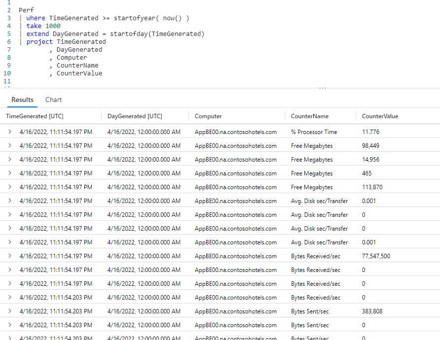
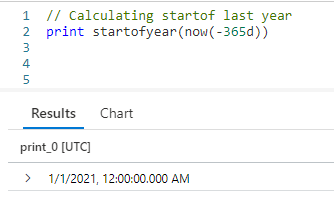
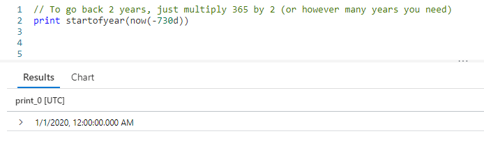
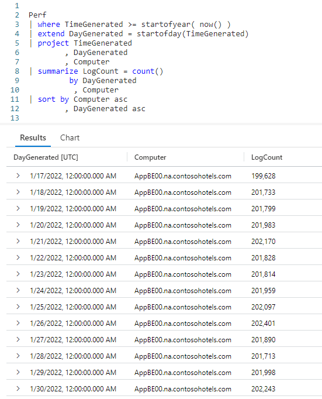
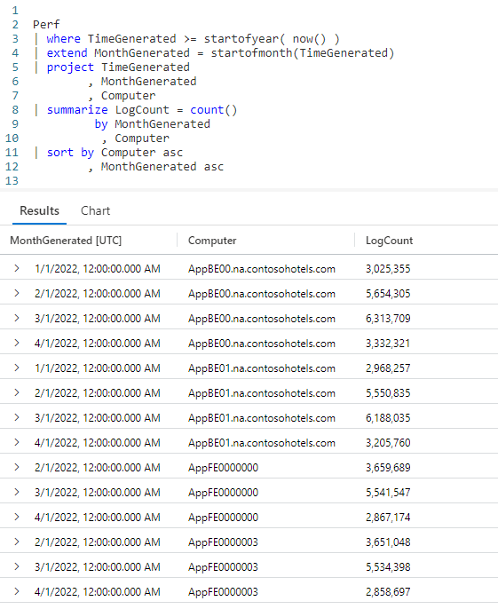
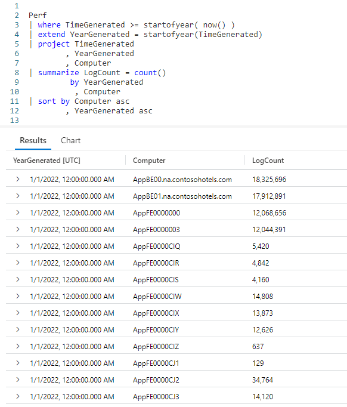
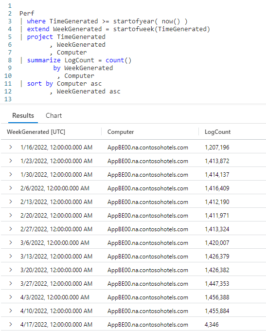

# Fun With KQL - StartOf

## Introduction

In the previous post, [Fun With KQL - DateTime Arithmetic](https://arcanecode.com/2022/08/08/fun-with-kql-datetime-arithmetic/), we had hard coded a date for the start of the year, in order ~~to~~ find out how much time had elapsed between it and datetime columns. I had mentioned there are ways to dynamically calculate such values.

In this post we'll look at one way, using the `StartOf...` functions. These include `startofyear`, `startofday`, `startofmonth`, and `startofweek`.

Before we get into the `StartOf...` collection of functions, I want to point out that the samples in this post will be run inside the LogAnalytics demo site found at [https://aka.ms/LADemo](https://aka.ms/LADemo). This demo site has been provided by Microsoft and can be used to learn the Kusto Query Language at no cost to you.

If you've not read my introductory post in this series, I'd advise you to do so now. It describes the user interface in detail. You'll find it at [https://arcanecode.com/2022/04/11/fun-with-kql-the-kusto-query-language/](https://arcanecode.com/2022/04/11/fun-with-kql-the-kusto-query-language/).

Note that my output may not look exactly like yours when you run the sample queries for several reasons. First, Microsoft only keeps a few days of demo data, which are constantly updated, so the dates and sample data won't match the screen shots.

Second, I'll be using the column tool (discussed in the introductory post) to limit the output to just the columns needed to demonstrate the query. Finally, Microsoft may make changes to both the user interface and the data structures between the time I write this and when you read it.

## StartOf Basics

In this first example, we'll use two of the `StartOf` functions.

First we use the `startofyear` function in the `where` operator to return all rows whose **TimeGenerated** occurred since the start of the current year. That would be 2022 as I write this, but would calculate back to January 1 for whatever the current year is.

Next, as I've done in past articles I use the `take` operator to keep our sample small, since this is just a demo.

The next line uses the `extend` operator to add a new column, **DayGenerated**. It uses the `startofday` function, into which we pass the datetime column of **TimeGenerated**.

_The start of the day will always begin at midnight, 12:00:00.000 AM._

From here we flow into a `project` to display the essential columns. In here you can contrast the **TimeGenerated** column with our new calculated column of **DayGenerated**.

## StartOf Previous Years

In the previous example we returned the start of the current year. What if we wanted the start of _last_ year? Well that is pretty easy with a little math.

In this example, we simply took `now` and passed in an off set of `-365d`, or 365 days in the past, putting into last year.

It's April 20, 2022 as I write this, so that would return April 20, 2021. Using that date, `startofyear` willl return January 1, 2021.

Need to go two years back? No problem, just multiple the offset of -365 by the number of years.

Two years ago would be 365 * 2, or 768 days in the past. Sure enough we get a date of January 1, 2020.

## Summarize by StartOfDay

Let's move on to do something more useful. In previous articles we've used the `summarize` operator to summarize counts by things like the computer name, or perhaps the counter name.

We can use the `startofday` function to return the number of entries into the `Perf` table for each day.

As before, we pipe `Perf` into a `where` to get results since the start of the current year.

Next, we use an `extend` to calculate the **DayGenerated**, using the `startofday` for the **TimeGenerated**.

We then `project` only the few columns we need. The `summarize` operator comes next, so we can get counts for each **Computer** for the day the data was generated. Finally we sort by the computer name and day generated in the output.

The result is a common use for the `startofday` function, one you will probably use frequently.

## Summarize by StartOfMonth

Getting monthly summaries of counts is also a common need, so let's employ the `startofmonth` to get these.

As you can see, our query is identical to the previous one, except of course for the use of the `startofmonth` function. In the output, you can now see the log counts for each month, broken out by computer name.

## Summarizing By StartOfYear

Once again, we can use another `startof` function to summarize by year.

Again, just like the previous query except we use `startofyear` in the `summarize` operator. Note too we could have used `now(-365d)` to get this year and last years data, although in the sample database most of the tables only have current year data.

## Summarize by StartOfWeek

One last example, we can do summaries by week.

Here you can see using `startofweek` in our query resulted in weekly buckets for our data. This can be helpful when we want to compare data week over week. By defaults weeks start on Sunday.

## See Also

The following operators, functions, and/or plugins were used or mentioned in this article's demos. You can learn more about them in some of my previous posts, linked below.

[Fun With KQL - Extend](https://arcanecode.com/2022/05/23/fun-with-kql-extend/)

[Fun With KQL - Project](https://arcanecode.com/2022/05/30/fun-with-kql-project/)

[Fun With KQL - Sort](https://arcanecode.com/2022/07/18/fun-with-kql-sort/)

[Fun With KQL - Summarize](https://arcanecode.com/2022/05/16/fun-with-kql-summarize/)

[Fun With KQL - Take](https://arcanecode.com/2022/05/02/fun-with-kql-take/)

[Fun With KQL - Where](https://arcanecode.com/2022/04/25/fun-with-kql-where/)

## Conclusion

In this article we used the `startof...` collection of functions to limit the data being returned as part of our `where` operator. We also saw how these functions could be used to group the data into discrete buckets of time.

Just like `startof...`, there are a corresponding collection of `endof...` functions, which we'll examine in the next article.

The demos in this series of blog posts were inspired by my Pluralsight courses [Kusto Query Language (KQL) from Scratch](https://pluralsight.pxf.io/MXDo5o) and [Introduction to the Azure Data Migration Service](https://pluralsight.pxf.io/2rQXjQ), two of the many courses I have on Pluralsight. All of my courses are linked on my [About Me](https://arcanecode.com/info/) page.

If you don't have a Pluralsight subscription, just go to [my list of courses on Pluralsight](https://pluralsight.pxf.io/kjz6jn) . At the top is a Try For Free button you can use to get a free 10 day subscription to Pluralsight, with which you can watch my courses, or any other course on the site.

## Navigator
[Table of Contents](../Table%20of%20Contents.md)

Post Link: [Fun With KQL - StartOf](https://arcanecode.com/2022/08/15/fun-with-kql-startof/)

Post URL: [https://arcanecode.com/2022/08/15/fun-with-kql-startof/](https://arcanecode.com/2022/08/15/fun-with-kql-startof/)
