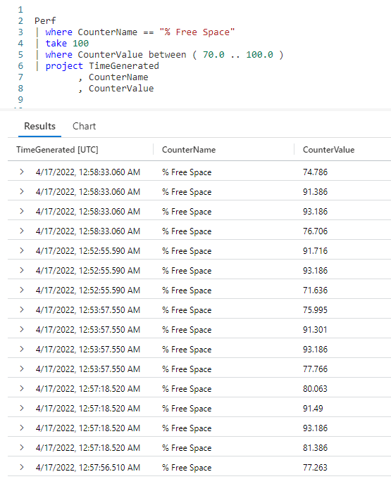
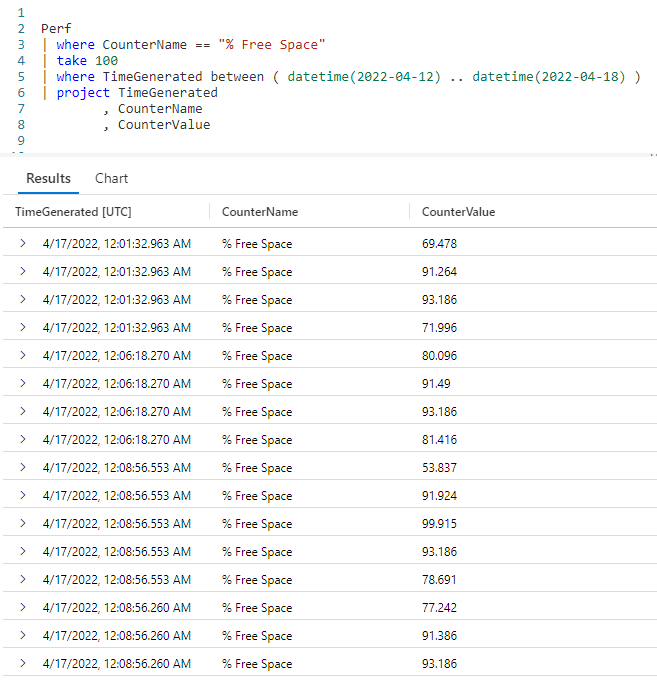
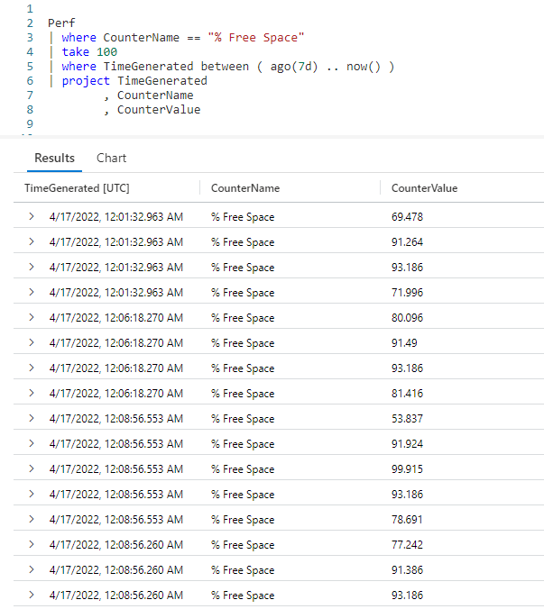
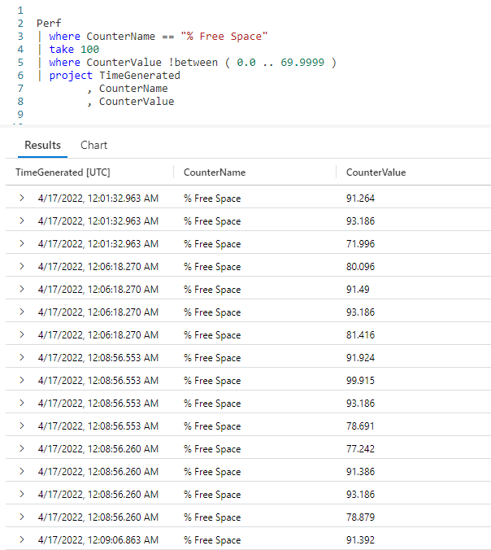

# Fun With KQL - Between

## Introduction

It's not uncommon to want to use a range of values when creating a Kusto query. This might be a range of numeric values, or perhaps a range of dates.

Kusto provides this ability using the `between` operator. In this post we'll see how to use it when authoring your Kusto queries.

Just between you and me, the samples in this post will be run inside the LogAnalytics demo site found at [https://aka.ms/LADemo](https://aka.ms/LADemo). This demo site has been provided by Microsoft and can be used to learn the Kusto Query Language at no cost to you.

If you've not read my introductory post in this series, I'd advise you to do so now. It describes the user interface in detail. You'll find it at [https://arcanecode.com/2022/04/11/fun-with-kql-the-kusto-query-language/](https://arcanecode.com/2022/04/11/fun-with-kql-the-kusto-query-language/).

Note that my output may not look exactly like yours when you run the sample queries for several reasons. First, Microsoft only keeps a few days of demo data, which are constantly updated, so the dates and sample data won't match the screen shots.

Second, I'll be using the column tool (discussed in the introductory post) to limit the output to just the columns needed to demonstrate the query. Finally, Microsoft may make changes to both the user interface and the data structures between the time I write this and when you read it.

## Between for Numeric Ranges

Let's say you want to grab records from the `Perf` table for the percentage of free disk space. But you only want to see it when the **CounterValue** is greater than or equal to 70 percent, up to 100 percent.

You could write the `where` operator like `where CounterValue >= 70 and CounterValue <= 100`, but that gets a bit wordy. The `between` operator is not only easier to read, but is more efficient.

We start with the `Perf` table, then use a `where` to limit the dataset to only rows that hold the `% Free Space` counter data. We then use a `take` operator, to keep the demo sample small.

Now comes the star of this post, the `between`. Using a `where`, you specify the column name. Then comes the `between` operator. In parentheses, you place the starting value, two periods, then the ending value. Here, we go from `70.0` up to `100.0`. This will include all rows with the starting value, `70.0`, as well as rows with the ending value of `100.0`.

In the results, you can see only rows in our specified range were included in the results. As I mentioned, the `between` is not only easier to read, it can be more efficient than using the `where CounterValue >= 70 and CounterValue <= 100` construction I mentioned earlier.

## Between for Date Ranges

In the introduction I mentioned you could use `between` for more than just a numeric range. It can also be used with dates.

In the `where` operator we used hard coded dates of April 12 to April 18, 2022. We had to put the dates in YYYY-MM-DD format. Because these are _strings_, we needed to use the `datetime` function to convert from a string to a _datetime_ datatype.

In the result pane you can see all of our dates fell into the specified range.

## Between Dynamic Dates

Hard coded dates may be OK for a quick, impromptu query, but for Kusto queries you'll want to run repeatedly having dynamic dates makes more sense.

In this example we used `ago(7d)` to go back one week, with an ending date of right now by using the `now` function. If you want to read more about these two functions see the **See Also** section below for links to past articles I've written about them.

## Not Between

Sometimes it makes more sense to write your Kusto query to _exclude_ a range. For that, KQL includes a not between operator.

In this example we used `!between` to exclude counter values in the range of `0.00` up to and including `69.999`. This produced the same results as our first example.

## See Also

The following operators, functions, and/or plugins were used or mentioned in this article's demos. You can learn more about them in some of my previous posts, linked below.

[Fun With KQL - Ago](https://arcanecode.com/2022/07/11/fun-with-kql-ago/)

[Fun With KQL - DateTime Arithmetic](https://arcanecode.com/2022/08/08/fun-with-kql-datetime-arithmetic/)

[Fun With KQL - EndOf](https://arcanecode.com/2022/08/22/fun-with-kql-endof/)

[Fun With KQL - Now](https://arcanecode.com/2022/07/04/fun-with-kql-now/)

[Fun With KQL - Project](https://arcanecode.com/2022/05/30/fun-with-kql-project/)

[Fun With KQL - StartOf](https://arcanecode.com/2022/08/15/fun-with-kql-startof/)

[Fun With KQL - Take](https://arcanecode.com/2022/05/02/fun-with-kql-take/)

[Fun With KQL - Where](https://arcanecode.com/2022/04/25/fun-with-kql-where/)

## Conclusion

Using the `between` operator allows you to not only write more readable queries, but ones that are more efficent.

The demos in this series of blog posts were inspired by my Pluralsight courses [Kusto Query Language (KQL) from Scratch](https://pluralsight.pxf.io/MXDo5o) and [Introduction to the Azure Data Migration Service](https://pluralsight.pxf.io/2rQXjQ), two of the many courses I have on Pluralsight. All of my courses are linked on my [About Me](https://arcanecode.com/info/) page.

If you don't have a Pluralsight subscription, just go to [my list of courses on Pluralsight](https://pluralsight.pxf.io/kjz6jn) . At the top is a Try For Free button you can use to get a free 10 day subscription to Pluralsight, with which you can watch my courses, or any other course on the site.

## Navigator
[Table of Contents](../Table%20of%20Contents.md)

Post Link: [Fun With KQL - Between](https://arcanecode.com/2022/08/29/fun-with-kql-between/)

Post URL: [https://arcanecode.com/2022/08/29/fun-with-kql-between/](https://arcanecode.com/2022/08/29/fun-with-kql-between/)
