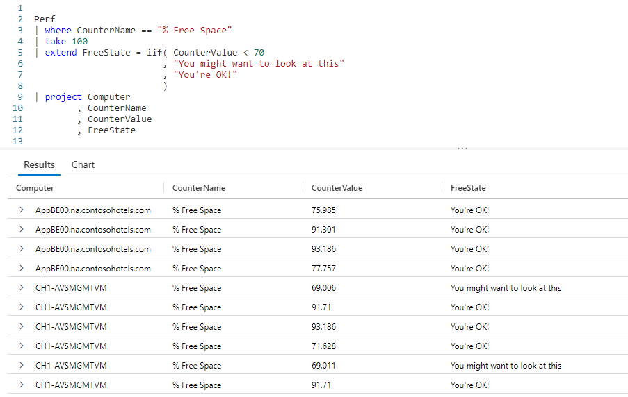
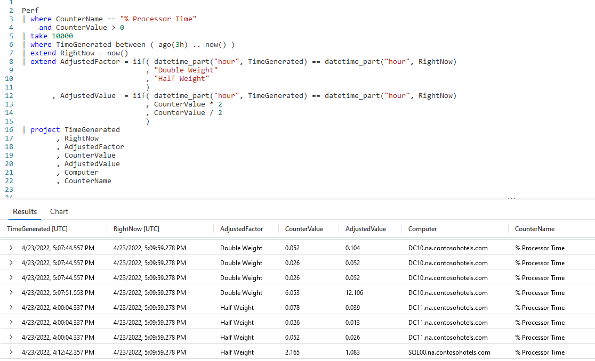

# Fun With KQL - IIF

## Introduction

Pretty much every query language, indeed any coding language, has a form of an _if_ statement. An if statement evaluates a condition for true or false, then takes an action based on that result.

In KQL, this is manifested using the `iif` function. In this post we'll see two examples of how an `iif` can be used in your Kusto queries.

If you recall from previous posts in the series, the samples in this post will be run inside the LogAnalytics demo site found at [https://aka.ms/LADemo](https://aka.ms/LADemo). This demo site has been provided by Microsoft and can be used to learn the Kusto Query Language at no cost to you.

If you've not read my introductory post in this series, I'd advise you to do so now. It describes the user interface in detail. You'll find it at [https://arcanecode.com/2022/04/11/fun-with-kql-the-kusto-query-language/](https://arcanecode.com/2022/04/11/fun-with-kql-the-kusto-query-language/).

Note that my output may not look exactly like yours when you run the sample queries for several reasons. First, Microsoft only keeps a few days of demo data, which are constantly updated, so the dates and sample data won't match the screen shots.

Second, I'll be using the column tool (discussed in the introductory post) to limit the output to just the columns needed to demonstrate the query. Finally, Microsoft may make changes to both the user interface and the data structures between the time I write this and when you read it.

## IIF Basics

In our first example, we'll examine the free disk space counter. If the value is under 70%, we want to display a message to the user that they should look at that computer.

As we've done many times in this series, we start with the `Perf` table, and filter the results to only rows with the `% Free Space` counter. We'll then grab just 100 using the `take` operator to keep a small sample set for this demo.

Next, we use an `extend` to create a new column **FreeState**. Then we call our `iif` function.

The first parameter is the condition. In this case, `CounterValue < 70`. If this evaluates to `true`, the statement in the second parameter is executed. In this case, it returns `You might want to look at this`.

Should the condition evaluate to `false`, the statement in the third parameter is executed. Here, it returns the string `You're OK!`.

In the results pane, you can see the counter values, along with the **FreeState** column. You can verify that the `iif` statement functioned correctly.

## Evaluating Dates with IIF

Let's do something a little more useful with `iif`. We'll examine the current time, and if the **TimeGenerated** is more than one hour hold, we'll apply a _weighted factor_ to our counter value. Sometimes we assign more importance to some data points, for example ones that are more recent may have more importance than older values. Weighted factors are a way of achieving this.

In this case, if the counter value is more than one hour hold we've decided it is not as important as more recent entries. Thus we'll use a weighted factor of 0.5, in other words we'll divide the value by 2. If the counter is within the current hour, we'll multiply by 2, indicating it's data is more important.

We start with our good old `Perf` table. We'll use a `where` to limit the results to our `% Processor Time` counter where its value is greater than zero.

Next we use `take` to limit the result set. We then use an `extend` to capture the current time into the new **RightNow** column. We do this so the value will be consistent across the rest of our query, otherwise you could introduce a subtle bug.

From here we fall into a second `extend` with our `iif` statements. In the first, we use `datetime_part` to get the hour of day from the **TimeGenerated** column. We call on `datetime_part` again to get the current hour from the **RightNow** column we just created.

If they are equal we know this row of data was recent, within the current hour, so we want to apply a double weight to it. For this demo query, we'll illustrate it by returning the text `Double Weight`. Else we return `Half Weight`. This will make it easy to identify which rows should be double and which half.

Now we fall to a second `iif`. The condition is the same as the previous `iif`. For a positive result though, we take our **CounterValue** column and multiply by `2`. In the else portion we divide by 2. (We could have also multiplied by 0.5, and produced the same result.)

Looking over the results pane, you can see we had some rows with a double weight. Looking at the adjusted value we can verify it is indeed twice the original counter value. Likewise we can see the half weight rows are indeed half the counter value.

Note there are other methods we could have used for comparison. Rather than seeing if the **TimeGenerated** was in the same hour of the day as the current time we could have used some date/time arithmetic to see if the **TimeGenerated** occurred within the last sixty minutes.

## See Also

The following operators, functions, and/or plugins were used or mentioned in this article's demos. You can learn more about them in some of my previous posts, linked below.

[Fun With KQL - DateTime Arithmetic](https://arcanecode.com/2022/08/08/fun-with-kql-datetime-arithmetic/)

[Fun With KQL - DateTime_Part]()

[Fun With KQL - Extend](https://arcanecode.com/2022/05/23/fun-with-kql-extend/)

[Fun With KQL - Project](https://arcanecode.com/2022/05/30/fun-with-kql-project/)

[Fun With KQL - Take](https://arcanecode.com/2022/05/02/fun-with-kql-take/)

[Fun With KQL - Where](https://arcanecode.com/2022/04/25/fun-with-kql-where/)

## Conclusion

This article showed a few uses for the `iif` function. First we used it to return a text string based on a condition. Then we performed one of two calculations based on the `iif` condition and returned the result.

In the next article we'll look at another way to make decisions based on a condition, the `case` function.

The demos in this series of blog posts were inspired by my Pluralsight courses [Kusto Query Language (KQL) from Scratch](https://pluralsight.pxf.io/MXDo5o) and [Introduction to the Azure Data Migration Service](https://pluralsight.pxf.io/2rQXjQ), two of the many courses I have on Pluralsight. All of my courses are linked on my [About Me](https://arcanecode.com/info/) page.

If you don't have a Pluralsight subscription, just go to [my list of courses on Pluralsight](https://pluralsight.pxf.io/kjz6jn) . At the top is a Try For Free button you can use to get a free 10 day subscription to Pluralsight, with which you can watch my courses, or any other course on the site.

## Navigator
[Table of Contents](../Table%20of%20Contents.md)

Post Link: [Fun With KQL - IIF](https://arcanecode.com/2022/10/03/fun-with-kql-iif/)

Post URL: [https://arcanecode.com/2022/10/03/fun-with-kql-iif/](https://arcanecode.com/2022/10/03/fun-with-kql-iif/)
