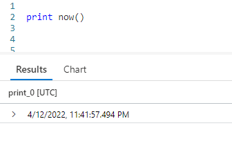
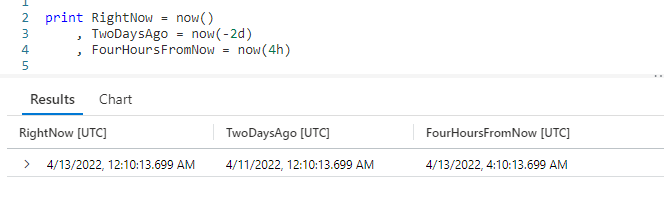
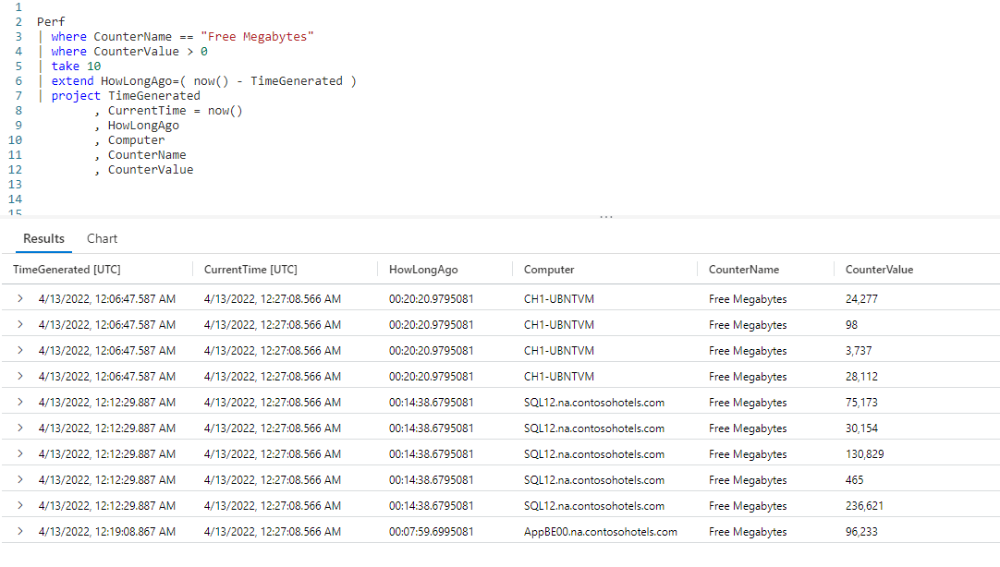

# Fun With KQL - Now

## Introduction

What time is it? That's what the KQL function `now` will tell you. It will return the current date and time. It is mostly used in queries where you need data relative to the current date and time.

Before we go on, let me mention the samples in this post will be run inside the LogAnalytics demo site found at [https://aka.ms/LADemo](https://aka.ms/LADemo). This demo site has been provided by Microsoft and can be used to learn the Kusto Query Language at no cost to you.

If you've not read my introductory post in this series, I'd advise you to do so now. It describes the user interface in detail. You'll find it at [https://arcanecode.com/2022/04/11/fun-with-kql-the-kusto-query-language/](https://arcanecode.com/2022/04/11/fun-with-kql-the-kusto-query-language/).

Note that my output may not look exactly like yours when you run the sample queries for several reasons. First, Microsoft only keeps a few days of demo data, which are constantly updated, so the dates and sample data won't match the screen shots.

Second, I'll be using the column tool (discussed in the introductory post) to limit the output to just the columns needed to demonstrate the query. Finally, Microsoft may make changes to both the user interface and the data structures between the time I write this and when you read it.

## Now Basics

At its simplest, the `now` function returns the current date and time.

Here we used the `print` operator (covered in [Fun With KQL - Print](https://arcanecode.com/2022/06/27/fun-with-kql-print/)) to display the current date time to the results pane at the bottom. Just a reminder, all Kusto functions require the use of parenthesis at the end, even if they are left empty.

## Now With An Offset

The `now` function can accept parameters. You can enter an offset to return a date in the past, or future, relative to the current date and time.

In the first column I get the current date time with `now()` and copy it into the `RightNow` column of the output.

In the second column I pass in a parameter of `-2d` to `now`. This will subtract two days from the current date time and place it in the `TwoDaysAgo` column.

Finally, I pass in a value of `4h` to `now`. This will get the time four hours in the future, again from the current date and time.

Below is a quick reference for common date and time abbreviations that can be passed into Kusto's many date time functions, including `now`.

| Abbreviation | Time Unit |
|------:|:------|
|            d | days |
|            h | hours |
|            m | minutes |
|            s | seconds |
|           ms | milliseconds |
|  microsecond | microseconds |

## Using Now in a Query

You can also use `now` as part of a query, as well as in its calculations.

Here, we took the `Perf` table and piped it through two `where` operators to limit the dataset to only rows with a counter name of `Free Megabytes` whose counter value is greater than zero.

It is then piped through the `take` operator to give us a small sample dataset of ten rows to work with, for demonstration purposes.

Next we use the `extend` operator to add a new column to the dataset naming it `HowLongAgo`. To get this, we subtract the **TimeGenerated** column from `now()`, to see how far in the past this entry was recorded in the `Perf` table. If you look at the value in the first row, the `HowLongAgo` indicates this data was recorded 0 hours, 20 minutes, and 20.9790581 seconds previous to the current date time.

The `project` operator is then used to get only the columns we want, including making a copy of the current date time (using `now`) into the `CurrentTime` column.

If you're not familiar with the operators that were used in this query, you can refer to my past posts for more information.

[Fun With KQL - Where](https://arcanecode.com/2022/04/25/fun-with-kql-where/)

[Fun With KQL - Take](https://arcanecode.com/2022/05/02/fun-with-kql-take/)

[Fun With KQL - Extend](https://arcanecode.com/2022/05/23/fun-with-kql-extend/)

[Fun With KQL - Project](https://arcanecode.com/2022/05/30/fun-with-kql-project/)

## Conclusion

In this post we covered the useful `now` function. It is a function you'll use a lot in your work with Kusto. In the next post we'll look at the other common date function `ago`, and contrast it with `now`.

The demos in this series of blog posts were inspired by my Pluralsight courses [Kusto Query Language (KQL) from Scratch](https://pluralsight.pxf.io/MXDo5o) and [Introduction to the Azure Data Migration Service](https://pluralsight.pxf.io/2rQXjQ), two of the many courses I have on Pluralsight. All of my courses are linked on my [About Me](https://arcanecode.com/info/) page.

If you don't have a Pluralsight subscription, just go to [my list of courses on Pluralsight](https://pluralsight.pxf.io/kjz6jn) . At the top is a Try For Free button you can use to get a free 10 day subscription to Pluralsight, with which you can watch my courses, or any other course on the site.

## Navigator
[Table of Contents](../Table%20of%20Contents.md)

Post Link: [Fun With KQL - Now](https://arcanecode.com/2022/07/04/fun-with-kql-now/)

Post URL: [https://arcanecode.com/2022/07/04/fun-with-kql-now/](https://arcanecode.com/2022/07/04/fun-with-kql-now/)
