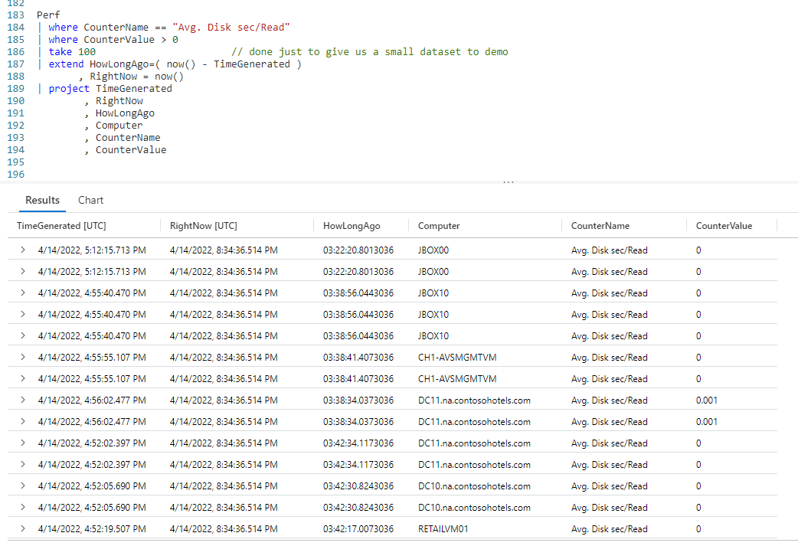
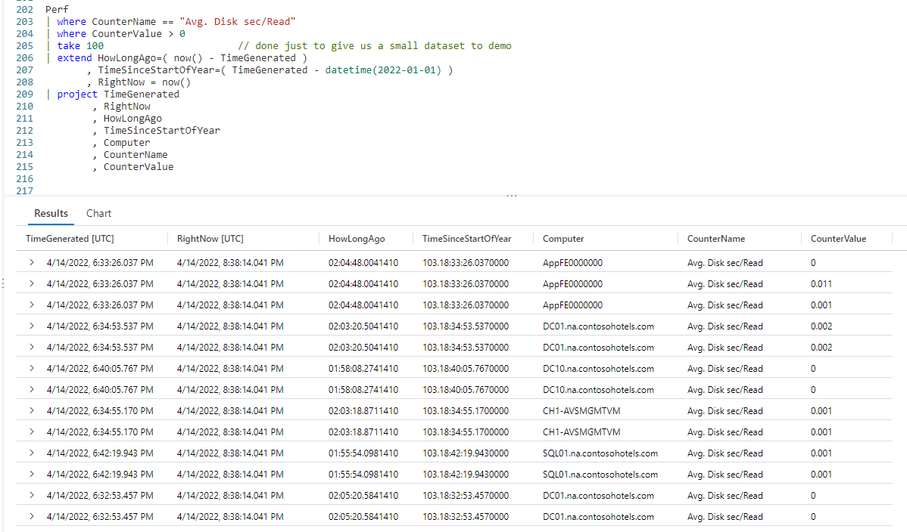
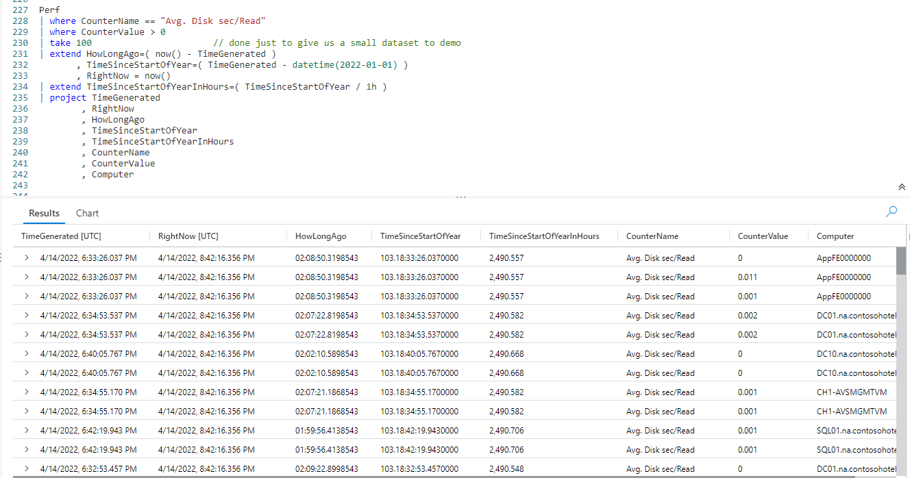
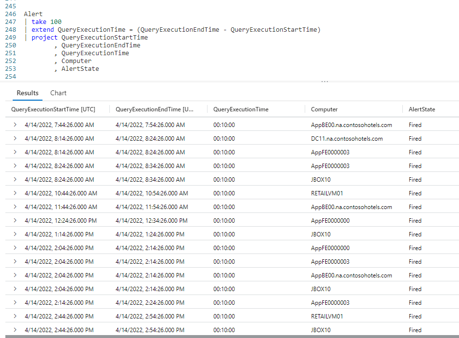

# Fun With KQL - DateTime Arithmetic

## Introduction

Performing DateTime arithmetic in Kusto is very easy. You simply take one DateTime data type object and apply standard math to it, such as addition, subtraction, and more. In this post we'll see some examples of the most common DateTime arithmetic done when authoring KQL.

The samples in this post will be run inside the LogAnalytics demo site found at [https://aka.ms/LADemo](https://aka.ms/LADemo). This demo site has been provided by Microsoft and can be used to learn the Kusto Query Language at no cost to you.

If you've not read my introductory post in this series, I'd advise you to do so now. It describes the user interface in detail. You'll find it at [https://arcanecode.com/2022/04/11/fun-with-kql-the-kusto-query-language/](https://arcanecode.com/2022/04/11/fun-with-kql-the-kusto-query-language/).

Note that my output may not look exactly like yours when you run the sample queries for several reasons. First, Microsoft only keeps a few days of demo data, which are constantly updated, so the dates and sample data won't match the screen shots.

Second, I'll be using the column tool (discussed in the introductory post) to limit the output to just the columns needed to demonstrate the query. Finally, Microsoft may make changes to both the user interface and the data structures between the time I write this and when you read it.

## DateTime Arithmetic Basics

In our first example we'll do something extremely common. We want to know how long ago something happened.

We start by grabbing the `Perf` demo table, then piping it through two `where` operators to limit the data. That is piped into a `take` operator to give us a small sample set. Since this is just a demo we didn't need 30,000 rows.

Now we fall into an `extend`, which is where the fun happens. To see how long ago this row was logged into the `Perf` table, we simply subtract the **TimeGenerated** column from the `now` function, which returns the current datetime. I then assigned this calculated value to the column name of **HowLongAgo**, to prevent KQL from assigning it a dumb column name like **Column1**.

I wrapped the calculation in parenthesis. Technically this wasn't required, it was just to demonstrate the flexibility of the Kusto query language. Sometimes using an item like parenthesis, even when not needed, may make your code more readable.

Within the `extend` I added a second column **RightNow** and set it equal to `now`. This was just so you could see the value being used in the previous calculation.

Finally I pipe to a project to grab the few columns we need to verify our output.

## Time Since A Date

Another use for DateTime arithmetic is determining how long it has been since a specific date. In this example we'll determine how long it has been since the start of the year 2022 (the current year as I write this).

The only difference with this query and the previous one is the addition of a new calculated column, **TimeSinceStartOfYear**. In it, we want to subtract the start of the year, January first, from the **TimeGenerated**.

In order for date arithmetic to work, all components must be of a datetime datatype. We know the **TimeGenerated** column is already a datetime, so we're good to go there.

In order to convert a hard coded date, in this case January first of 2022, we need to use the `datetime` function. This will take the string passed in and make it a datetime datatype. The format passed into `datetime` needs to be in `YYYY-MM-DD` format.

In the results pane, you can see the first row shows 103 days, 18 hours, 33 minutes, and 26.037 seconds since the start of the year!

In this example we hard coded the date, in later posts we'll show how to calcualte things like the start of the current year using functions built into Kusto.

Note, the resulting column from this calculation, **TimeSinceStartOfYear**, is _not_ a datetime datatype, but rather a datatype of _timespan_.

## Timespan Results In Specific Units

In the previous example, we calculated the time since the start of the year until an event was logged in our `Perf` table. It returned the value in a _timespan_ which had days, hours, minutes, and seconds.

What if we needed the time returned in a single unit such as hours? Well that is possible too, using just a bit more date arithmetic.

With the first `extend` operator, we created a new column, **TimeSinceStartOfYear**, which resulted in a _timespan_ datatype. Now we want to express that new timespan in hours.

We can take our new column and pipe it into a second `extend`. In here we'll divide the timespan by the unit we want, in this case hours. In the output this resulted in 2,490,557 hours since the start of 2022.

Any unit could have worked, `1d` would work for days, and is very common for larger timespans. Seconds (`1s`) and minutes (`1m`) are also useful.

You're not restricted to single units either. You could, for example, have used `7d` to return how many weeks are in the timespan, or maybe `365d` to see how many years.

One note, you'll see a lot of repeating values in the output. This is strictly due to this being sample data from Microsoft.

## Date Arithmetic Between Columns

So far all of our calculations have been between a date and a function, such as `now`, or a fixed date (cast using `datetime`).

We can also perform datetime arithmetic between two columns in a dataset.

In this example we'll use a different table in the Log Analytics database, `Alert`. When a query is executed it places that event in the `Alert` table. Included are two columns, which indicate when the query started and when it ended.

We'd like to know just how long each query took to execute. In this example we took the `Alert` table and piped it into a `take` operator to give us a small sample set for this demo.

From there we pipe it into an `extend` where we do our date arithmetic. All we have to do is subtract the **QueryExecutionStartTime** from the **QueryExecutionEndTime** to give the timespan the query took. Yes, it is just that easy, and results in a _timespan_.

We then pipe that into a `project` operator and display the results. As you can see, the **QueryExecutionTime** calculated column resulted in ten minute query times.

Again, like most of the examples in this **Fun With KQL** series, there are a lot of duplicated values due to this being sample data.

## See Also

The following operators and / or functions were used in this article's demos. You can learn more about them in some of my previous posts, linked below.

[Fun With KQL - Where](https://arcanecode.com/2022/04/25/fun-with-kql-where/)

[Fun With KQL - Take](https://arcanecode.com/2022/05/02/fun-with-kql-take/)

[Fun With KQL - Extend](https://arcanecode.com/2022/05/23/fun-with-kql-extend/)

[Fun With KQL - Project](https://arcanecode.com/2022/05/30/fun-with-kql-project/)

[Fun With KQL - Now](https://arcanecode.com/2022/07/04/fun-with-kql-now/)

[Fun With KQL - Ago](https://arcanecode.com/2022/07/11/fun-with-kql-ago/)

## Conclusion

In this post we covered the basics of datetime arithmetic. There are more functions that can be used with datetime arithmetic, which we'll see in upcoming posts in this series.

The demos in this series of blog posts were inspired by my Pluralsight courses [Kusto Query Language (KQL) from Scratch](https://pluralsight.pxf.io/MXDo5o) and [Introduction to the Azure Data Migration Service](https://pluralsight.pxf.io/2rQXjQ), two of the many courses I have on Pluralsight. All of my courses are linked on my [About Me](https://arcanecode.com/info/) page.

If you don't have a Pluralsight subscription, just go to [my list of courses on Pluralsight](https://pluralsight.pxf.io/kjz6jn) . At the top is a Try For Free button you can use to get a free 10 day subscription to Pluralsight, with which you can watch my courses, or any other course on the site.

## Navigator
[Table of Contents](../Table%20of%20Contents.md)

Post Link: [Fun With KQL - DateTime Arithmetic](https://arcanecode.com/2022/08/08/fun-with-kql-datetime-arithmetic/)

Post URL: [https://arcanecode.com/2022/08/08/fun-with-kql-datetime-arithmetic/](https://arcanecode.com/2022/08/08/fun-with-kql-datetime-arithmetic/)
