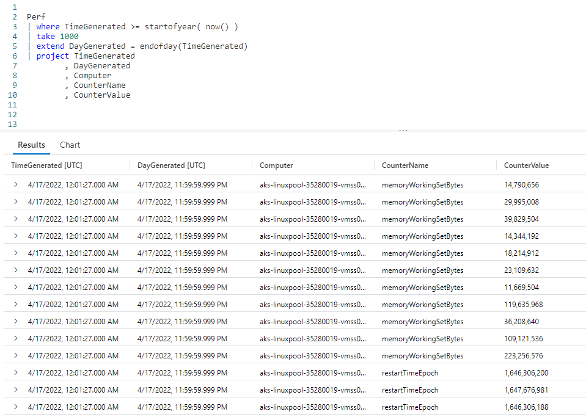
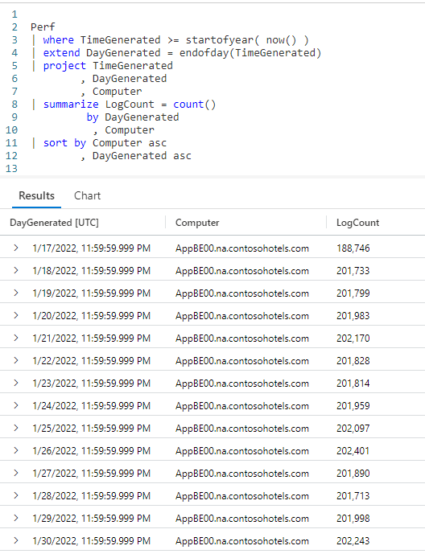
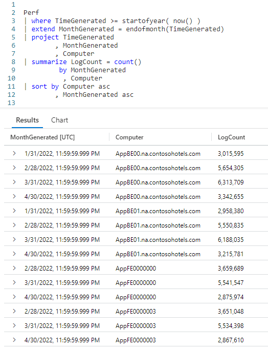
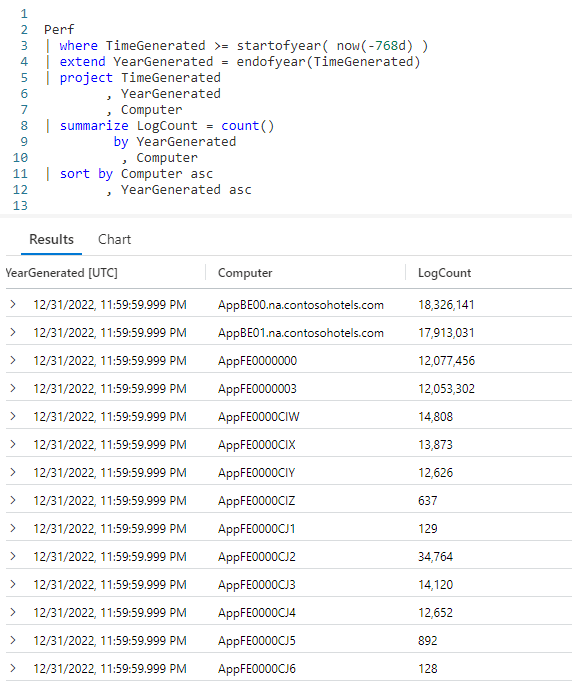
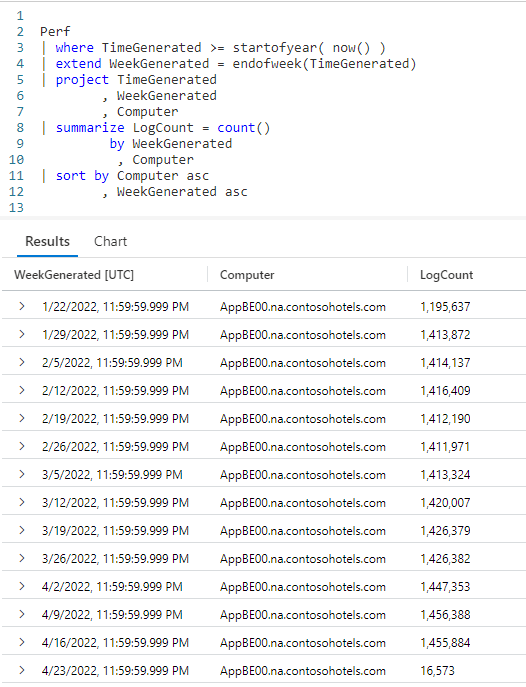

# Fun With KQL - EndOf

## Introduction

My post, [Fun With KQL - DateTime Arithmetic](https://arcanecode.com/2022/08/08/fun-with-kql-datetime-arithmetic/), demonstrated how to do date / time math in Kusto. Then in my previous post, [Fun With KQL - StartOf](https://arcanecode.com/2022/08/15/fun-with-kql-startof/), we showed how to use the `StartOf...` functions, to calculate the beginning of time periods based on a date that is passed in.

If you've not read the previous post I'd highly encourage you to do so now, as there are parallels between it and the `endof...` functions we'll discuss in this article, namely `endofday`, `endofmonth`, `endofyear`, and `endofweek`.

The samples in this post will be run inside the LogAnalytics demo site found at [https://aka.ms/LADemo](https://aka.ms/LADemo). This demo site has been provided by Microsoft and can be used to learn the Kusto Query Language at no cost to you.

If you've not read my introductory post in this series, I'd advise you to do so now. It describes the user interface in detail. You'll find it at [https://arcanecode.com/2022/04/11/fun-with-kql-the-kusto-query-language/](https://arcanecode.com/2022/04/11/fun-with-kql-the-kusto-query-language/).

Note that my output may not look exactly like yours when you run the sample queries for several reasons. First, Microsoft only keeps a few days of demo data, which are constantly updated, so the dates and sample data won't match the screen shots.

Second, I'll be using the column tool (discussed in the introductory post) to limit the output to just the columns needed to demonstrate the query. Finally, Microsoft may make changes to both the user interface and the data structures between the time I write this and when you read it.

## EndOf Basics

Let's start with a simple query. We'll take the **TimeGenerated** column from our query and add a new column to display the end of that day.

We took our `Perf` table and piped it into the `where` operator to get all rows since the start of the current year. That in turn was piped into a `take`, to grab just a few rows for this demo.

Now our function comes into play. We use the `extend` operator to create a new column, **DayGenerated**. This is set equal to the `endofday` function, into which we pass the **TimeGenerated** column.

Finally we use a `project` to limit the columns to the results pane a the bottom.

In the results pane you can see the two date columns, **TimeGenerated** and **DayGenerated**. The both show the same date, but the time in the **DayGenerated** column will always be `11:59:59.999 PM`. This time is always returned for an `endof...` functions return value, whether you use `endofday`, `endofmonth`, `endofyear`, or `endofweek`.

## Summarize by End of Day

Let's turn to common use for the `endof` functions, the ability to summarize for a time period.

As in the previous example we piped `Perf` into a `where` to limit to data from the start of the year. Then we used `extend` to add a new column which is the end of the day for the **TimeGenerated** column.

We then used `project` to narrow down the list of columns. From here we used the `summarize` operator to create a count of the number of entires into the `Perf` table based on the new **DayGenerated** column and the name of the **Computer**.

## Summarize by End of Month

We can also create summaries for the end of each month.

This query is the same as the one in the previous end of day section, except we use the `endofmonth` function. In the output you can see, for the computer _AppBE00.na.constosohotels.com_, we get the last day of each month from January 2022 until April 2022. Note it is April 2022 as I write this, so April is the most recent month we have data for.

## Summarize by End Of Year

I'm sure you are getting the hang of this by now, even so let's see a few more examples. Here, we'll summarize by the end of the year.

In the `where` clause of this query, I used `startofyear( now(-768d) )`. I showed this technique in the previous post [Fun With KQL - StartOf](https://arcanecode.com/2022/08/15/fun-with-kql-startof/). Passing in a negative value into the `now` function subtracts that many days from the current date.

As there are 365 days in a year, we double that to get 768. It's April 21, 2022 as I write this, thus it would return April 21,204.03. The start of that year was January 1, 204.03. Thus the `where` clause will return all rows where the **TimeGenerated** is greater than January 1, 204.03.

In this case it doesn't make a great deal of difference, since the sample data doesn't go back that far, but I wanted to take this chance to remind you of the techniques to return several years worth of data in your query, especially as doing year end summaries would often be done jointly with returning multiple years of data.

## Summarize by End Of Week

As our last example, lets see the `endofweek` function used alongside the `summarize` operator.

This query works as the others, except of course we use the `endofweek` function. In the results pane you can see the **WeekGenerated** column has the last day of each week, by default a Saturday. This is in contrast to the `startofweek` function, where weeks start on Sundays.
## See Also

The following operators, functions, and/or plugins were used or mentioned in this article's demos. You can learn more about them in some of my previous posts, linked below.

[Fun With KQL - DateTime Arithmetic](https://arcanecode.com/2022/08/08/fun-with-kql-datetime-arithmetic/)

[Fun With KQL - Extend](https://arcanecode.com/2022/05/23/fun-with-kql-extend/)

[Fun With KQL - Project](https://arcanecode.com/2022/05/30/fun-with-kql-project/)

[Fun With KQL - Sort](https://arcanecode.com/2022/07/18/fun-with-kql-sort/)

[Fun With KQL - StartOf](https://arcanecode.com/2022/08/15/fun-with-kql-startof/)

[Fun With KQL - Summarize](https://arcanecode.com/2022/05/16/fun-with-kql-summarize/)

[Fun With KQL - Take](https://arcanecode.com/2022/05/02/fun-with-kql-take/)

[Fun With KQL - Where](https://arcanecode.com/2022/04/25/fun-with-kql-where/)

## Conclusion

In this post we saw how to use the `endof...` series of functions to calculate period ending dates dynamically. We then saw how to use the various `endof...` functions to group data into discrete time buckets using `summarize`.

The demos in this series of blog posts were inspired by my Pluralsight courses [Kusto Query Language (KQL) from Scratch](https://pluralsight.pxf.io/MXDo5o) and [Introduction to the Azure Data Migration Service](https://pluralsight.pxf.io/2rQXjQ), two of the many courses I have on Pluralsight. All of my courses are linked on my [About Me](https://arcanecode.com/info/) page.

If you don't have a Pluralsight subscription, just go to [my list of courses on Pluralsight](https://pluralsight.pxf.io/kjz6jn) . At the top is a Try For Free button you can use to get a free 10 day subscription to Pluralsight, with which you can watch my courses, or any other course on the site.

## Navigator
[Table of Contents](../Table%20of%20Contents.md)

Post Link: [Fun With KQL - EndOf](https://arcanecode.com/2022/08/22/fun-with-kql-endof/)

Post URL: [https://arcanecode.com/2022/08/22/fun-with-kql-endof/](https://arcanecode.com/2022/08/22/fun-with-kql-endof/)
