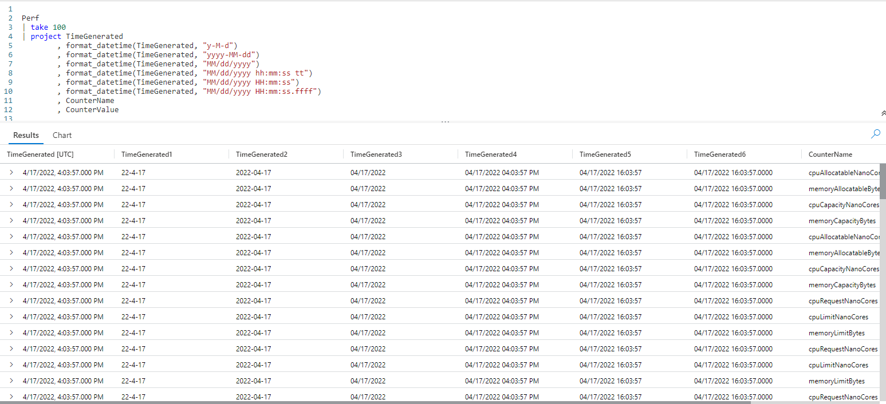
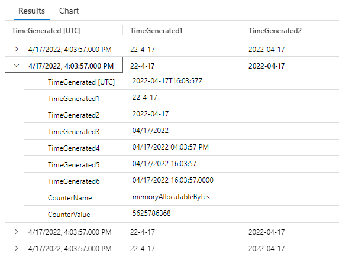
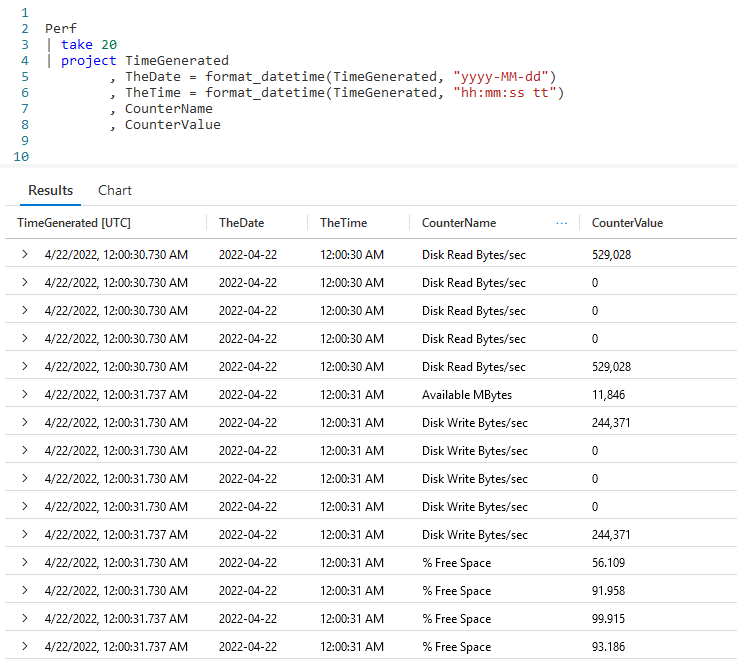

# Fun With KQL - Format_DateTime

Reformatting dates is very common when querying data. You may, for example, wish to come up with a more compact date than the default KQL returns. Perhaps you work for an international company. In some countries you may want the date in month/day/year format, while other countries would prefer day/month/year.

Fortunately Kusto provides the `format_datetime` function that allows you to do just this. We'll take a look at it in this article.

Be aware that the samples in this post will be run inside the LogAnalytics demo site found at [https://aka.ms/LADemo](https://aka.ms/LADemo). This demo site has been provided by Microsoft and can be used to learn the Kusto Query Language at no cost to you.

If you've not read my introductory post in this series, I'd advise you to do so now. It describes the user interface in detail. You'll find it at [https://arcanecode.com/2022/04/11/fun-with-kql-the-kusto-query-language/](https://arcanecode.com/2022/04/11/fun-with-kql-the-kusto-query-language/).

Note that my output may not look exactly like yours when you run the sample queries for several reasons. First, Microsoft only keeps a few days of demo data, which are constantly updated, so the dates and sample data won't match the screen shots.

Second, I'll be using the column tool (discussed in the introductory post) to limit the output to just the columns needed to demonstrate the query. Finally, Microsoft may make changes to both the user interface and the data structures between the time I write this and when you read it.

## Format_DateTime

The `format_datetime` function is very simple to use.

The function requires two parameters. The first is the column to be formatted, which must be of a _datetime_ datatype.

The second is a string, holding the format using _placeholders_, which I'll cover more momentarily. In the above output I formatted the **TimeGenrated** column using a variety of formats.

Since it is a bit hard to read, here it is with one of the rows expanded.

## Format_DateTime Placeholders

There are many placeholders, as shown in the tables below.

| Date Placeholder | Result |
|------:|:------|-------|
|    d | Day, 1 to 31 |
|   dd | Day, 01 to 31 |
|    M | Month, 1 to 12 |
|   MM | Month, 01 to 12 |
|    y | Year, 0 to 9999 |
|   yy | Year, 00 to 9999 |
| yyyy | Year, 0000 to 9999 |

| Time Placeholder | Result |
|------:|:------|-------|
|  h | Hour, 1 to 12 (used with AM/PM)|
| hh | Hour, 01 to 12 (used with AM/PM) |
|  H | Hour, 1 to 23 (24 hour clock) |
| HH | Hour, 01 to 23 (24 hour clock)|
|  m | Minute, 0 to 59 |
| mm | Minute, 00 to 59 |
|  s | Second, 0 to 59 |
| ss | Second, 00 to 59 |
| f | Sub-second |
| F | Sub-second for non-zero vales |
| tt | am/pm |

With the above placeholder syntax, a single letter will result in a single digit. Two characters results in a two digit value.

For example, with one `d`, the first day of the month is returned as `1`. On the other hand, with two `dd`, the first day of the month is returned as `01`.

Note that the lower case `h` for hours should be used with `tt`, to get 12 hour dates in `AM/PM` format. Using upper case `H` will return the time in 24 hour format.

The `f` for sub-seconds will return the amount of sub-seconds for the number of `f`s you supply. Here's an example:

| Value| Format | Result |
|-----:|:----:|:-----|
| 22.016 | f | 22.0 |
| 22.016 | ff | 22.02 |
| 22.016 | fff | 22.016 |
| 22.016 | F | 22 |
| 22.016 | FF | 22.02 |
| 22.016 | FFF | 22.016 |

If you use a lower case `f`, it will place a `0` if the value is zero. With an uppercase `F`, it will suppress the character if it is zero.

## Separators

There are several characters you can use as separators when formatting your datetime data.

| Separator | Character |
|-----:|:-----|
| / | Forward Slash |
| - | Dash |
| : | Colon |
| , | Comma |
| . | Period |
| _ | Underscore |
| [ | Left square bracket |
| ] | Right square bracket |
| | Space |

## Separating Date and Time

Another use for `format_datetime` is separating a datetime column into two parts, a date column and a time column.

Here I created a new column using `project`, **TheDate**, and used `format_datetime` to set it to "yyyy-MM-dd" format. I also created another column, **TheTime**, and formatted it.

As you can see in the output, we now have the **TimeGenerated** column broken into two columns, one for the date part and the second for the time.

If I really needed to, I could have broken this down further. A column for year, another for month, and so on.

In this example I created the calculated column using `project`, I could have opted to do the same thing using an `extend` if that made more sense for my query.

## See Also

The following operators, functions, and/or plugins were used or mentioned in this article's demos. You can learn more about them in some of my previous posts, linked below.

[Fun With KQL - Extend](https://arcanecode.com/2022/05/23/fun-with-kql-extend/)

[Fun With KQL - Project](https://arcanecode.com/2022/05/30/fun-with-kql-project/)

[Fun With KQL - Take](https://arcanecode.com/2022/05/02/fun-with-kql-take/)

## Conclusion

The `format_datetime` function isn't very complicated, but it is very flexible and useful. You can adapt the dates and times in your results to any format you want. Additionally it can be used to break a datetime column into its distinct parts.

The demos in this series of blog posts were inspired by my Pluralsight courses [Kusto Query Language (KQL) from Scratch](https://pluralsight.pxf.io/MXDo5o) and [Introduction to the Azure Data Migration Service](https://pluralsight.pxf.io/2rQXjQ), two of the many courses I have on Pluralsight. All of my courses are linked on my [About Me](https://arcanecode.com/info/) page.

If you don't have a Pluralsight subscription, just go to [my list of courses on Pluralsight](https://pluralsight.pxf.io/kjz6jn) . At the top is a Try For Free button you can use to get a free 10 day subscription to Pluralsight, with which you can watch my courses, or any other course on the site.

## Navigator
[Table of Contents](../Table%20of%20Contents.md)

Post Link: [Fun With KQL - Format_DateTime](https://arcanecode.com/2022/09/12/fun-with-kql-format_datetime/)

Post URL: [https://arcanecode.com/2022/09/12/fun-with-kql-format_datetime/](https://arcanecode.com/2022/09/12/fun-with-kql-format_datetime/)
