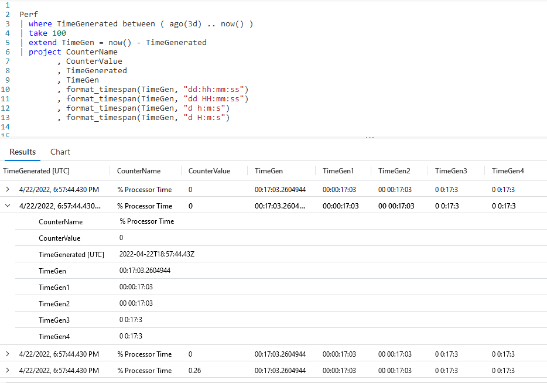
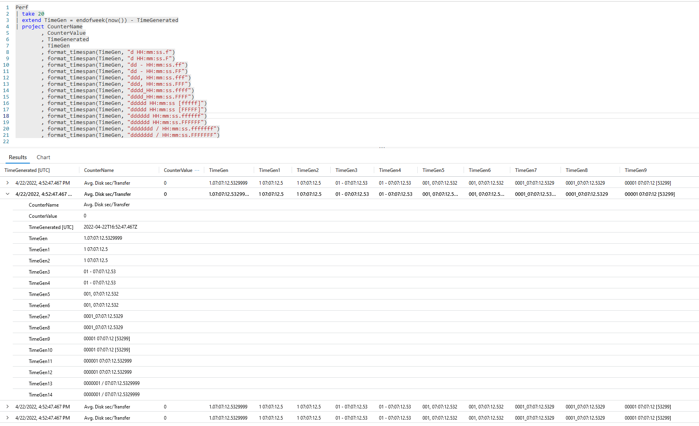
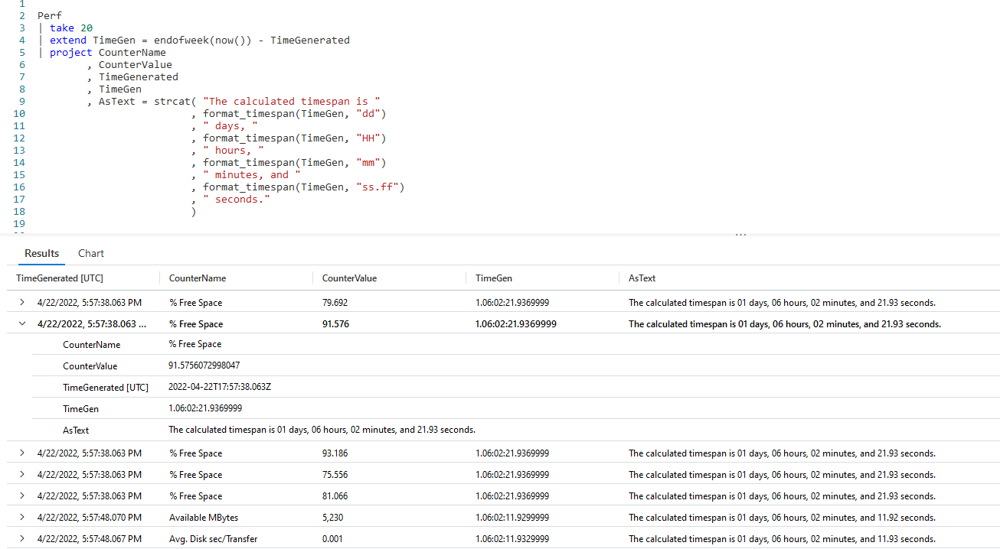

# Fun With KQL - Format_TimeSpan - UNDER CONSTRUCTION

## Introduction

In my previous post, [Fun With KQL - Format_DateTime](https://arcanecode.com/2022/09/12/fun-with-kql-format_datetime/), we showed how to use the `format_datetime` function to reformat a date to your liking.

If you refer back to my post [Fun With KQL - DateTime Arithmetic](https://arcanecode.com/2022/08/08/fun-with-kql-datetime-arithmetic/), you may recall that when you perform any math with datetime data types, such as subtracting one date from another to get the amount of elapsed time, the resulting data type is a _timespan_.

In this post, we'll see how to format _timespan_ data types using the `format_timespan` function.

A timely reminder, be aware that the samples in this post will be run inside the LogAnalytics demo site found at [https://aka.ms/LADemo](https://aka.ms/LADemo). This demo site has been provided by Microsoft and can be used to learn the Kusto Query Language at no cost to you.

If you've not read my introductory post in this series, I'd advise you to do so now. It describes the user interface in detail. You'll find it at [https://arcanecode.com/2022/04/11/fun-with-kql-the-kusto-query-language/](https://arcanecode.com/2022/04/11/fun-with-kql-the-kusto-query-language/).

Note that my output may not look exactly like yours when you run the sample queries for several reasons. First, Microsoft only keeps a few days of demo data, which are constantly updated, so the dates and sample data won't match the screen shots.

Second, I'll be using the column tool (discussed in the introductory post) to limit the output to just the columns needed to demonstrate the query. Finally, Microsoft may make changes to both the user interface and the data structures between the time I write this and when you read it.

## Format_TimeSpan Basics

In this first example, we'll look at some of the simple, basic ways to format a _timespan_ using the `format_timespan` function.

First, we take the `Perf` table and get the last three days of data. Then we use a `take` to grab just a few rows for this sample.

Next we use the `extend` operator to do some datetime arithmetic, to see how far in the past the **TimeGenerated** column was from the time right now. This results in the **TimeGen** column, which is a _timespan_ datatype.

We use the `project` operator to grab a few relevant columns, then we have four entires to demonstrate the `format_timespan` function.

The `d` character is the place holder for the number of days. For each `d` provided it will display the days. If there are more `d`s than there were days, it will pad the day value with leading zeros. For example, if the timespan held 33 days, and you used `dddd` in the function, the result would be `0033`.

Next come the placeholders for hours, minutes, seconds, and sub-seconds. These behave just like they do with `format_datetime`. Below is a chart with the list of allowed formatting characters.

| Time Placeholder | Result |
|------:|:------|
|  d | Days, number of d's indicates how many 0s to use |
|  H | Hour, 1 to 23 (24 hour clock) |
| HH | Hour, 01 to 23 (24 hour clock)|
|  m | Minute, 0 to 59 |
| mm | Minute, 00 to 59 |
|  s | Second, 0 to 59 |
| ss | Second, 00 to 59 |
| f | Sub-second |
| F | Sub-second for non-zero vales |

Note that the 12 hour clock format of `h` (lowercase h's) is not valid. This function measures the number of elapsed hours, not the time of the day.

There's also an assortment of separator characters we can use to separate the individual parts of our timespan, namely the days, hours, minutes and so on.

| Separator | Character |
|-----:|:-----|
| / | Forward Slash |
| - | Dash |
| : | Colon |
| , | Comma |
| . | Period |
| _ | Underscore |
| [ | Left square bracket |
| ] | Right square bracket |
| | Space |

## Format TimeSpan Examples

Below is a screen shot with a query where I created many variations using `format_timespan`.

You may wish to open up this image in a new browser tab so you can easily read it. Because there were so many columns I expanded the second row so you could easily reference all the different formats.

Note that these are not set in stone. I randomly picked a variety of formats, using different characters and separators. You can adapt these to any format you need.

In the `extend` I used the `endofweek` function to get the difference between the **TimeGenerated** and the end of the current week. Honestly, for this example, I did this just so we could get some non zero values in the day position of our output. You could use this method though with any of the `startof...` or `endof...` functions.

## Composing a Sentence using Format_TimeSpan and StrCat

In a future post I'll go more into the `strcat` function, but for now just understand that `strcat` takes all of the values passed in as parameters, and composes them into a single string.

## See Also

The following operators, functions, and/or plugins were used or mentioned in this article's demos. You can learn more about them in some of my previous posts, linked below.

[Fun With KQL - Between](https://arcanecode.com/2022/08/29/fun-with-kql-between/)

[Fun With KQL - DateTime Arithmetic](https://arcanecode.com/2022/08/08/fun-with-kql-datetime-arithmetic/)

[Fun With KQL - EndOf](https://arcanecode.com/2022/08/22/fun-with-kql-endof/)

[Fun With KQL - Extend](https://arcanecode.com/2022/05/23/fun-with-kql-extend/)

[Fun With KQL - Format_DateTime](https://arcanecode.com/2022/09/12/fun-with-kql-format_datetime/)

[Fun With KQL - Project](https://arcanecode.com/2022/05/30/fun-with-kql-project/)

[Fun With KQL - StartOf](https://arcanecode.com/2022/08/15/fun-with-kql-startof/)

[Fun With KQL - Take](https://arcanecode.com/2022/05/02/fun-with-kql-take/)

[Fun With KQL - Where](https://arcanecode.com/2022/04/25/fun-with-kql-where/)

## Conclusion

In this article we saw how to use the `format_timespan` function to create custom formats for the _timespan_ datatype, typically the result of datetime arithmetic.

Our next post will continue the discussion of datetime functions within the Kusto world.

The demos in this series of blog posts were inspired by my Pluralsight courses [Kusto Query Language (KQL) from Scratch](https://pluralsight.pxf.io/MXDo5o) and [Introduction to the Azure Data Migration Service](https://pluralsight.pxf.io/2rQXjQ), two of the many courses I have on Pluralsight. All of my courses are linked on my [About Me](https://arcanecode.com/info/) page.

If you don't have a Pluralsight subscription, just go to [my list of courses on Pluralsight](https://pluralsight.pxf.io/kjz6jn) . At the top is a Try For Free button you can use to get a free 10 day subscription to Pluralsight, with which you can watch my courses, or any other course on the site.

## Navigator
[Table of Contents](../Table%20of%20Contents.md)

Post Link: [Fun With KQL - Format_TimeSpan](https://arcanecode.com/2022/09/19/fun-with-kql-format_timespan/)

Post URL: [https://arcanecode.com/2022/09/19/fun-with-kql-format_timespan/](https://arcanecode.com/2022/09/19/fun-with-kql-format_timespan/)
