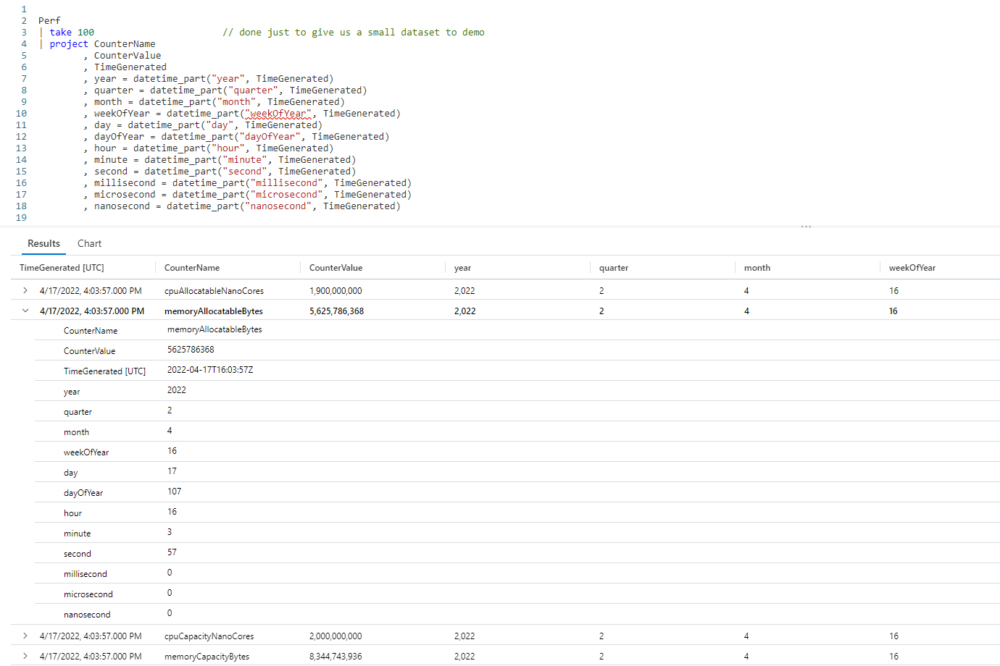

# Fun With KQL - DateTime_Part

## Introduction

In the previous post, [Fun With KQL - Format_TimeSpan](https://arcanecode.com/2022/09/19/fun-with-kql-format_timespan/), we saw how to extract pieces of a _timespan_ datatype. In this post, we'll see how to extract parts of a _datetime_ datatype using the `datetime_part` function.

A timely reminder, the samples in this post will be run inside the LogAnalytics demo site found at [https://aka.ms/LADemo](https://aka.ms/LADemo). This demo site has been provided by Microsoft and can be used to learn the Kusto Query Language at no cost to you.

If you've not read my introductory post in this series, I'd advise you to do so now. It describes the user interface in detail. You'll find it at [https://arcanecode.com/2022/04/11/fun-with-kql-the-kusto-query-language/](https://arcanecode.com/2022/04/11/fun-with-kql-the-kusto-query-language/).

Note that my output may not look exactly like yours when you run the sample queries for several reasons. First, Microsoft only keeps a few days of demo data, which are constantly updated, so the dates and sample data won't match the screen shots.

Second, I'll be using the column tool (discussed in the introductory post) to limit the output to just the columns needed to demonstrate the query. Finally, Microsoft may make changes to both the user interface and the data structures between the time I write this and when you read it.

## DateTime_Part Basics

The `datetime_part` function is quite easy to use. The first parameter is a value that indicates which part of the date to extract. The second parameter is a _datetime_ column you want a part of.

In this example I grabbed the `Perf` table and used `take` to get 100 random rows, in order to keep this sample small. I then use `project` to create new columns using `datetime_part` to get each part of a date.

In the output I expanded the second row so you could see all of the different parts.

These are the valid values for the first parameter to datetime_part.

| Valid Values |
|:-----|
| year |
| quarter |
| month |
| weekofyear (or week_of_year) |
| day |
| dayofyear |
| hour |
| minute |
| second |
| millisecond |
| microsecond |
| nanosecond |

## Summarizing on a DateTime Part

One of the more useful things you can do with `datetime_part` is create summaries based on some common time factor. In this example, we'll get the hour of the day for the **TimeGenerated** column, then see how many items appear for each hour of the day.

Here we get the `Perf` table for all rows in the last 7 days via the `where` operator.

Next, the `extend` operator is used to create a new column, **HourOfDay**. The `datetime_part` function is used to get the hour of the day from the **TimeGenerated** column.

We now pipe into a `project` and only pass on the new **HourOfDay** column.

From here we move into the `summarize` operator, we get a count which we name **PerfCount**, based on the new **HourOfDay** column. Finally we sort the output.

We now have counts for the number of entries into the `Perf` table broken down by the hour of the day.

This kind of query allows you to spot for time of day issues. Perhaps there is a big upsurge in entires in the 5 o'clock hour, you can look for causes and try to mitigate them.

In this case, the distribution of values seems pretty equivalent across the 24 hours (the rest of the hours are towards the bottom just off screen) so you can be assured the load is even throughout the day.

## See Also

The following operators, functions, and/or plugins were used or mentioned in this article's demos. You can learn more about them in some of my previous posts, linked below.

[Fun With KQL - Count](https://arcanecode.com/2022/05/09/fun-with-kql-count/)

[Fun With KQL - Extend](https://arcanecode.com/2022/05/23/fun-with-kql-extend/)

[Fun With KQL - Extract](https://arcanecode.com/2022/07/25/fun-with-kql-extract/)

[Fun With KQL - Project](https://arcanecode.com/2022/05/30/fun-with-kql-project/)

[Fun With KQL - Sort](https://arcanecode.com/2022/07/18/fun-with-kql-sort/)

[Fun With KQL - Summarize](https://arcanecode.com/2022/05/16/fun-with-kql-summarize/)

[Fun With KQL - Take](https://arcanecode.com/2022/05/02/fun-with-kql-take/)

[Fun With KQL - Where](https://arcanecode.com/2022/04/25/fun-with-kql-where/)

## Conclusion

In this article we saw how the `datetime_part` function can be used to extract portions of a column that is of a datetime datatype. We then saw how to `summarize` based on the date part we extracted, in this case the hour of the day.

The demos in this series of blog posts were inspired by my Pluralsight courses [Kusto Query Language (KQL) from Scratch](https://pluralsight.pxf.io/MXDo5o) and [Introduction to the Azure Data Migration Service](https://pluralsight.pxf.io/2rQXjQ), two of the many courses I have on Pluralsight. All of my courses are linked on my [About Me](https://arcanecode.com/info/) page.

If you don't have a Pluralsight subscription, just go to [my list of courses on Pluralsight](https://pluralsight.pxf.io/kjz6jn) . At the top is a Try For Free button you can use to get a free 10 day subscription to Pluralsight, with which you can watch my courses, or any other course on the site.

## Navigator
[Table of Contents](../Table%20of%20Contents.md)

Post Link: [Fun With KQL - DateTime_Part](https://arcanecode.com/2022/09/26/fun-with-kql-datetime_part/)

Post URL: [https://arcanecode.com/2022/09/26/fun-with-kql-datetime_part/](https://arcanecode.com/2022/09/26/fun-with-kql-datetime_part/)
