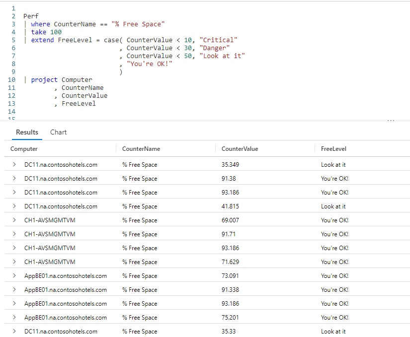
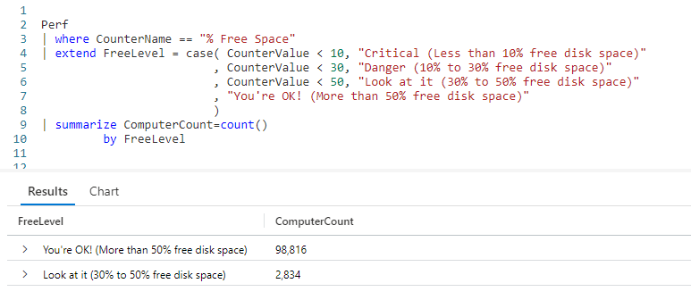
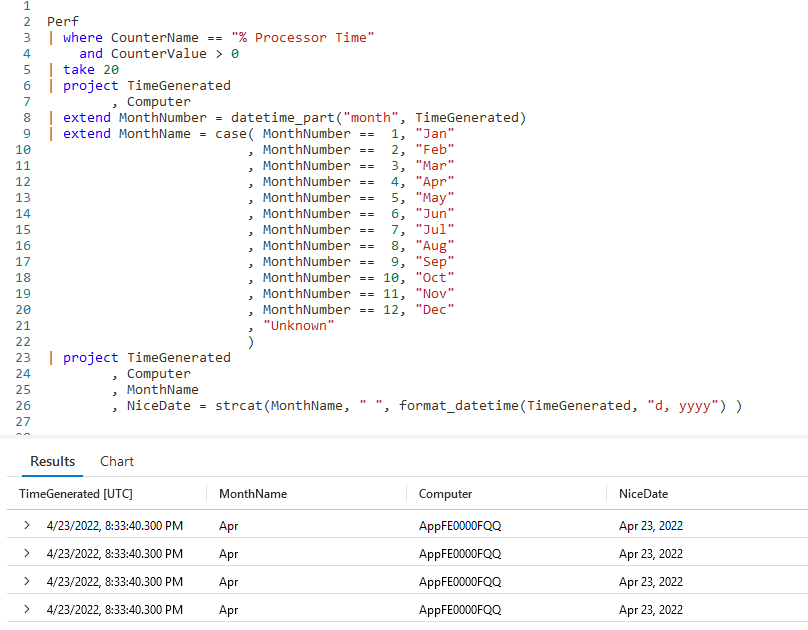

# Fun With KQL - Case

## Introduction

In my previous post [Fun With KQL - IIF](https://arcanecode.com/2022/10/03/fun-with-kql-iif/), we saw how to use the Kusto `iif` function to check for a condition then perform an action based on the result of a condition.

What if you had multiple conditions you need to check? While you could string multiple `iif` functions together there's better solution: the KQL `case` function.

Before we take a look at `case`, you should know that the samples in this post will be run inside the LogAnalytics demo site found at [https://aka.ms/LADemo](https://aka.ms/LADemo). This demo site has been provided by Microsoft and can be used to learn the Kusto Query Language at no cost to you.

If you've not read my introductory post in this series, I'd advise you to do so now. It describes the user interface in detail. You'll find it at [https://arcanecode.com/2022/04/11/fun-with-kql-the-kusto-query-language/](https://arcanecode.com/2022/04/11/fun-with-kql-the-kusto-query-language/).

Note that my output may not look exactly like yours when you run the sample queries for several reasons. First, Microsoft only keeps a few days of demo data, which are constantly updated, so the dates and sample data won't match the screen shots.

Second, I'll be using the column tool (discussed in the introductory post) to limit the output to just the columns needed to demonstrate the query. Finally, Microsoft may make changes to both the user interface and the data structures between the time I write this and when you read it.

## Case Basics

The `case` function works by checking a condition, and if true executing the code associted with it. It then checks the next condition, and runs the code associated with it, and so on. When it runs out of conditions, it will execute the final set of code.

This is much easier to understand with a good example, so let's take a look.

As with so many of the samples in this **Fun With KQL** series, we start by piping the `Perf` table into a `where` to limit the dataset to `% Free Space`. We then `take` 100 rows for a small dataset for this demo.

Now we flow into an `extend`, which creates a new column **FreeLevel**. We use the `case` function to get its value.

As the first parameter to `case`, we pass in a condition, `CounterValue < 10`. If this condition evaluates to true, it will return the value in the second parameter. In this case it is a simple string, `Critical`, but we could have done a calculated value.

If the condition is `false`, in other words **CounterValue** is greater than or equal to 10, it moves onto the next parameter.

The third parameter is another condition, `CounterValue < 30`. If true, it executes the code in the fourth parameter, returning the text string `Danger`. If false, it moves on to the next parameter.

The fifth parameter is `CounterValue < 50`. Again, if true it returns `Look at it`. If false, it moves on to the next parameter.

The seventh and final parameter is not a condition, but a value. Because of this, the `case` treats it as an _else_. It will execute this final parameter and return its value.

## Short Circuiting

Its important to understand the `case` uses what is known as _short circuit logic_. When it finds the first positive match, it returns the value associated with it, then stops checking.

For example, lets say the **CounterValue** had been 20. It would have checked the `CounterValue < 10`, said "nope no match", then moved on. It would then do the `CounterValue < 30` check, and said "ah, 20 is less than 30, so we have a match!". It would then execute the code associated with it, in this case returning the string `Danger`.

At this point it will stop checking. The `CounterValue < 50` will never be checked, nor the else portion of the `case` function.

## Using Case to Summarize

The `case` function can become useful when combined with the `summarize` operator.

Here our query is similar to the previous one, except our text is a bit more descriptive.

We then pipe this into a `summarize`, where we get a count of computers for each of the **FreeLevel** items. As you can see in the output, the "You're OK..." level has 98,816 computers in this category. The "Look at it..." level has 2,834 computers.

Now you have an idea of the state of health of your infrastructure, and can decide if you need to do more examination of these 2,834 computers. For example you could run queries, using techniques from previous posts, to get a list of computers you may want to look at.

## Number of Conditions

In the previous examples we used three conditions as well as the else parameter. You can have less conditions, or even more. A common use of `case` is to convert a month number into a month name, as you can see in this example.

In the first `extend`, we use the `datetime_part` function to get the number of the month. We do it here, so we only have to run the function once, and not for every line in the `case` statement.

We run through a series of conditional checks, comparing the new **MonthNumber** column to a hard coded value. When it finds a match, it returns the three character abbreviation for that month.

At the end of the `case` is the else part, where the value `Unknown` is returned. In theory, in this situation it should never fail to find a match, however the `case` function always expects to have an else parameter.

After the `case`, we pipe into the project. In the project we use `strcat` to combine the new **MonthName** with a space. Then, `format_datetime` is used to get the day number and the year number for the **TimeGenerated** column, resulting in dates like `April 23, 2022`.

## See Also

The following operators, functions, and/or plugins were used or mentioned in this article's demos. You can learn more about them in some of my previous posts, linked below.

[Fun With KQL - Extend](https://arcanecode.com/2022/05/23/fun-with-kql-extend/)

[Fun With KQL - Project](https://arcanecode.com/2022/05/30/fun-with-kql-project/)

[Fun With KQL - Summarize](https://arcanecode.com/2022/05/16/fun-with-kql-summarize/)

[Fun With KQL - Take](https://arcanecode.com/2022/05/02/fun-with-kql-take/)

[Fun With KQL - Where](https://arcanecode.com/2022/04/25/fun-with-kql-where/)

[Fun With KQL - Format_DateTime](https://arcanecode.com/2022/09/12/fun-with-kql-format_datetime/)

## Conclusion

In this post we saw how the `case` statement can be used to evaluate multiple conditions and return a value. We also learned how it _short circuits_ during its decision making process.

The demos in this series of blog posts were inspired by my Pluralsight courses [Kusto Query Language (KQL) from Scratch](https://pluralsight.pxf.io/MXDo5o) and [Introduction to the Azure Data Migration Service](https://pluralsight.pxf.io/2rQXjQ), two of the many courses I have on Pluralsight. All of my courses are linked on my [About Me](https://arcanecode.com/info/) page.

If you don't have a Pluralsight subscription, just go to [my list of courses on Pluralsight](https://pluralsight.pxf.io/kjz6jn) . At the top is a Try For Free button you can use to get a free 10 day subscription to Pluralsight, with which you can watch my courses, or any other course on the site.

## Navigator
[Table of Contents](../Table%20of%20Contents.md)

Post Link: [Fun With KQL - Case](https://arcanecode.com/2022/10/10/fun-with-kql-case/)

Post URL: [https://arcanecode.com/2022/10/10/fun-with-kql-case/](https://arcanecode.com/2022/10/10/fun-with-kql-case/)
