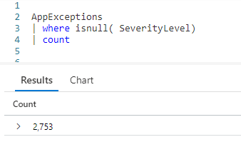
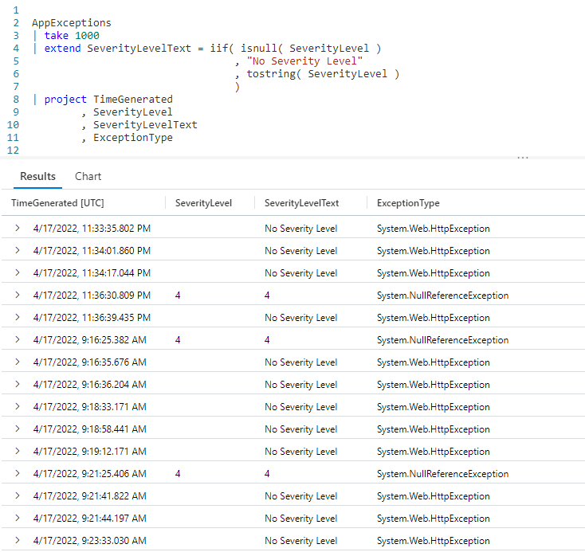
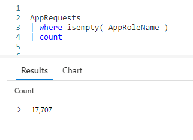
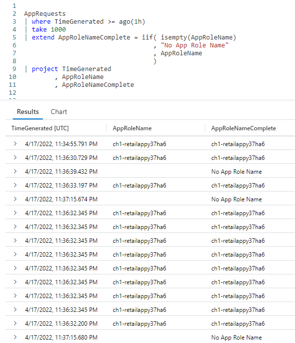

# Fun With KQL - IsNull and IsEmpty

## Introduction

In writing queries, it is not uncommon to get results where a column has missing values. This can cause concerns or questions from your users. "Why is this blank?", "There must be something wrong with your query its missing data!".

To avoid this, Kusto provides two functions to check for missing values: `isnull` and `isempty`. You can combine this with the `iif` function (covered in the [Fun With KQL - IIF](https://arcanecode.com/2022/10/03/fun-with-kql-iif/) post) to provide clarifying text to the end user.

Before we begin, be aware the samples in this post will be run inside the LogAnalytics demo site found at [https://aka.ms/LADemo](https://aka.ms/LADemo). This demo site has been provided by Microsoft and can be used to learn the Kusto Query Language at no cost to you.

If you've not read my introductory post in this series, I'd advise you to do so now. It describes the user interface in detail. You'll find it at [https://arcanecode.com/2022/04/11/fun-with-kql-the-kusto-query-language/](https://arcanecode.com/2022/04/11/fun-with-kql-the-kusto-query-language/).

Note that my output may not look exactly like yours when you run the sample queries for several reasons. First, Microsoft only keeps a few days of demo data, which are constantly updated, so the dates and sample data won't match the screen shots.

Second, I'll be using the column tool (discussed in the introductory post) to limit the output to just the columns needed to demonstrate the query. Finally, Microsoft may make changes to both the user interface and the data structures between the time I write this and when you read it.

## IsNull

The `isnull` function is used with _numeric_ data. Let's look at this simple example.

We'll use the `AppExceptions` table, and use `where` to limit the output to rows where the **SeverityLevel** column does not have a value, in other words it is _null_.

This is then piped into the `count` operator, to get a count of the number of rows without an entry in the **SeverityLevel** column. As you can see, there are 2,753 rows without a **SeverityLevel**.

So what happens if we want to get a listing of rows in the `AppExceptions` table, and for rows with a null **SeverityLevel** print a message letting the user know it isn't there?

We use our old friend `iif` to see if the **SeverityLevel** is null. Note that we don't have to use `isnull( SeverityLevel ) == true`, the `isnull` function always evaluates to true or false. The `iif` knows what to do with that true or false, and executes the following parameters accordingly.

If it came out true, the **SeverityLevel** was null, the text `No Severity Level` is returned, to let the user know this row lacked any data in this column.

On the other hand, if there was data in the **SeverityLevel** column then that value is returned. Note something though, we had to wrap the column in the `tostring` function.

Both the true and false sections off an `iif` function must return the _same datatype_! Since the true branch returned a text string, the else must too. Since the **SeverityLevel** column is of datatype _int_, we need to convert it to a string.

We do so using the simple `tostring` function, which simply takes the passed in numeric value and converts it to a string datatype.

## IsEmpty

While `isnull` is meant for numeric data, the `isempty` function is used with string data.

In this first example we'll get a count of rows from the `AppRequests` table where the column **AppRoleName** is missing any text.

Here we pipe the `AppRequests` table into a `where` operator, limiting the dataset to only rows with an empty **AppRoleName** column. We then use the `count` operator and find there are 17,707 rows where this column has no data (as of the running of this query).

Lets emulate what we did with `isnull`, and create an `iif` statement to let users know that the data in the **AppRoleName** column wasn't present.

Here we used `iif` to check if **AppRoleName** is empty. If so, it returns the text `No App Role Name`, otherwise it returns the **AppRoleName** column.

It wasn't necessary to wrap the column name with `tostring`. **AppRoleName** is already a string datatype, so it will match the hard coded string we have for the true part of the `iif` function.

## See Also

The following operators, functions, and/or plugins were used or mentioned in this article's demos. You can learn more about them in some of my previous posts, linked below.

[Fun With KQL - Count](https://arcanecode.com/2022/05/09/fun-with-kql-count/)

[Fun With KQL - Extend](https://arcanecode.com/2022/05/23/fun-with-kql-extend/)

[Fun With KQL - IIF](https://arcanecode.com/2022/10/03/fun-with-kql-iif/)

[Fun With KQL - Project](https://arcanecode.com/2022/05/30/fun-with-kql-project/)

[Fun With KQL - Take](https://arcanecode.com/2022/05/02/fun-with-kql-take/)

[Fun With KQL - Where](https://arcanecode.com/2022/04/25/fun-with-kql-where/)

## Conclusion

As you see, `isnull` and `isempty` are very easy to use. They can be combined with counts, summaries, if functions, even the case function. With these, users can have some assurance that the column was left with no data, and that it wasn't an issue with the query.

The demos in this series of blog posts were inspired by my Pluralsight courses [Kusto Query Language (KQL) from Scratch](https://pluralsight.pxf.io/MXDo5o) and [Introduction to the Azure Data Migration Service](https://pluralsight.pxf.io/2rQXjQ), two of the many courses I have on Pluralsight. All of my courses are linked on my [About Me](https://arcanecode.com/info/) page.

If you don't have a Pluralsight subscription, just go to [my list of courses on Pluralsight](https://pluralsight.pxf.io/kjz6jn) . At the top is a Try For Free button you can use to get a free 10 day subscription to Pluralsight, with which you can watch my courses, or any other course on the site.

## Navigator
[Table of Contents](../Table%20of%20Contents.md)

Post Link: [Fun With KQL - IsNull and IsEmpty](https://arcanecode.com/2022/10/17/fun-with-kql-isnull-and-isempty/)

Post URL: [https://arcanecode.com/2022/10/17/fun-with-kql-isnull-and-isempty/](https://arcanecode.com/2022/10/17/fun-with-kql-isnull-and-isempty/)
