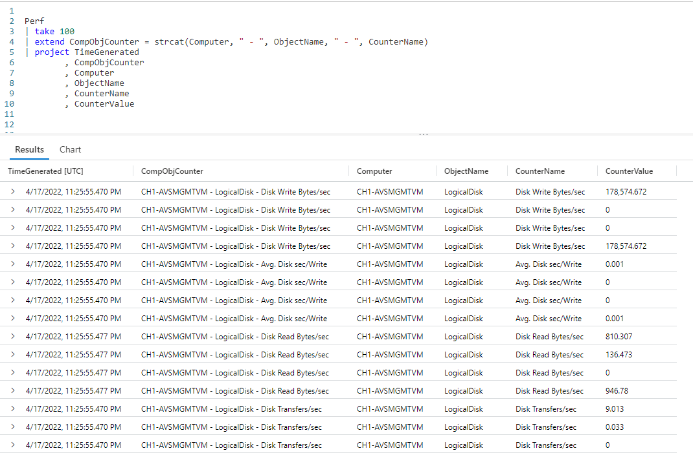
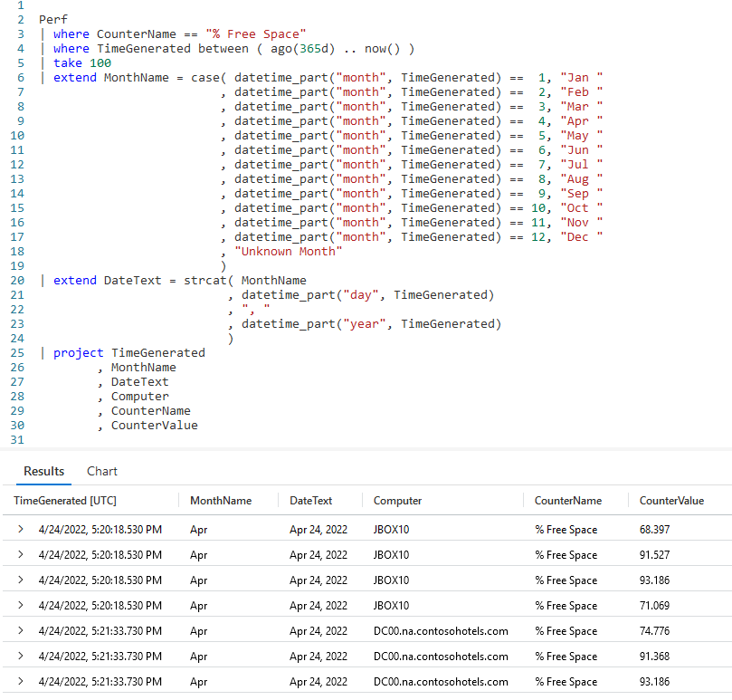

# Fun With KQL - StrCat

## Introduction

The `strcat` function has been shown in previous articles, but it's so useful it deserves a post all of its own.

As usual, the samples in this post will be run inside the LogAnalytics demo site found at [https://aka.ms/LADemo](https://aka.ms/LADemo). This demo site has been provided by Microsoft and can be used to learn the Kusto Query Language at no cost to you.

If you've not read my introductory post in this series, I'd advise you to do so now. It describes the user interface in detail. You'll find it at [https://arcanecode.com/2022/04/11/fun-with-kql-the-kusto-query-language/](https://arcanecode.com/2022/04/11/fun-with-kql-the-kusto-query-language/).

Note that my output may not look exactly like yours when you run the sample queries for several reasons. First, Microsoft only keeps a few days of demo data, which are constantly updated, so the dates and sample data won't match the screen shots.

Second, I'll be using the column tool (discussed in the introductory post) to limit the output to just the columns needed to demonstrate the query. Finally, Microsoft may make changes to both the user interface and the data structures between the time I write this and when you read it.

## StrCat Basics

In the `Perf` table, the three columns of **Computer**, **ObjectName**, and **CounterName** are often used together to identify a specific counter value. It'd be nice to combine them into a single column, and we'll use the `strcat` function to do just that.

In this example we took the `Perf` table and piped it into a `take` to just grab a few rows for this demo.

Next we used the `extend` operator to create a new column, **CompObjCounter**. With `strcat`, you simply keep listing values in the parameters you want to join together.

We start with a column name, **Computer**. We then pass in a _string literal_, a static text string of `" - "`. This is followed by another column, another text string, and finally another column.

As you can see in the output, this results in the nicely formatted string of `CH1-AVSMGMTVM - LogicalDisk - Disk Write Bytes/sec` for the first row.

Here we passed in five values to the `strcat` function, but there is really no limit. We could have used as few as two, or twenty, or however many we needed. We could have also used other functions to generate values, as we'll see in the next example.

## StrCat with Functions

In this example, we'll include a function, `datetime_part`, as one of the parameters to `strcat`.

We take `Perf`, and filter it down with two `where` operators. Then `take` is used to limit the rows for this simple sample.

Next we use `case`. You saw this code in the [Fun With KQL - Case](http://). We extract the month number from the **TimeGenerated** column using `datetime_part`. We compare it to a number and return the three character abbreviation for it.

From here we go into an `extend` operator, using `strcat` to combine the newly calculated **MonthName**, along with the day and year. You can see I used the `datetime_part` function as a parameter to `strcat` to demonstrate it is perfectly allowable to pass in functions.

By the way, if you refer back to the example in [Fun With KQL - Case](http://), I used the `format_datetime` function to get the day and year. Either method works, I just wanted to show a variety of ways to accomplish the same task.

As a final step to the query, I used `project` to display the column names to the output, including our new, nicely formatted **DateText** column.

## See Also

The following operators, functions, and/or plugins were used or mentioned in this article's demos. You can learn more about them in some of my previous posts, linked below.

[Fun With KQL - Extend](https://arcanecode.com/2022/05/23/fun-with-kql-extend/)

[Fun With KQL - Case](http://)

[Fun With KQL - DateTime_Part](http://)

[Fun With KQL - Format_DateTime](http://)

[Fun With KQL - Project](https://arcanecode.com/2022/05/30/fun-with-kql-project/)

[Fun With KQL - Take](https://arcanecode.com/2022/05/02/fun-with-kql-take/)

[Fun With KQL - Where](https://arcanecode.com/2022/04/25/fun-with-kql-where/)

## Conclusion

In this post we took a dive into the `strcat` function. We saw how it can be used to concatenate columns together along with static text. In addition, we saw how functions could be used within `strcat` to create nicely formatted output.

The demos in this series of blog posts were inspired by my Pluralsight courses [Kusto Query Language (KQL) from Scratch](https://pluralsight.pxf.io/MXDo5o) and [Introduction to the Azure Data Migration Service](https://pluralsight.pxf.io/2rQXjQ), two of the many courses I have on Pluralsight. All of my courses are linked on my [About Me](https://arcanecode.com/info/) page.

If you don't have a Pluralsight subscription, just go to [my list of courses on Pluralsight](https://pluralsight.pxf.io/kjz6jn) . At the top is a Try For Free button you can use to get a free 10 day subscription to Pluralsight, with which you can watch my courses, or any other course on the site.

## Navigator
[Table of Contents](../Table%20of%20Contents.md)

Post Link: [Fun With KQL - StrCat](https://arcanecode.com/2022/10/31/fun-with-kql-strcat/)

Post URL: [https://arcanecode.com/2022/10/31/fun-with-kql-strcat/](https://arcanecode.com/2022/10/31/fun-with-kql-strcat/)
