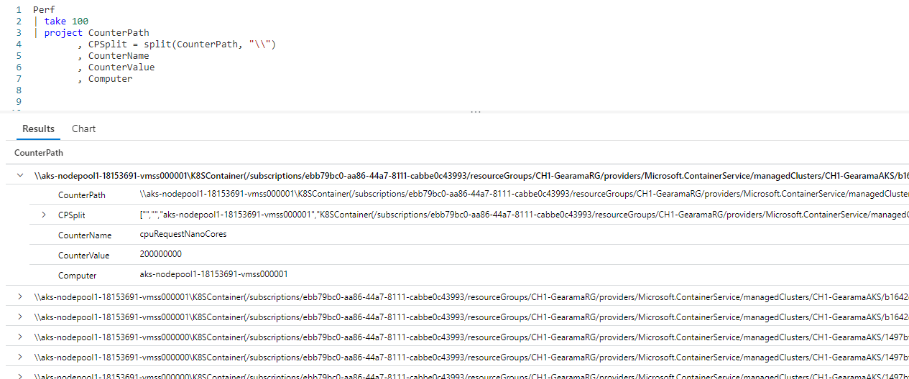
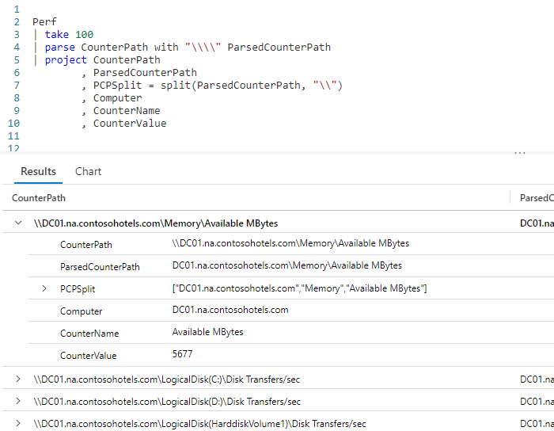
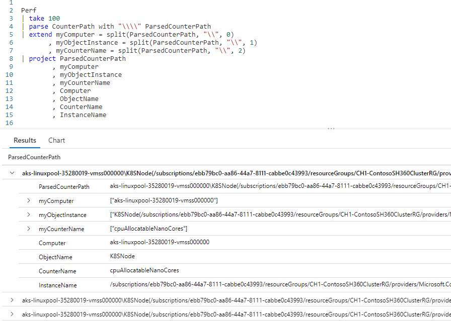
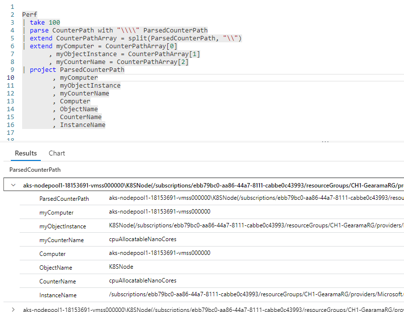

# Fun With KQL - Split

## Introduction

In databases, we often find columns that are stored in a hierarchy structure, not unlike a file path on your drive. For example, in the Microsoft Logs sample database the `Perf` table stores its counter path this way: `\\computername\Memory\Available MBytes`.

It would be helpful to have a way to easily break this path out into its individual parts. KQL provides us a way of doing this using the `split` function.

The samples in this post will be run inside the LogAnalytics demo site found at [https://aka.ms/LADemo](https://aka.ms/LADemo). This demo site has been provided by Microsoft and can be used to learn the Kusto Query Language at no cost to you.

If you've not read my introductory post in this series, I'd advise you to do so now. It describes the user interface in detail. You'll find it at [https://arcanecode.com/2022/04/11/fun-with-kql-the-kusto-query-language/](https://arcanecode.com/2022/04/11/fun-with-kql-the-kusto-query-language/).

Note that my output may not look exactly like yours when you run the sample queries for several reasons. First, Microsoft only keeps a few days of demo data, which are constantly updated, so the dates and sample data won't match the screen shots.

Second, I'll be using the column tool (discussed in the introductory post) to limit the output to just the columns needed to demonstrate the query. Finally, Microsoft may make changes to both the user interface and the data structures between the time I write this and when you read it.

## Split Basics

To perform a split, you simply pass the column name to split, along with the character to split on, into the `split` function.



Here we've taken the `Perf` table, used `take` to grab 100 rows at random, then piped it into `project`.

Within the `project`, we create a new column, **CPSplit**, using the `split` function. We pass in the column containing what we want to split, **CounterPath**. We want to perform the split on the backslash.

Because the backslash is a special character, we need to put two of them to escape it. The KQL `split` function will convert it to a single backslash when it does its work.

In the output pane, you can see it created the `CPSplit` as an array, but the first item is blank. The split function found the leading double backslashes and treated them as two individual slashes to split on. Since there was nothing between them, it returned a blank column representing the data between the opening backslashes, which of course there was none.

We can fix our issue with the double backslash with `parse`, which was covered in [Fun With KQL - Parse](https://arcanecode.com/2022/08/01/fun-with-kql-parse/).

## Fixing The Double Slash

To eliminate the double backslash, we can use the `parse` function. This will start grabbing characters starting after the double backslash. As before, with the backslash being a special character we have to escape it by using two backslashes. And because we want to get rid of two backslashes we have to put four of them.



This resulted in a new column, **ParsedCounterPath**, which has the same text without the double backslashes on front.

Now we can use the `split` function on the new column. As you can see in the output, the **PCSplit** now has an array with 3 distinct pieces.

```
{"DC01.na.contosohotels.com", "Memory", "Available MBytes"}
```

## Getting The Individual Parts

Let's take the next step, and be able to grab individual items out of the array produced by `split`.



If you look at the `extend` operator, you'll see that the `split` function, in addition to the column to split on and the character to use for splitting, allows a third parameter, the position of the item from the array to be returned.

From past experience we know that the **CounterPath** column holds the computer first, then the object, then the counter name. Because arrays are zero based, we pass in a `0` into the first line of the `extend` operator so the computer name is returned.

We use `1` in the second line to return the object instance, then `2` to get back the counter name.

If you look at the output pane, you may notice something interesting. Take a look at the `myCounterName` column, and you'll see it contains the text `{"cpuAllocatableNanoCores"}`. The squiggly braces are a clear indicator this is still a _dynamic_ (aka array) datatype, in this case with one element.

Generally you want to get only the text, and not an array, so let's see how to resolve this issue.

## Split Then Read

In this example, we'll first use `split` to break out data out, then read from the new array column it created.



As before, we use `parse` to chop off the leading two backslashes from the **CounterPath** column, resulting in the new **ParsedCounterPath** column.

We then use `split` to create a new dynamic (array) column of **CounterPathArray**, splitting our **ParsedCounterPath** column on the backslashes.

Now we'll use another `extend`, to read the individual elements of the **CounterPathArray** using _positional notation_. We put the position number of the element we want in square brackets after the name.

As an example, into **myComputer** we put element 0 (the first one) of the array by using the syntax `CounterPathArray[0]`.

This is repeated for the rest of the array, then everything flows into `project` to be displayed.

In the results pane, if you look at the three "my` variables you'll notice they are _not_ arrays, but individual non-array data types, in this example they are all strings.

## Splitting on Other Characters

In these examples we used the backslash to split on. However, you are free to use any character. Dashes, colons, a space, the letter X, any character can be used.

For example, if you used `split("Arcane-Code", "-")` you'd get a dynamic (array) column with `Arcane` in position 0, and `Code` in position 1.

Let's say you had a timespan, but it was stored as a string. Thus the `format_timespan` function wouldn't work with it. You could use `split("10:42:33", ":")` to split it into the three elements of `10` (hours), `42` (minutes), and `33` (seconds).

## See Also

The following operators, functions, and/or plugins were used or mentioned in this article's demos. You can learn more about them in some of my previous posts, linked below.

[Fun With KQL - Extend](https://arcanecode.com/2022/05/23/fun-with-kql-extend/)

[Fun With KQL - Format_TimeSpan](http://)

[Fun With KQL - Project](https://arcanecode.com/2022/05/30/fun-with-kql-project/)

[Fun With KQL - Take](https://arcanecode.com/2022/05/02/fun-with-kql-take/)

[Fun With KQL - Parse](https://arcanecode.com/2022/08/01/fun-with-kql-parse/)

## Conclusion

This post showed how to use `split`, combined with `parse` and normal _array notation_, to extract the individual pieces out of a column of text. This can be a powerful tool for breaking down formatted text into individual components.

The demos in this series of blog posts were inspired by my Pluralsight courses [Kusto Query Language (KQL) from Scratch](https://pluralsight.pxf.io/MXDo5o) and [Introduction to the Azure Data Migration Service](https://pluralsight.pxf.io/2rQXjQ), two of the many courses I have on Pluralsight. All of my courses are linked on my [About Me](https://arcanecode.com/info/) page.

If you don't have a Pluralsight subscription, just go to [my list of courses on Pluralsight](https://pluralsight.pxf.io/kjz6jn) . At the top is a Try For Free button you can use to get a free 10 day subscription to Pluralsight, with which you can watch my courses, or any other course on the site.

## Navigator
[Table of Contents](../Table%20of%20Contents.md)

Post Link: [Fun With KQL - Split](https://arcanecode.com/2022/10/24/fun-with-kql-split/)

Post URL: [https://arcanecode.com/2022/10/24/fun-with-kql-split/](https://arcanecode.com/2022/10/24/fun-with-kql-split/)
