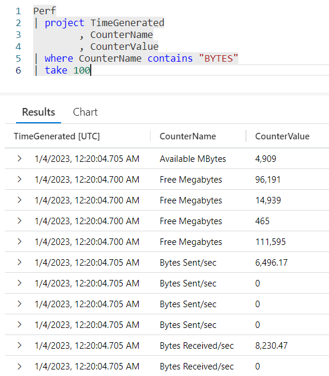
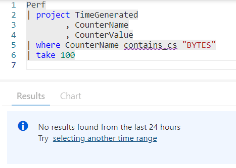
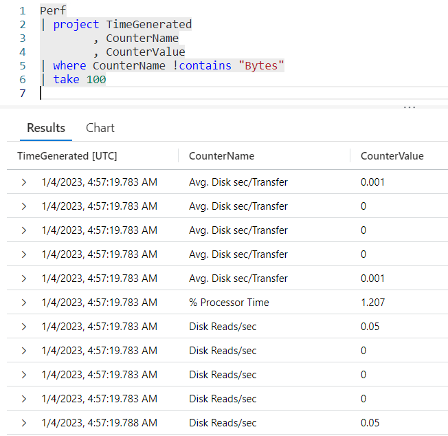
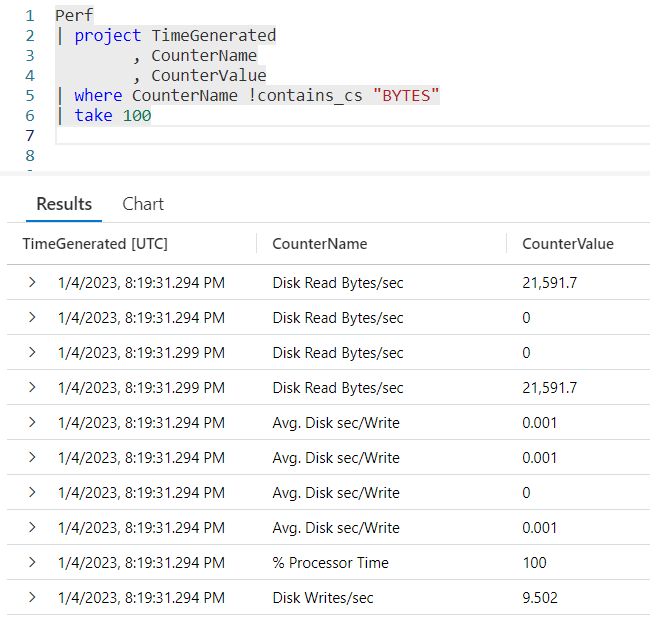
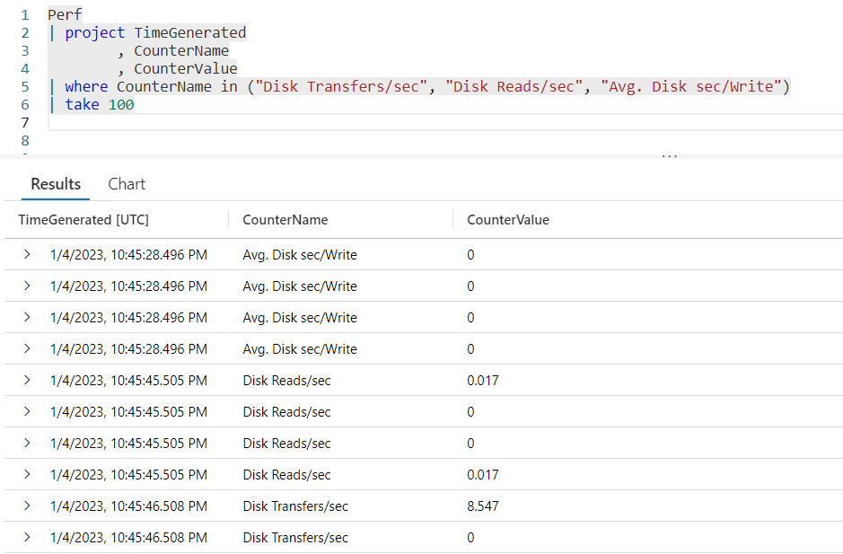
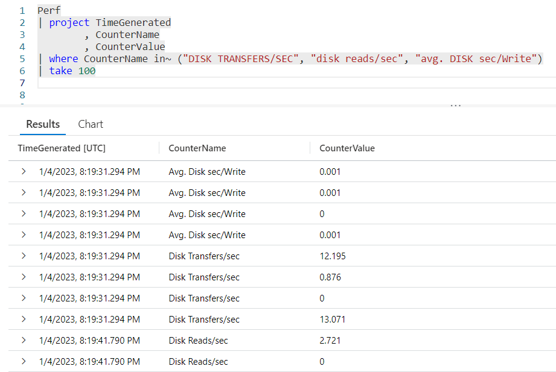
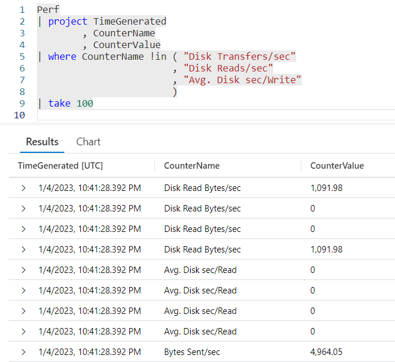
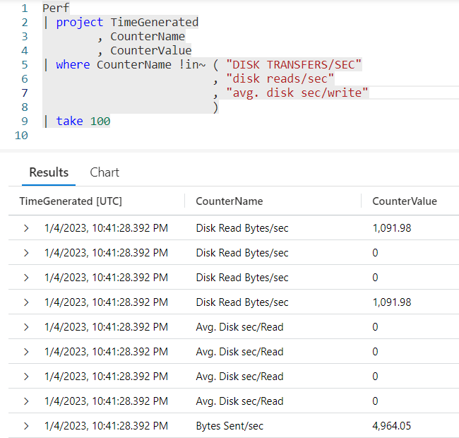

# Fun With KQL - Contains and In

## Introduction

Back on April 25, 2022 I did a blog post on the `where` operator, [Fun With KQL - Where](https://arcanecode.com/2022/04/25/fun-with-kql-where/). In that post, I covered several functions that can be used with `where` to limit the results of a query. This list includes: `startswith`, `endswith`, `has`,`hasprefix`, `hassuffix`, and `contains`.

All of these had one thing in common, they were case _insensitive_. Kusto ignored the case of the text passed in. If you passed in the text BYTE, for example, Kusto would match on BYTE, Byte, bYtE, byte and other combinations.

There are versions of these which are case _sensitive_. We'll see a few here, focusing on the `contains` keyword. In addition there are _not_ versions, which will also be demonstrated.

There is another operator we'll discuss here, `in`. It is a bit of an odd duck, in that it is case _sensitive_ by default. We'll see it and its variants later in this post.

The samples in this post will be run inside the LogAnalytics demo site found at [https://aka.ms/LADemo](https://aka.ms/LADemo). This demo site has been provided by Microsoft and can be used to learn the Kusto Query Language at no cost to you.

If you've not read my introductory post in this series, I'd advise you to do so now. It describes the user interface in detail. You'll find it at [https://arcanecode.com/2022/04/11/fun-with-kql-the-kusto-query-language/](https://arcanecode.com/2022/04/11/fun-with-kql-the-kusto-query-language/).

Note that my output may not look exactly like yours when you run the sample queries for several reasons. First, Microsoft only keeps a few days of demo data, which are constantly updated, so the dates and sample data won't match the screen shots.

Second, I'll be using the column tool (discussed in the introductory post) to limit the output to just the columns needed to demonstrate the query. Finally, Microsoft may make changes to both the user interface and the data structures between the time I write this and when you read it.

## Preface

For this section of the post I'm going to use `contains` for the demonstrations. Be aware everything I discuss on `contains` also applies to the other operators mentioned in the Introduction. Each has the same variants as `contains`.

## Case Insensitive Contains

First, let's take a look at the normal version of `contains`.

Briefly, we get the **Perf** table and grab three columns, **TimeGenerated**, **CounterName**, and **CounterValue**. This is then piped into a `where`, in which we use `contains` to look for rows in the **CounterName** column with the text **BYTES**.

In the results, you can see names like _Available MBytes_, _Free Megabytes_, and _Bytes Sent/sec_, to name a few. In this case the case of the text passed into `contains`, all uppercase, was irrelevant to the match.

## Making Contains Case Sensitive

There is an alternate version of `contains`, `contains_cs`. Let's rerun the above query, using the `_cs` version.

This invokes `contains_cs`, the case sensitive version of `contains`. It and will look for an exact match of the text that was passed in. In this case it looked in **CounterName** and found no records with **BYTES** in all caps, so in the results at the bottom shows "No results found...".

The other keywords I mentioned in the Introduction also have case sensitive versions, just add `_cs` to the end of their names.

## Not Contains

In addition to the case sensitive versions of these commands, there is also a _not_ version, as in "not contains". To invoke the not version of `contains` or any of the operators place a ! (exclamation mark, also called a "bang") on the front, as in `!contains`.

In the results you will see all rows as long as the word **Bytes** is _**not**_ in the ****CounterName** column.

Note that the `!contains` is case _insensitive_. The casing of the value passed in, in this example **Bytes** didn't matter.

## Not Contains Case Sensitive

It probably won't come as a surprise, but there is a case _sensitive_ version of not contains. You simply combine the `!` on the front and append the `_cs` to the end of the command. Here we do it with `contains`, using the command `!contains_cs`.

In this example we used `!contains_cs` to look for rows that did not contain the exact text **BYTES** in all caps. As you can see in the output, it returned rows including some that had the word **Bytes**, but it was in mixed case. No rows with upper case **BYTES** were returned.

## In

In the introduction I mentioned there is one keyword that had the rules revered when it comes to case sensitivity, and that is `in`.

The `in` looks for values in a list that you pass into the `in` parameters. Let's take a look.

We use `where` on the **CounterName**, then call `in`. In the parameters we pass in three values, three strings which we want to find rows with these values. The results show matches on some of the text that was passed in, there were many more rows not show on the screen capture.

One thing to note, by default `in` is _case sensitive_, unlike the other commands mentioned in this post. `in` looked for exact matches, including case, with the values we passed in.

## Case Insensitive In

To make `in` case _insensitive_, you append a ~ (tilde) after the keyword, `in~`.

In this example, you can see it found matches for the values passed in, even though the case of the text passed in did not match the case in the results.

## Not In

The `in` has a **not** version that works like the other operators. Place a ! (exclamation mark / bang) before it.

In this version of the query, `!in` returned all records _except_ for ones in the list passed into the `!in`.

Also note we took advantage of the flexibility of the Kusto Query Language formatting and put each parameter on its own line.

Like a regular `in`, `!in` is case sensitive by default. There is a version, as you might expect, that can be case insensitive.

## Not In Case Insensitive

To call the not and case insensitive version of `in`, simply combine the `!` and `~`: `!in~`.

With this example, it omitted matches of the three values passed in, regardless of the case of the text in the **Perf** table.

## In Parameters

I just wanted to point out that with `in` there is no limit to the number of parameters. `in` can handle 1, 2, 3, 4, or more.

In addition, while these examples used strings `in` and its variants can also work with numeric values, for example `where CounterValue !in (0, 42, 33, 73)`.

## See Also

The following operators, functions, and/or plugins were used or mentioned in this article's demos. You can learn more about them in some of my previous posts, linked below.

Where | [ArcaneCode](https://arcanecode.com/2022/04/25/fun-with-kql-where/)

## Conclusion

In this post, we covered how to make certain operators case sensitive as well as use the not versions of them. While we focused on `contains`, the same methods also apply to `startswith`, `endswith`, `has`,`hasprefix`, and `hassuffix`.

We then looked at the `in` operator and how it differed from the others when it comes to case sensitivity.

The demos in this series of blog posts were inspired by my Pluralsight courses on the Kusto Query Language, part of their Kusto Learning Path.

The first course in the series is [Kusto Query Language: Getting Started](https://app.pluralsight.com/library/courses/kusto-query-language-getting-started/table-of-contents). The second course is [Kusto Query Language: Beginning Operators](https://app.pluralsight.com/library/courses/kusto-query-language-operators/table-of-contents). The third course, to be published soon, is Kusto Query Language: Basic Scalar Operators and it contains video instruction for the operators discussed in this blog post.

I have two previous Kusto courses on Pluralsight as well. [Kusto Query Language (KQL) from Scratch](https://pluralsight.pxf.io/MXDo5o) and [Introduction to the Azure Data Migration Service](https://pluralsight.pxf.io/2rQXjQ), and these are two of the many courses I have on Pluralsight. All of my courses are linked on my [About Me](https://arcanecode.com/info/) page.

If you don't have a Pluralsight subscription, just go to [my list of courses on Pluralsight](https://pluralsight.pxf.io/kjz6jn) . At the top is a Try For Free button you can use to get a free 10 day subscription to Pluralsight, with which you can watch my courses, or any other course on the site.

## Navigator
[Table of Contents](../Table%20of%20Contents.md)

Post Link: [Fun With KQL - Contains and In](https://arcanecode.com/2023/01/09/fun-with-kql-contains-and-in/)

Post URL: [https://arcanecode.com/2023/01/09/fun-with-kql-contains-and-in/](https://arcanecode.com/2023/01/09/fun-with-kql-contains-and-in/)
