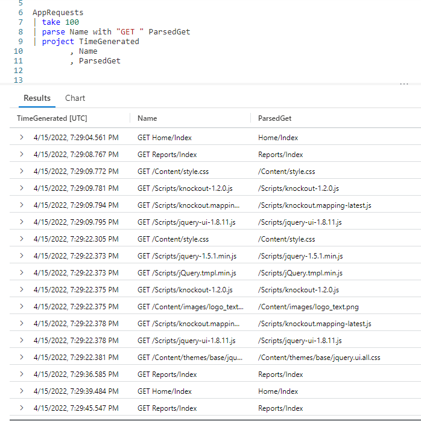
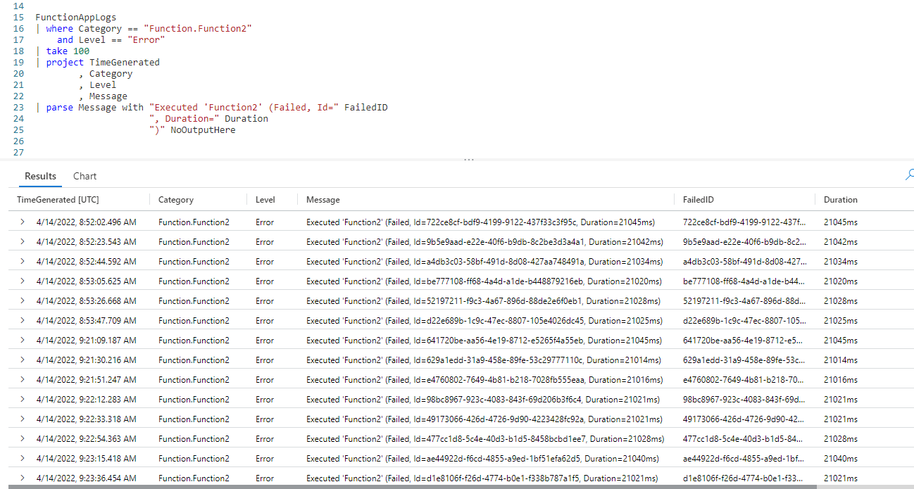
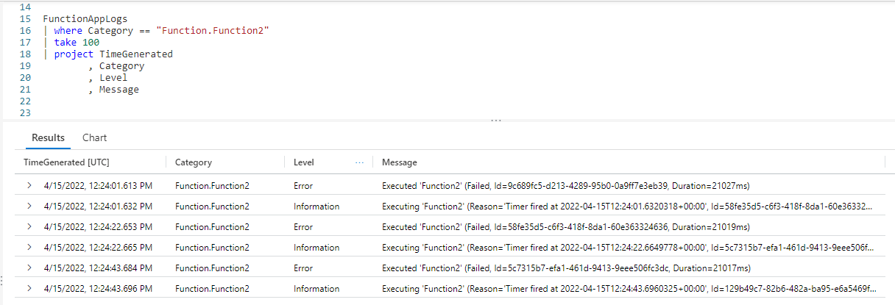

# Fun With KQL - Parse

## Introduction

The previous post in this series [Fun With KQL - Extract](https://arcanecode.com/2022/07/25/fun-with-kql-extract/), showed how we can use the `extract` operator to pull part of a string using regular expressions. I think you'd agree though, using regular expressions can be a bit tricky.

If you have a string that is well formatted with recurring text you can count on, and want to pull one or more strings from it into their own columns, Kusto provides a much easier to use operator: `parse`.

Before we get into `parse`, be aware that the samples in this post will be run inside the LogAnalytics demo site found at [https://aka.ms/LADemo](https://aka.ms/LADemo). This demo site has been provided by Microsoft and can be used to learn the Kusto Query Language at no cost to you.

If you've not read my introductory post in this series, I'd advise you to do so now. It describes the user interface in detail. You'll find it at [https://arcanecode.com/2022/04/11/fun-with-kql-the-kusto-query-language/](https://arcanecode.com/2022/04/11/fun-with-kql-the-kusto-query-language/).

Note that my output may not look exactly like yours when you run the sample queries for several reasons. First, Microsoft only keeps a few days of demo data, which are constantly updated, so the dates and sample data won't match the screen shots.

Second, I'll be using the column tool (discussed in the introductory post) to limit the output to just the columns needed to demonstrate the query. Finally, Microsoft may make changes to both the user interface and the data structures between the time I write this and when you read it.

## Parse Basics

The `AppRequests` table in the **LogManagement** section of the **Demo** database has a column called **Name**. The **Name** column always begins with the word `GET` followed by a space, then the request that was passed in.

What we'd like to do is return just the data that was being requested by the `GET`.

In this example we take our `AppRequests` table and pipe it into a `take` operator to keep our sample set small.

Now comes the `parse`. After the operator we give the name of the column we want to parse, in this case **Name**.

After the `with` comes the string we want to look for, here it is our `GET `. (Make sure we include the trailing space after GET.) Kusto will look for the string, then start grabbing the characters _after_ it.

It will keep grabbing characters until it either hits the end of the string, or until it finds a match for a second string we pass in. We didn't pass in a second string with this example (that will come in the next section), so it just keeps going until it hits the end.

That data is then placed in the new column name we provide, here I used **ParsedGet** although we could have used any name.

If you look at the output, we have the original **Name** column, then we have the new **ParsedGet** column. As you can see, the `GET ` is now missing from the **ParsedGet** column.

## Parsing Multiple Columns

That was easy! What if we wanted to extract multiple parts from a string?

Let's take a look at the table `FunctionAppLogs`. It has a column, **Message**. When the category is `Function.Function2` and the level is `Error`, the **Message** column will always have the message formatted the same way.

It will begin with the text `Executed 'Function2' (Failed, Id=`. After this is the ID of the error.

After the ID comes the text `, Duration=`, then the duration of the error in milliseconds. The final bit of text is a right parenthesis. Lets see how to extract this text so we can get the ID and the Duration as separate columns.

Here we have the `parse` operator, then the name of the column to parse, `Message`, then the `with` keyword.

We then enter the text we want to start looking for, `Executed 'Function2' (Failed, Id=`. The `parse` operator will start getting characters right after the equal sign. 

It keeps going until it finds the text `, Duration=`. At that point it stops, and copies the characters it has found so far into the new column, which we named **FailedID**.

Once it has done this, it begins to look for more characters after `, Duration=`. It keeps taking those characters until it finds the third string, `)`. That data is then placed into our column which we named **Duration**.

The `parse` operator then finds the `)`, and starts looking for more characters until it gets to the end of the text, and would put that into a column we named `NoOutputHere`.

Because `parse` didn't find any characters after the `)`, nothing is placed into `NoOutputHere`. At the end of our query, since the `NoOutputHere` column is empty for all of the rows, it is discarded from the final output.

This little trick can be a handy way of removing any unwanted characters from the end of a text string, in this case the closing parenthesis.

Also note that unlike other operators in Kusto we do _NOT_ separate the passed data with commas.

Looking at the output, you can see the **FailedID** column now contains only the ID part of the **Message** column. Likewise, the **Duration** column contains only the duration piece of the **Message** column. As I just mentioned, Kusto helpfully discarded the closing parenthesis from the output.

In this case we only extracted two pieces of data from our string, but we could have kept going adding more text to look for as part of our `with` statement.

## When You Can Use Parse... and When You Can't

Parse works great when the format of the text string is always the same, as was the case in this example. If not, you will need to find ways to narrow down the dataset until it is.

Let's see this quick example...

If you look closely at the **Message** column, you'll see the message text differs between levels `Error` and `Information`. As such our `parse` from the previous section would not work. That's why we had to add the `and Level == "Error"` in the previous query, to limit the rows so our **Messsage** column had the same text format for every row.

## See Also

The following operators and / or functions were used in this article's demos. You can learn more about them in some of my previous posts, linked below.

[Fun With KQL - Where](https://arcanecode.com/2022/04/25/fun-with-kql-where/)

[Fun With KQL - Take](https://arcanecode.com/2022/05/02/fun-with-kql-take/)

[Fun With KQL - Project](https://arcanecode.com/2022/05/30/fun-with-kql-project/)

## Conclusion

The `parse` operator can be extremely useful for extracting portions of a string, and breaking them out into columns, without the need for complex regular expressions. As long as, that is, your columns text has a consistent format.

The demos in this series of blog posts were inspired by my Pluralsight courses [Kusto Query Language (KQL) from Scratch](https://pluralsight.pxf.io/MXDo5o) and [Introduction to the Azure Data Migration Service](https://pluralsight.pxf.io/2rQXjQ), two of the many courses I have on Pluralsight. All of my courses are linked on my [About Me](https://arcanecode.com/info/) page.

If you don't have a Pluralsight subscription, just go to [my list of courses on Pluralsight](https://pluralsight.pxf.io/kjz6jn) . At the top is a Try For Free button you can use to get a free 10 day subscription to Pluralsight, with which you can watch my courses, or any other course on the site.

## Navigator
[Table of Contents](../Table%20of%20Contents.md)

Post Link: [Fun With KQL - Parse](https://arcanecode.com/2022/08/01/fun-with-kql-parse/)

Post URL: [https://arcanecode.com/2022/08/01/fun-with-kql-parse/](https://arcanecode.com/2022/08/01/fun-with-kql-parse/)
