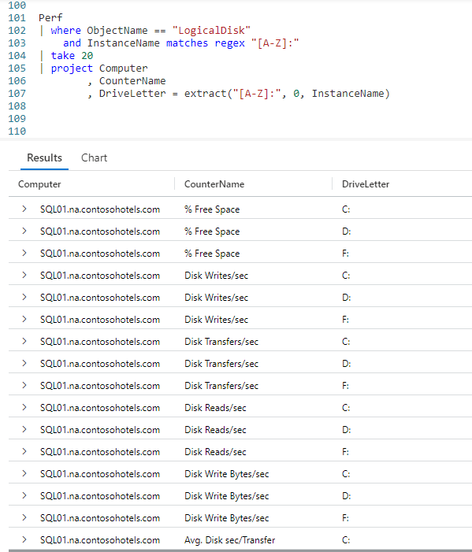
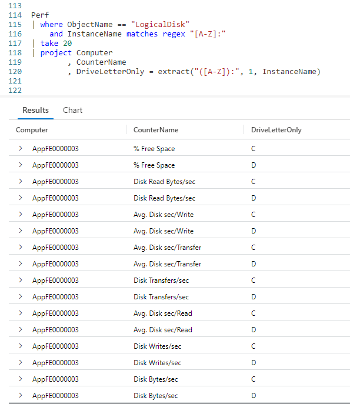
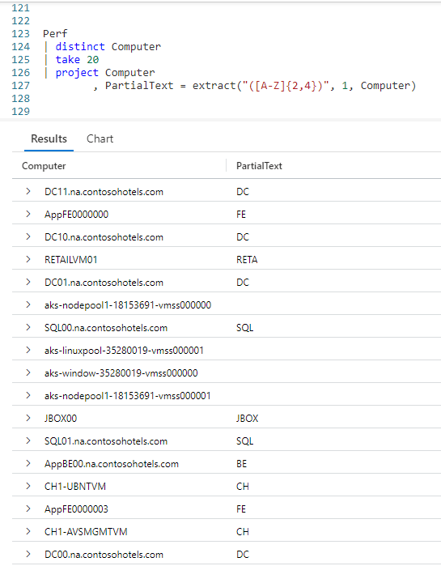

# Fun With KQL - Extract

## Introduction

Almost all languages have the ability to extract _part_ of a string. In C#, this is the `Substring` method of a string. With SQL, it is the `SUBSTRING` command.

Kusto has an operator that will perform this same task, it is called `extract`. In this post we'll see some examples of using it.

The samples in this post will be run inside the LogAnalytics demo site found at [https://aka.ms/LADemo](https://aka.ms/LADemo). This demo site has been provided by Microsoft and can be used to learn the Kusto Query Language at no cost to you.

If you've not read my introductory post in this series, I'd advise you to do so now. It describes the user interface in detail. You'll find it at [https://arcanecode.com/2022/04/11/fun-with-kql-the-kusto-query-language/](https://arcanecode.com/2022/04/11/fun-with-kql-the-kusto-query-language/).

Note that my output may not look exactly like yours when you run the sample queries for several reasons. First, Microsoft only keeps a few days of demo data, which are constantly updated, so the dates and sample data won't match the screen shots.

Second, I'll be using the column tool (discussed in the introductory post) to limit the output to just the columns needed to demonstrate the query. Finally, Microsoft may make changes to both the user interface and the data structures between the time I write this and when you read it.

## Extract Basics

In this example, we want to extract the drive letter information from the **InstanceName** column.

We start with a standard query, taking the `Perf` table and piping it through a `where` operator to limit the dataset to **ObjectName** of `LogicalDisk` and using a regular expression to only get instances of drive letters.

Next we use a `take` to grab 20 random rows, to keep the sample data for this post small. This is then piped to a `project` to select just a few columns.

In the last column we employ the `extract` function. The first parameter is a _regular expression_ that will grab a single letter in the range of A to Z, followed by a colon.

The second parameter, 0, indicates we should grab the entire text returned by the regular expression. In the output this is C:, D:, and so on.

The third and final parameter passed into `extract` is the column name we want to extract from, **InstanceName**. Finally we assign the result to the column name of **DriveLetter**, a name we picked. We could have called it Fred if we wanted, or omitted it entirely.

## Extracting Part of a String

We also have the option of returning _part_ of the text.

In this example, we wrap the `[A-Z]` in parenthesis. We then pass a `1` as the second parameter to the `extract` function. This tells `extract` to only return the portion of the string within the parenthesis.

In the output, you can see the **DriveLetterOnly** column only has the single drive letter, it omits the column.

## Extracting Multiple Characters

In addition to a single character, the `extract` can grab multiple characters. You need some good regular expression skills to do so.

In this example we are using the `distinct` operator to get a unique list of computer names from the `Perf` table. We grab 20 random rows to keep the sample small, then go into a `project`.

In the first parameter to `extract`, inside the parenthesis, we pass in `[A-Z]{2,4}`. This translates to "look for upper case characters in the range A to Z, where there are between 2 and 4 of them in a row".

As before, the `1` parameter only returns the data in the parenthesis, and the third parameter is the column we want to look in.

In the output you see a list of matches in the **PartialText** column. When the **PartialText** column is blank, it means it did not find a match.

As you can see, you'll need good skills at regular expressions to formulate good matches, but it can be done.

## See Also

The following operators and / or functions were used in this article's demos. You can learn more about them in some of my previous posts, linked below.

[Fun With KQL - Where](https://arcanecode.com/2022/04/25/fun-with-kql-where/)

[Fun With KQL - Take](https://arcanecode.com/2022/05/02/fun-with-kql-take/)

[Fun With KQL - Project](https://arcanecode.com/2022/05/30/fun-with-kql-project/)

## Conclusion

Extracting parts of a string is a common need when authoring queries. In this article you saw how to use the `extract` function, combined with regular expressions, to accomplish this.

The demos in this series of blog posts were inspired by my Pluralsight courses [Kusto Query Language (KQL) from Scratch](https://pluralsight.pxf.io/MXDo5o) and [Introduction to the Azure Data Migration Service](https://pluralsight.pxf.io/2rQXjQ), two of the many courses I have on Pluralsight. All of my courses are linked on my [About Me](https://arcanecode.com/info/) page.

If you don't have a Pluralsight subscription, just go to [my list of courses on Pluralsight](https://pluralsight.pxf.io/kjz6jn) . At the top is a Try For Free button you can use to get a free 10 day subscription to Pluralsight, with which you can watch my courses, or any other course on the site.

## Navigator
[Table of Contents](../Table%20of%20Contents.md)

Post Link: [Fun With KQL - Extract](https://arcanecode.com/2022/07/25/fun-with-kql-extract/)

Post URL: [https://arcanecode.com/2022/07/25/fun-with-kql-extract/](https://arcanecode.com/2022/07/25/fun-with-kql-extract/)
