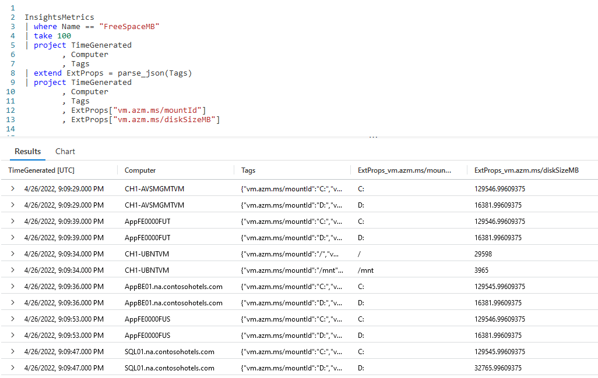
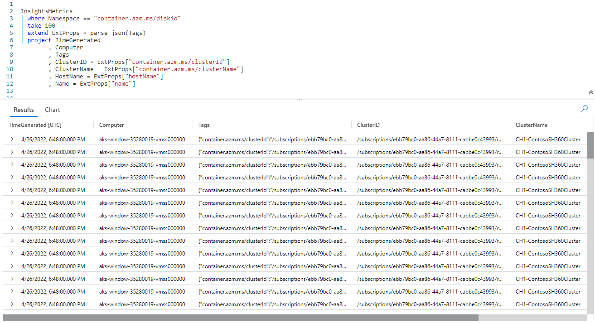
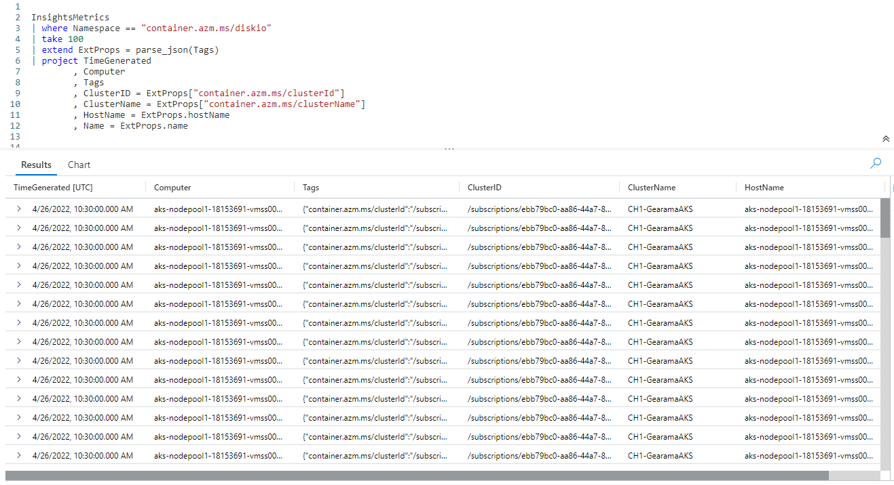
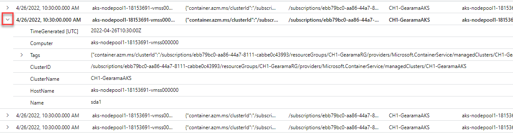
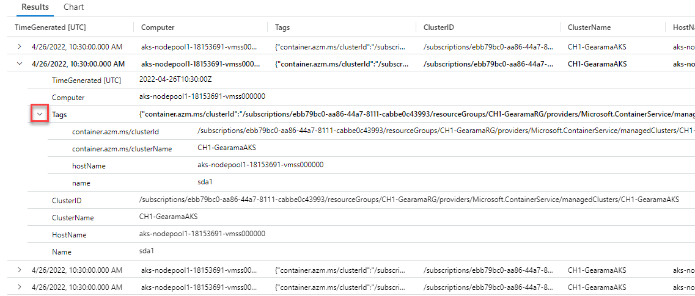

# Fun With KQL - Parse_JSON and ToDynamic

## Introduction

In order to compact data, JSON is often used to store information within columns in databases. JSON is also useful when you want to store data, but the exact data is different on a row by row basis. Using JSON prevents the need to have a lot of extra columns that will be blank for many of the rows.

It becomes important then that a query language provides a simple method for unpacking that JSON data into useful columns. The Kusto Query Language provides that ability through the use of the `parse_json` scalar function. In this post we'll look at examples of how to use it to expand data stored in JSON format.

Originally, `parse_json` was called `todynamic`, and the older `todynamic` function name still works. Both functions work and behave identically. In this post we'll use the newer `parse_json` name, but be aware that for any example you could use the older `todynamic` name and get identical results.

The `parse_json` samples in this post will be run inside the LogAnalytics demo site found at [https://aka.ms/LADemo](https://aka.ms/LADemo). This demo site has been provided by Microsoft and can be used to learn the Kusto Query Language at no cost to you.

If you've not read my introductory post in this series, I'd advise you to do so now. It describes the user interface in detail. You'll find it at [https://arcanecode.com/208.03/04/11/fun-with-kql-the-kusto-query-language/](https://arcanecode.com/208.03/04/11/fun-with-kql-the-kusto-query-language/).

Note that my output may not look exactly like yours when you run the sample queries for several reasons. First, Microsoft only keeps a few days of demo data, which are constantly updated, so the dates and sample data won't match the screen shots.

Second, I'll be using the column tool (discussed in the introductory post) to limit the output to just the columns needed to demonstrate the query. Finally, Microsoft may make changes to both the user interface and the data structures between the time I write this and when you read it.

## Parse_JSON Basics

In order to use this function, we'll need a table that has a column with JSON formatted data. For that we'll be using the `InsightMetrics` table, which has a column named **Tags**.

Here is a sample piece of data stored in the column. Be aware that not every row in this table has the same format for its JSON data. In addition the samples in the code below may not match the screen shots exactly.

For this example I've broken the JSON code into multiple lines to make it easier to read. If you look at the JSON columns inside the results pane you'll just see one long string of text.

```JSON
 {
   "vm.azm.ms/mountId":"C:"
 , "vm.azm.ms/diskSizeMB":129545.99609375
 }
```

Now let's see how to use `parse_json` in our Kusto query.



In order to properly use `parse_json`, each row in the dataset must have a consistent format for its JSON formatted column. So for this example we'll take the `InsightMetrics` table, then use `where` to restrict the rows where the **Name** column is `FreeSpaceMB`. The **Tags** column for `FreeSpaceMB` rows have the required consistent JSON formatting.

From here we use `take` to get a small sample for our demo (no sense in taking time to sift through 30,000 rows, the default maximum number of rows KQL will return in the user interface, for a simple demo). Next we flow into a `project` to just get the few columns we need.

Now we use the `extend` operator to create a new column, **ExtProps**. We use the `parse_json` function, and pass the **Tags** column into it. This will decompose the JSON data into the new **ExtProps** column.

In Kusto terms, they specify the new column as a datatype of _dynamic_. If you are familiar with PowerShell, this is actually created as a _hash table_, a list of key/value pairs. (If you aren't familiar with PowerShell, you may want to take a look at my [Fun With PowerShell](https://arcanecode.com/208.03/04/04/the-fun-with-powershell-roundup/)) series.

Once we've unpacked the JSON into the **ExtProps** column, we flow into another `project`. The first three columns are a repeat of our original three.

Then we have our **ExtProps** column. In the first one, inside the square brackets `[]` we pass in the key we want, here `vm.azm.ms/mountID`. This will return the value associated with this key. If you refer to the JSON example above, this would be `C:`.

In the next **ExtProps** entry, we use the second key, `vm.azm.ms/diskSizeMB`. If you refer to the example above, this will return `129545.99609375`.

In the image above, the last two columns are the unpacked JSON data.

## More JSON columns

What if our JSON data was more than just two columns? Let's take a look at an example with four key/values. As before I've expanded this to multiple lines to make it easier to read here, in the database it is all one long string.

```json
{
  "container.azm.ms/clusterId":"/subscriptions/ebb79bc0-aa86-44a7-8111-cabbe0c43993/resourceGroups/CH1-GearamaRG/providers/Microsoft.ContainerService/managedClusters/CH1-GearamaAKS"
, "container.azm.ms/clusterName":"CH1-GearamaAKS"
, "hostName":"aks-nodepool1-18153691-vmss000000"
, "name":"sdb1"
}
```

We'll again use the `InsightMetrics` table.



We use a `where` to limit the **Namespace** to `container.azm.ms/diskio`, the data associated with this **Namespace** has a JSON format that is consistent and resembles the four key/value pairs shown above.

We again use the same `parse_json`, passing in the **Tags** column.

In the `project` I simply reference the **ExtProps** column four times, passing in the keys for each one. I also used the `project` ability to rename these columns into something more human friendly.

Note, there is nothing special about the name **ExtProps**. I could have used any name I wanted, like **TagProps**, **MyKeyValues**, or even **ArcaneCodeIsAwesome**.

## Case is Important!

Be aware, KQL is case sensitive when it comes to the JSON keys. When I was first developing these samples, I accidentally keyed in `HostName = ExtProps["hostname"]` then spent a few minutes scratching my head wondering why I wasn't getting back any data for the **HostName**.

I finally realized I should have used `hostName`, and not `hostname` for the key (the `N` in Name is upper cased in the JSON). Once I got the casing correct, the query worked like it should have.

## Property Notation

If, and only if, your JSON key has no spaces or special characters such as /, \\, and so on, you can use what is called _property notation_.



On the last two lines of the query, I was able to use `ExtProps.hostName` and `ExtProps.name` instead of needing to use the square brackets. This makes for a bit less typing and better readability. Note the case rules still apply with property notation, I needed to use `hostName` just as it was in the JSON.

For the **ClusterID** and **ClusterName** I still needed to pass the JSON keys within square brackets as they had special characters in the name.

## Expanding Rows

This is a good time to point out a feature of the user interface. In the results pane at the bottom, to the very left of each row you'll see a sideways triangle. If you click it, it will expand the row to display the columns under it vertically.



In this screen shot I clicked on the triangle on the second row (highlighted by the little red box in the image). This then expanded the row to display each column of data in a row under it. For results where many columns are returned, this can make it **much** easier to read the result for a specific row.

## But wait, there's more!

In the above screen shot, you may have noticed there is another arrow beside the **Tags** column. The interface figured out that the data contained in **Tags** is a dynamic datatype with JSON data.



Behind the scenes it used `parse_json` to unpack it, and break it into the individual columns (shown on rows under the **Tags**).

This is a useful tool for development. With this you can easily verify you are using the correct keys for writing your KQL code.

## See Also

The following articles, operators, functions, and/or plugins were used or mentioned in this article's demos. You can learn more about them in some of my previous posts, linked below.

[Fun With KQL - Extend](https://arcanecode.com/208.03/05/23/fun-with-kql-extend/)

[Fun With KQL - Project](https://arcanecode.com/208.03/05/30/fun-with-kql-project/)

[Fun With KQL - Take](https://arcanecode.com/208.03/05/02/fun-with-kql-take/)

[Fun With KQL - Where](https://arcanecode.com/208.03/04/25/fun-with-kql-where/)

[Fun With PowerShell](https://arcanecode.com/208.03/04/04/the-fun-with-powershell-roundup/)

## Conclusion

Finding JSON data stored in a database column is becoming more and more common today. It is fortunate that Kusto provides an easy to use way of extracting that data using the `parse_json` function. Remember for this to work in a query, each row must have a consistent format for its JSON.

I also want to add a final reminder, there is a version of `parse_json` named `todynamic`. Both functions work and behave identically, and can be used interchangeably. It's important to remember this as you'll find queries written both ways. When writing your queries though, you should prefer the use of the newer `parse_json` name.

The demos in this series of blog posts were inspired by my Pluralsight courses [Kusto Query Language (KQL) from Scratch](https://pluralsight.pxf.io/MXDo5o) and [Introduction to the Azure Data Migration Service](https://pluralsight.pxf.io/2rQXjQ), two of the many courses I have on Pluralsight. All of my courses are linked on my [About Me](https://arcanecode.com/info/) page.

If you don't have a Pluralsight subscription, just go to [my list of courses on Pluralsight](https://pluralsight.pxf.io/kjz6jn) . At the top is a Try For Free button you can use to get a free 10 day subscription to Pluralsight, with which you can watch my courses, or any other course on the site.

## Navigator
[Table of Contents](../Table%20of%20Contents.md)

Post Link: [Fun With KQL - Parse_JSON and ToDynamic](https://arcanecode.com/208.03/09/05/fun-with-kql-parse_json-and-todynamic/)

Post URL: [https://arcanecode.com/208.03/09/05/fun-with-kql-parse_json-and-todynamic/](https://arcanecode.com/208.03/09/05/fun-with-kql-parse_json-and-todynamic/)
